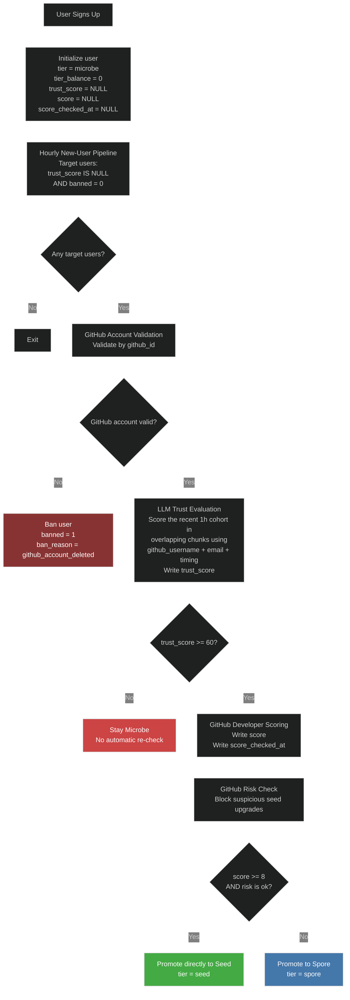

# User Pipeline

This document is the intended contract for the implemented user pipeline on this branch.

One-time backfills are separate operational jobs and are not part of the steady-state pipeline.

Manual emergency tools are also separate and live outside the steady-state flow under `scripts/user-pipeline/manual/`.

The one-time `trust_score = 0/100` bootstrap remains migration-only in `drizzle/0017_add_score_and_trust_score.sql`; it is not part of steady-state code.

`trust_score` is the single trust field for the implemented pipeline:

- it is first written by the hourly onboarding trust gate

See also:

- [`PRODUCTION_ROLLOUT.md`](./PRODUCTION_ROLLOUT.md) for the final pre-merge productionization checklist and the initial dry-run rollout plan.

## Implemented Jobs

1. Hourly new-user trust gate and tier pipeline
2. Daily spore recheck

## Layout

Current checked-in layout on this branch:

```text
scripts/user-pipeline/
├── hourly-new-users.ts
├── daily-spore-recheck.ts
├── scoring/
│   ├── trust-score.ts
│   ├── github-score.ts
│   └── github-risk.ts
├── shared/
│   ├── d1.ts
│   ├── email-cohort.ts
│   ├── github-identity.ts
│   └── github.ts
├── manual/
│   ├── cleanup-github-users.ts
│   ├── replay-hourly-new-users.ts
│   └── replay-daily-spore-recheck.ts
└── backfills/
    └── backfill-spore-scores.ts
```

Pipeline tests live under `enter.pollinations.ai/test/`, not inside `scripts/user-pipeline/`.

## Hourly New-User Pipeline

- Targets users where `trust_score IS NULL` and `banned = 0`
- In steady state, only scans users from the last hour
- Validates that the GitHub account still exists by `github_id` before any other checks
- Uses `github_id` as the identity key for validation and writes
- Uses the stored `github_username` from D1 only as LLM context
- Uses the old overlapping recent-cohort LLM detector on username/email/domain/timing patterns to decide whether the user can leave `microbe`
- Scores developer activity immediately for trusted users
- Applies a separate GitHub risk check before allowing `seed`
- Allows a direct `microbe -> seed` upgrade for users who already qualify



## Daily Spore Recheck Pipeline

- Runs only on unbanned `spore` users
- Rechecks the users who have waited the longest since their last GitHub score check
- Daily slice size is `ceil(current_spore_count / 7)`
- Validates GitHub account existence by `github_id` before scoring
- Uses `github_id` as the only GitHub identity key in the active pipeline
- Applies the same GitHub risk check before allowing `seed`
- This keeps the full `spore` pool rotating over roughly one week, even as the pool grows

## Backfill And Replay Tools

- `backfills/backfill-spore-scores.ts` backfills `score` and `score_checked_at` for existing `spore` users
- `manual/replay-hourly-new-users.ts` resets a staging cohort and reruns the hourly trust + tier pipeline
- `manual/replay-daily-spore-recheck.ts` resets a staging cohort and reruns the daily `spore -> seed` pipeline


