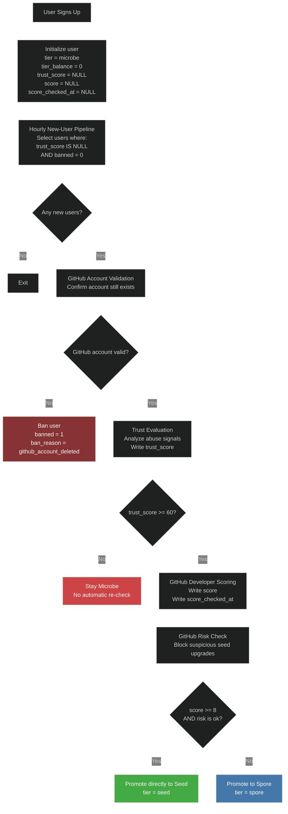
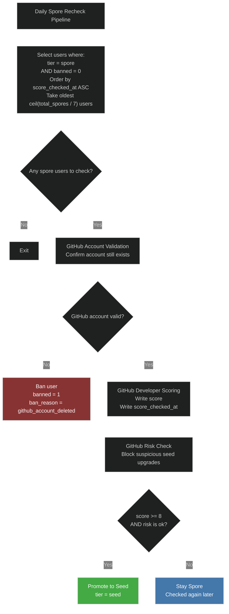

# User Pipeline

This document is the intended steady-state contract for the user pipeline on this branch.

It describes the ongoing hourly and daily flows only.

One-time backfills are separate operational jobs and are not part of the steady-state pipeline.

Manual emergency tools are also separate and live outside the steady-state flow under `scripts/user-pipeline/manual/`.

The one-time `trust_score = 0/100` bootstrap remains migration-only in `drizzle/0017_add_score_and_trust_score.sql`; it is not part of steady-state code.

See also:

- [`PRODUCTION_ROLLOUT.md`](/Users/comsom/Github/pollinations/enter.pollinations.ai/scripts/user-pipeline/PRODUCTION_ROLLOUT.md) for the final pre-merge productionization checklist and the initial dry-run rollout plan.

## Layout

```text
scripts/user-pipeline/
├── hourly-new-users.ts
├── daily-spore-recheck.py
├── scoring/
│   ├── trust-score.ts
│   ├── github_score.py
│   └── github_risk.py
├── shared/
│   ├── d1.ts
│   ├── d1.py
│   ├── email-cohort.ts
│   ├── github_account_state.py
│   ├── python.ts
│   └── python_runtime.py
├── manual/
│   ├── apply-abuse-blocks.ts
│   ├── cleanup-github-users.ts
│   ├── replay-hourly-new-users.py
│   └── replay-daily-spore-recheck.py
└── backfills/
    └── backfill-spore-scores.py
```

## Local Python

- Python package scripts honor `PYTHON_BIN` if it is set.
- If `PYTHON_BIN` is not set, the launcher prefers `python3.11`, then falls back to `python3`.
- This keeps local replay and backfill commands stable even when the machine default `python3` is not the interpreter that has the required SSL certificates or Python packages.

## Hourly New-User Pipeline

- Runs on users where `trust_score IS NULL` and `banned = 0`
- Validates that the GitHub account still exists before any other checks
- Uses trust scoring to decide whether the user can leave `microbe`
- Scores developer activity immediately for trusted users
- Applies a separate GitHub risk check before allowing `seed`
- Allows a direct `microbe -> seed` upgrade for users who already qualify



## Daily Spore Recheck Pipeline

- Runs only on unbanned `spore` users
- Rechecks the users who have waited the longest since their last GitHub score check
- Daily slice size is `ceil(current_spore_count / 7)`
- Applies the same GitHub risk check before allowing `seed`
- This keeps the full `spore` pool rotating over roughly one week, even as the pool grows


