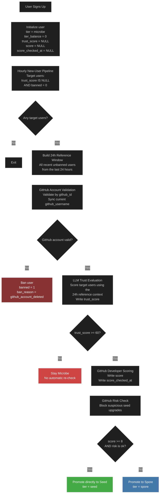
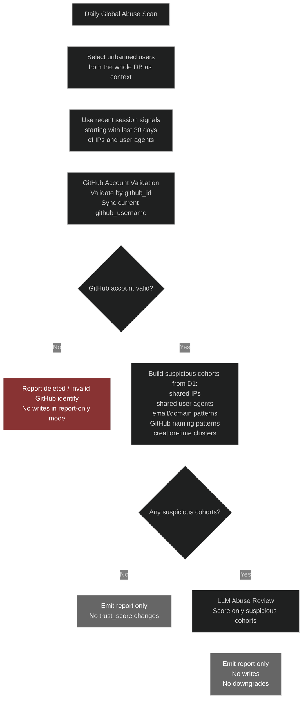
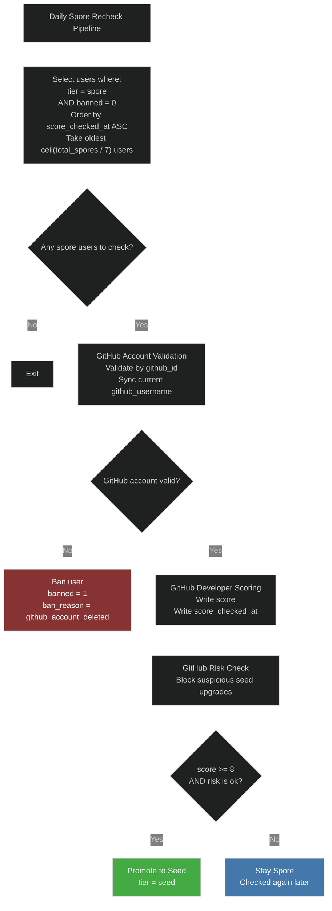

# User Pipeline

This document is the intended contract for the implemented user pipeline on this branch.

It describes the implemented steady-state flows first, plus the current planned follow-up work.

One-time backfills are separate operational jobs and are not part of the steady-state pipeline.

Manual emergency tools are also separate and live outside the steady-state flow under `scripts/user-pipeline/manual/`.

The one-time `trust_score = 0/100` bootstrap remains migration-only in `drizzle/0017_add_score_and_trust_score.sql`; it is not part of steady-state code.

`trust_score` is the single trust field for the implemented pipeline:

- it is first written by the hourly onboarding trust gate
- the daily global abuse scan is report-only on this branch and does not write `trust_score` yet

See also:

- [`PRODUCTION_ROLLOUT.md`](./PRODUCTION_ROLLOUT.md) for the final pre-merge productionization checklist and the initial dry-run rollout plan.

## Implemented Jobs

1. Hourly new-user trust gate and tier pipeline
2. Daily global abuse scan (report-only)
3. Daily spore recheck

## Layout

Current checked-in layout on this branch:

```text
scripts/user-pipeline/
├── daily-global-abuse-scan.ts
├── hourly-new-users.ts
├── daily-spore-recheck.py
├── scoring/
│   ├── global-abuse-score.ts
│   ├── trust-score.ts
│   ├── trust-score-helpers.ts
│   ├── github_score.py
│   ├── github_risk.py
│   └── test_github_risk.py
├── shared/
│   ├── d1.ts
│   ├── d1.py
│   ├── email-cohort.ts
│   ├── github-identity.ts
│   ├── github-validation.ts
│   ├── github_account_state.py
│   ├── pollinations-llm.ts
│   ├── python.ts
│   └── python_runtime.py
├── manual/
│   ├── cleanup-github-users.ts
│   ├── replay-hourly-new-users.py
│   └── replay-daily-spore-recheck.py
└── backfills/
    └── backfill-spore-scores.py
```

## Local Python

- Python package scripts honor `PYTHON_BIN` if it is set.
- If `PYTHON_BIN` is not set, the launcher prefers `python3.11`, then falls back to `python3`.
- This keeps local replay and backfill commands stable even when the machine default `python3` is not the interpreter that has the required SSL certificates or Python packages.

## Hourly New-User Pipeline

- Targets users where `trust_score IS NULL` and `banned = 0`
- Uses all recent unbanned users from the last 24 hours as the reference context for trust scoring
- Validates that the GitHub account still exists by `github_id` before any other checks
- Syncs `github_username` from GitHub when the user has renamed their account
- Uses LLM trust scoring to decide whether the user can leave `microbe`
- Scores developer activity immediately for trusted users
- Applies a separate GitHub risk check before allowing `seed`
- Allows a direct `microbe -> seed` upgrade for users who already qualify



## Daily Global Abuse Scan

- This job is implemented on this branch as a staging-only report-only workflow
- Recommended cadence is daily, not weekly
- It runs separately from onboarding and separately from the daily spore recheck
- Workflow file: `.github/workflows/user-pipeline-daily-global-abuse-scan.yml`
- Runtime entrypoint: `scripts/user-pipeline/daily-global-abuse-scan.ts`
- Scorer: `scripts/user-pipeline/scoring/global-abuse-score.ts`
- Uses D1 directly, not Tinybird, because IP and session signals matter
- Uses the whole unbanned user table as reference context
- Uses recent session data as signals, starting with the last 30 days of `session.ip_address` and `session.user_agent`
- Validates GitHub account existence by `github_id` before broader abuse analysis
- Syncs `github_username` if the current GitHub login changed
- Builds deterministic suspicious cohorts before using the LLM
- Sends only suspicious cohorts to the LLM, not the whole database raw
- Reuses `trust_score` as the current trust field
- Reuses the LLM plumbing from `scoring/trust-score.ts`, but not the onboarding prompt
- Current version is report-only with no writes and no downgrades
- Later live mode can overwrite `trust_score` and downgrade to `microbe` when `trust_score < 60`
- Does not ban users for LLM suspicion in this pipeline
- Detects deleted GitHub accounts after `github_id` validation, but only reports them in this version



Planned live-mode follow-up:

- overwrite `trust_score` for evaluated users
- downgrade to `microbe` when `trust_score < 60`
- keep deleted-account handling separate from LLM suspicion

## Daily Spore Recheck Pipeline

- Runs only on unbanned `spore` users
- Rechecks the users who have waited the longest since their last GitHub score check
- Daily slice size is `ceil(current_spore_count / 7)`
- Validates GitHub account existence by `github_id` before scoring
- Syncs `github_username` from GitHub when needed
- Applies the same GitHub risk check before allowing `seed`
- This keeps the full `spore` pool rotating over roughly one week, even as the pool grows


