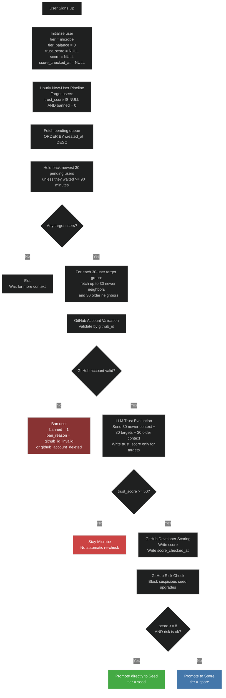
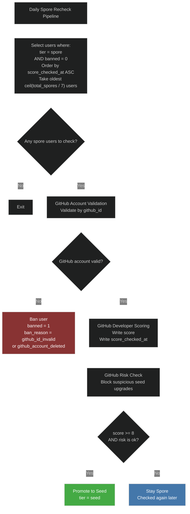

# User Scoring

This document is the intended contract for the implemented user-scoring subsystem on this branch.

One-time rollout scripts are separate operational jobs and are not part of the steady-state subsystem.

Operational helpers are kept separate from the steady-state subsystem under `user-scoring/rollout/`.

The one-time `trust_score = 0/100` bootstrap remains migration-only in `drizzle/0017_add_score_and_trust_score.sql`; it is not part of steady-state code.

`trust_score` is the single trust field for the implemented pipeline:

- it is first written by the hourly onboarding trust gate

See also:

- [`rollout/README.md`](./rollout/README.md) for the final pre-merge productionization checklist and the initial dry-run rollout plan.

## Implemented Jobs

1. Hourly new-user trust gate and tier pipeline
2. Daily spore recheck

## Local Debugging

- `user-scoring/scoring/trust-score.ts` supports `--trace-file` for local JSONL trust traces
- `user-scoring/jobs/hourly-new-users.ts` supports `--trace-file` for local JSONL hourly decision traces
- `user-scoring/jobs/daily-spore-recheck.ts` supports `--trace-file` for local JSONL daily decision traces
- the replay harnesses in [`test/`](./test/) can combine these into one local trace file per replay run

## Layout

Current checked-in layout on this branch:

```text
user-scoring/
├── jobs/
│   ├── hourly-new-users.ts
│   ├── daily-spore-recheck.ts
│   └── audit-github-accounts.ts
├── scoring/
│   ├── trust-score.ts
│   ├── trust-score-prompt.md
│   ├── github-score.ts
│   └── github-risk.ts
├── shared/
│   ├── d1.ts
│   ├── email-cohort.ts
│   ├── github-identity.ts
│   ├── github.ts
│   └── llm.ts
├── rollout/
│   ├── fill-spore-github-scores.ts
│   └── bootstrap-trust-scores.ts
└── test/
    ├── TESTING.md
    ├── STAGING.md
    ├── cohort-setup.ts
    ├── reset-cohort.ts
    ├── verify-results.ts
    ├── user-pipeline.test.ts
    ├── github-risk.test.ts
    └── github-score.test.ts
```

## Hourly New-User Pipeline

- Targets users where `trust_score IS NULL` and `banned = 0`
- Builds one reverse-chronological pending queue ordered by `created_at DESC`
- Holds back the newest `30` pending users so they become newer-side context on the next run
- Scores every remaining pending user in consecutive `30`-user target groups
- For each target group, fetches up to `30` newer neighbors and `30` older neighbors by registration date
- Context neighbors may already have a `trust_score`; they are prompt-only and are never rewritten
- Users waiting at least `90` minutes bypass the holdback buffer and get scored immediately
- Bans missing/invalid `github_id` rows before calling GitHub
- Validates that the GitHub account still exists by `github_id` before any other checks
- Uses `github_id` as the identity key for validation and writes
- Uses the stored `github_username` from D1 only as LLM context
- Sends `30/30/30` trust batches to the LLM:
  `newer context + target users + older context`
- The LLM returns scores only for the middle target users; only those target rows get `trust_score` written
- Scores developer activity immediately for trusted users
- Applies a separate GitHub risk check before allowing `seed`
- Allows a direct `microbe -> seed` upgrade for users who already qualify



## Daily Spore Recheck Pipeline

- Runs only on unbanned `spore` users
- Rechecks the users who have waited the longest since their last GitHub score check
- Daily slice size is `ceil(current_spore_count / 7)`
- Bans missing/invalid `github_id` rows before calling GitHub
- Validates GitHub account existence by `github_id` before scoring
- Uses `github_id` as the only GitHub identity key in the active pipeline
- Applies the same GitHub risk check before allowing `seed`
- This keeps the full `spore` pool rotating over roughly one week, even as the pool grows

## Rollout, Audit And Replay Tools

- `rollout/bootstrap-trust-scores.ts` is a one-time rollout/repair helper that applies the same trust bootstrap semantics as the migration to rows where `trust_score IS NULL`
- `rollout/fill-spore-github-scores.ts` is a one-time rollout helper that fills missing `score` and `score_checked_at` for existing `spore` users without changing tier directly
- `audit-github-accounts.ts` audits GitHub account validity for D1 users
- `test/replay-hourly-new-users.ts` resets a staging cohort and reruns the hourly trust + tier pipeline
- `test/replay-daily-spore-recheck.ts` resets a staging cohort and reruns the daily `spore -> seed` pipeline


