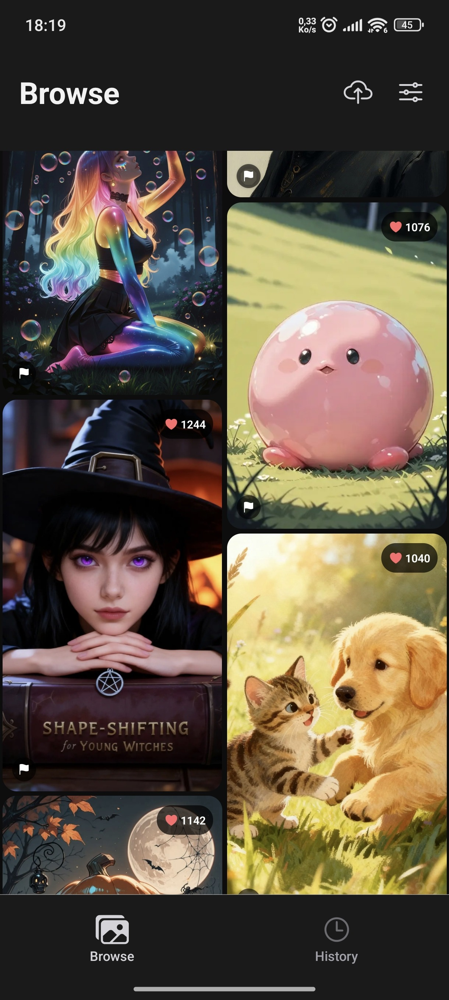

# 🎨 ReImagine - Transform Images with AI

[](https://pollinations.ai)
[](https://reactnative.dev/)
[](https://expo.dev/)

ReImagine is a mobile application that lets you transform images using powerful AI models from Pollinations. Browse and select images from the Civitai community or upload your own, then apply creative transformations with just a few taps!


## ✨ Features

- **Image Browsing**: Discover trending images from Civitai
- **Multi-image Selection**: Choose 1-4 images to transform
- **AI Transformation**: Use Pollinations' AI to transform selected images
- **Smart Model Selection**:
    - **Kontext**: For transforming single images
    - **GPTImage**: For combining 2-4 images
- **Transformation History**: Keep track of all your transformed images
- **Version Control**: Create multiple versions of your transformations
- **Dark/Light Mode**: Choose your preferred theme
- **Sharing Capabilities**: Save or share your AI creations

## 🚀 How It Works

1. **Browse** trending AI-generated images or upload your own photos
2. **Select** up to 4 images to transform
3. **Enter** your transformation prompt (e.g., "make it cyberpunk style")
4. **Transform** with AI powered by Pollinations
5. **Save** your creations to your history
6. **Share** with friends or continue transforming

## 🔧 Technology

ReImagine is built using:

- **React Native & Expo**: For cross-platform mobile development
- **Pollinations API**: For powerful AI image transformation
    - Uses `kontext` model for single image transformations
    - Uses `gptimage` model for multi-image transformations (2-4 images)
- **Civitai API**: For browsing trending AI-generated images
- **Async Storage**: For local data persistence
- **React Navigation**: For seamless app navigation

## 🖼️ Pollinations Integration

ReImagine leverages the Pollinations.AI API to transform images with AI. The integration allows users to:

- Transform images with text prompts
- Apply different transformation models based on the number of images selected
- Configure image parameters like dimensions and enhancement settings

Example API endpoint used:
```
https://image.pollinations.ai/prompt/[encoded-prompt]/?model=[model]&image=[image-urls]&width=1024&height=1024&nologo=true
```

## 📱 Screenshots



## 🧩 Core Components

- **HomeScreen**: Browse and select images from Civitai
- **EditScreen**: Apply transformations to selected images
- **ProfileScreen**: View transformation history
- **TransformationDetailScreen**: See details and versions of transformations

## 🛠️ Installation & Setup

1. Clone the repository
   ```bash
   git clone https://github.com/yourusername/reimagine.git
   cd reimagine
   ```

2. Install dependencies
   ```bash
   npm install
   ```

3. Create a .env file with the necessary environment variables:
   ```
   BANNED_IMAGES_URL=your-banned-images-url
    example : 'https://gist.github.com/ismailazdad/5cbe339966c62a2322f60416c9661b78/raw/banned_images_reim.json'
   VERSION_URL=your-version-url
    example : 'https://gist.github.com/ismailazdad/260c302498b1fee07f6dba776776bc78/raw/reimage_version.json'
   FORMCARRY_ENDPOINT=your-formcarry-endpoint
    note : create a form carry to https://formcarry.com/ and get a form url id
   ADMIN_EMAIL=your-admin-email
   FROM_EMAIL=your-from-email
   IMGBB_API_KEY=your-imgbb-api-key
   APP_REFERER=referer url
   COOLDOWN_SECONDS=30
   MAX_GENERATIONS_PER_DAY=10
   ```

4. Start the development server
   ```bash
   npx expo start -c
   ```

5. Follow Expo instructions to run on your device or emulator

6. here the link for the apk Android for test :
[](https://drive.google.com/file/d/1EFe44mzE8xQA7fIbYHuajXHzY-B2n7AX/view?usp=sharing)

## 🔮 Future Features
- start tour
- User accounts and cloud synchronization
- More transformation models and options
- Community sharing of transformations
- Advanced editing tools
- Batch transformation processing

## 🙌 Credits

- [Pollinations.AI](https://pollinations.ai) - For the powerful AI image transformation API
- [Civitai](https://civitai.com) - For the source of trending AI-generated images
- [Expo](https://expo.dev) - For the React Native development framework

## 📄 License

This app is licensed under the MIT License - see the LICENSE file for details.

---

Made with ❤️ | Part of the [Pollinations Garden](https://github.com/pollinations/pollinations/tree/main/garden) 🌱 (Originally created for Hacktoberfest 2025)