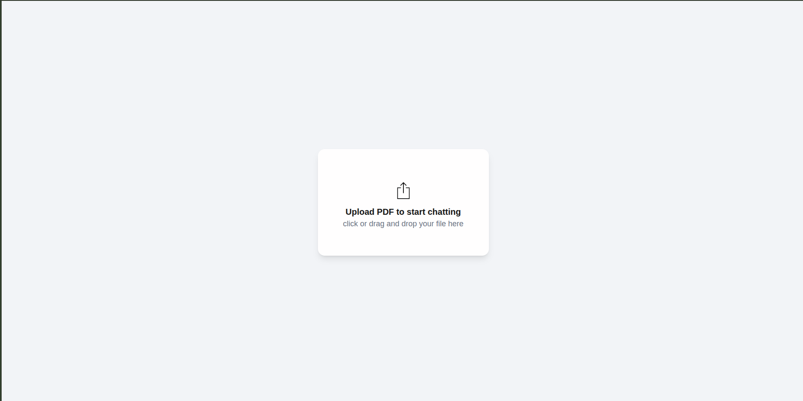
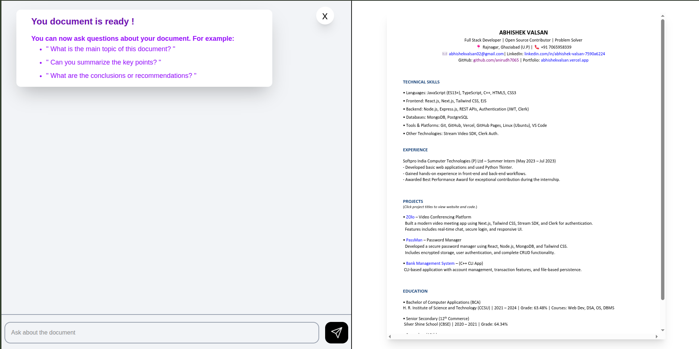
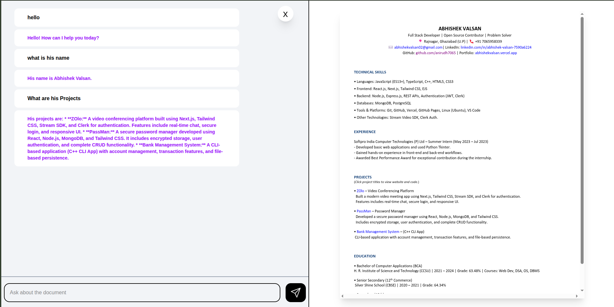

# 📖 PDF Analyzer

[](https://nextjs.org/) 
[](https://www.typescriptlang.org/) 
[](https://tailwindcss.com/) 
[](https://ai.google.dev/) 
[](LICENSE)

A fully functional **Google NotebookLM-inspired web application** built using **Next.js**, **TypeScript**, and **Google Gemini API**. This project allows you to **upload documents, generate embeddings, and interact with your data through AI-powered chat**, all with **in-memory search** (no database required).  



---

## ✨ Features  

- 📂 **Upload PDF & documents** and process them into searchable chunks.  
- 🧠 **AI-Powered Q&A** using Google **Gemini embeddings**.  
- 🔍 **In-memory vector search** (simple and fast, no external DB needed).  
- 🖥️ **Modern UI** built with React, TailwindCSS, and Next.js 14 App Router.  
- ⚡ **Streaming responses** for a ChatGPT-like experience.  

---

## 🛠 Tech Stack  

- **Frontend:** Next.js (React + TypeScript), TailwindCSS  
- **Backend:** Next.js API Routes, Node.js  
- **AI & Embeddings:** Google **Gemini API**  
- **Vector Search:** Lightweight **in-memory search engine**  

---

## ⚙️ Installation & Setup  

1. **Clone the repository:**  

   ```bash
   git clone https://github.com/anirudh7065/Google-NotebookLM-Clone.git
   cd Google-NotebookLM-Clone
    ````

2. **Install dependencies:**

   ```bash
    npm install
    # or
    yarn install
   ```

3. **Set up environment variables:**
   Create a `.env.local` file in the root directory and add the following:

   ```env
    GEMINI_API_KEY=your_google_gemini_api_key_here
   ```

   * Get your **Gemini API Key** from [Google AI Studio](https://ai.google.dev/).

4. **Run the development server:**

   ```bash
   npm run dev
   # or
   yarn dev
   ```

   Visit `http://localhost:3000` to see the app in action.

---

## 📁 Project Structure

```
├── app/                # Next.js App Router (routes, API endpoints)
├── components/         # Reusable React components
├── lib/                # Utilities (AI calls, embeddings, vector search, etc.)
├── public/             # Static assets (icons, images, screenshots)
├── types/              # TypeScript type definitions
├── .env.local          # Environment variables (not committed)
├── package.json        # Dependencies and scripts
└── README.md
```

---

## 🚀 Usage

1. Upload one or more PDFs.
2. The app will split documents into smaller chunks and generate **Gemini embeddings**.
3. Ask questions in the chat – answers will be retrieved from your documents using **in-memory vector search**.

---

## 📸 Screenshots





---

## 🤝 Contributing

Contributions are welcome! Feel free to fork the repo, create a branch, and submit a PR.

---

## 📜 License

This project is licensed under the **MIT License**.

