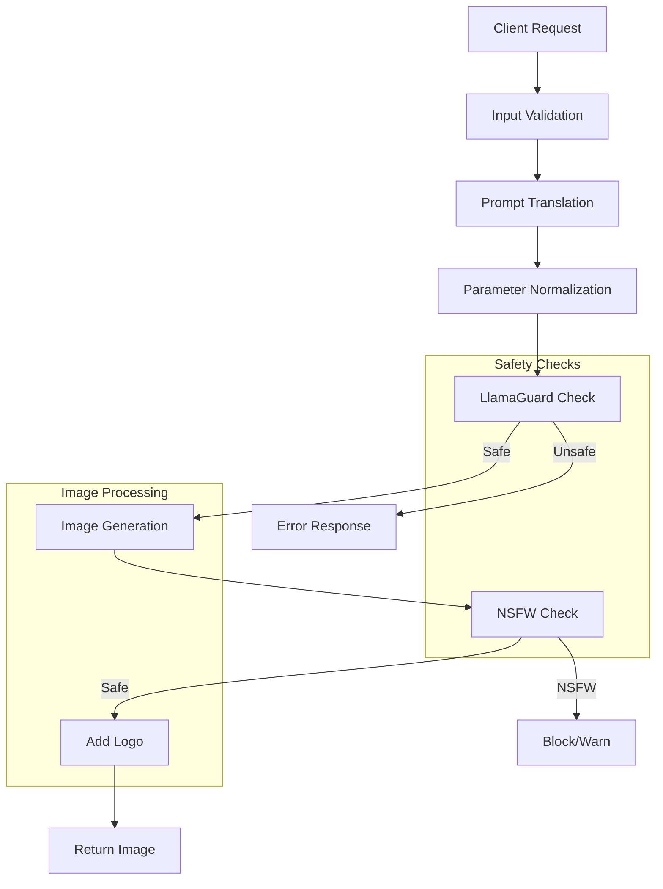

# generative_image_url

## Architecture



## Installation Instructions

Install automatic1111's [webui](https://github.com/AUTOMATIC1111/stable-diffusion-webui/)

Run with

```bash
./webui.sh --api [--xformers]
```
(xformers for speed up)


Run server (will listen on port 16384 by default)
```bash
mkdir -p /tmp/stableDiffusion_cache
npm install
node index.js
```
