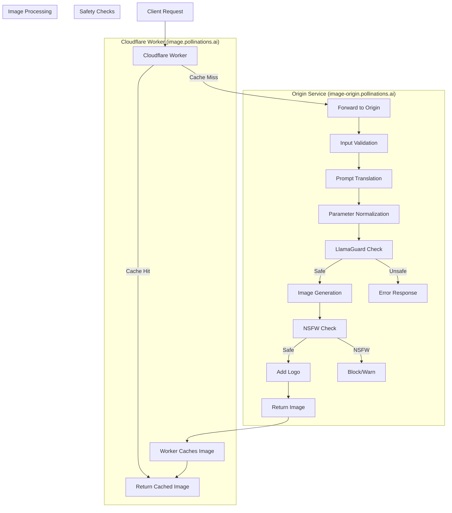

# image.pollinations.ai

## Architecture

The image.pollinations.ai service now uses a multi-tier architecture with Cloudflare Workers and R2 for caching:



### Components

1. **Cloudflare Worker (image.pollinations.ai)**
   - Serves as the entry point for all image requests
   - Checks R2 storage for cached images
   - Forwards requests to the origin service when needed
   - Caches responses in R2 for future requests
   - Preserves client IP addresses for rate limiting

2. **Origin Service (image-origin.pollinations.ai)**
   - Handles the actual image generation
   - Implements safety checks and content moderation
   - Processes and transforms images
   - Enforces rate limiting (1 request per 10 seconds per IP)

3. **Cloudflare R2 Storage**
   - Stores cached images
   - Provides fast access to previously generated images
   - Reduces load on the origin service

## DNS Configuration

- **image.pollinations.ai**: Points to the Cloudflare Worker
- **image-origin.pollinations.ai**: Points to the Cloudflare Tunnel connected to the origin service

## Installation Instructions

### Origin Service Setup

1. Install automatic1111's [webui](https://github.com/AUTOMATIC1111/stable-diffusion-webui/)

2. Run with:
   ```bash
   ./webui.sh --api [--xformers]
   ```
   (xformers for speed up)

3. Run the origin server (will listen on port 16384 by default):
   ```bash
   mkdir -p /tmp/stableDiffusion_cache
   npm install
   node index.js
   ```

4. Set up Cloudflare Tunnel for the origin service:
   ```bash
   ./setup-cloudflare-tunnel.sh image-origin pollinations.ai 16384
   ```

### Cloudflare Worker Setup

1. Navigate to the cloudflare-cache directory:
   ```bash
   cd cloudflare-cache
   ```

2. Install dependencies:
   ```bash
   npm install
   ```

3. Configure wrangler.toml:
   - Set `ORIGIN_HOST` to `image-origin.pollinations.ai`
   - Configure R2 bucket binding for `IMAGE_BUCKET`

4. Deploy the worker:
   ```bash
   npx wrangler deploy
   ```

5. Add a custom domain in the Cloudflare dashboard:
   - Go to Workers & Pages > Your Worker > Domains & Routes
   - Add `image.pollinations.ai` as a custom domain

## Rate Limiting

The origin service implements strict IP-based rate limiting (1 request per 10 seconds per IP). The Cloudflare Worker properly forwards the client's IP address through the following headers:
- x-forwarded-for
- x-real-ip
- cf-connecting-ip

This ensures that rate limiting works correctly based on the original client's IP address, even when requests go through the worker.

## Design Principles

The system follows a "thin proxy" design principle:
- Minimal processing in the worker
- Direct forwarding of requests
- No transformation of responses
- Simple and efficient caching logic

## Troubleshooting

- If the worker returns 404 errors, ensure that the origin service is accessible
- If you encounter rate limiting issues, verify that IP forwarding is working correctly
- For caching issues, check the R2 bucket configuration and permissions
