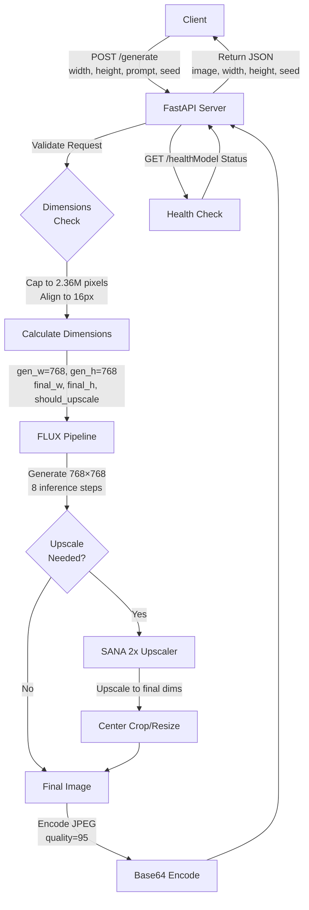

# FLUX.2-dev-Turbo Server

FastAPI server for FLUX.2-dev-Turbo with SANA 2x upscaling from Black Forest Labs.

## Overview

High-performance text-to-image generation service optimized for production deployment. Generates images at 768×768 natively with optional 2x upscaling via SANA to achieve resolutions up to 1536×1536 (or up to 2048×1152 landscape).

## Performance Metrics

- **Base Generation (768×768)**: ~4-6 seconds
- **With SANA Upscaling (1536×1536)**: ~8-12 seconds
- **Max Output**: 2,359,296 pixels (e.g., 1536×1536 or 2048×1152)
- **VRAM**: ~30GB peak
- **Inference Steps**: 8 (optimized for quality-speed trade-off)

## Resolution Support

```
Square:     1536×1536 (maximum square output)
Landscape:  2048×1152 (wide output, 2,359,296 pixels)
Portrait:   1152×2048 (tall output, 2,359,296 pixels)
Any Ratio:  As long as width × height ≤ 2,359,296 pixels
```

## Working Mechanism



## API Endpoints

### POST /generate

Generate an image from a text prompt.

**Request:**
```json
{
  "prompts": ["a sleek futuristic spaceship in orbit around a blue planet"],
  "width": 1536,
  "height": 1536,
  "seed": 42
}
```

**Parameters:**
- `prompts` (array[string], required): List of prompts (uses first item)
- `width` (int, default: 1024, max: 2048): Output width in pixels
- `height` (int, default: 1024, max: 2048): Output height in pixels
- `seed` (int, optional): Random seed for reproducibility. Auto-generated if omitted

**Response:**
```json
{
  "image": "base64_encoded_jpeg_data",
  "width": 1536,
  "height": 1536,
  "seed": 42,
  "prompt": "a sleek futuristic spaceship in orbit around a blue planet"
}
```

**Status Codes:**
- `200`: Success
- `400`: Invalid dimensions (exceeds pixel limits)
- `403`: Unauthorized (missing/invalid token)
- `503`: Model not loaded

### GET /health

Health check endpoint.

**Response:**
```json
{
  "status": "healthy",
  "model": "black-forest-labs/FLUX.1-dev"
}
```

## Installation & Setup

### Prerequisites
- NVIDIA GPU with CUDA 12.4 support (RTX 3080 or better recommended)
- 30GB VRAM minimum
- Docker & Docker Compose (for containerized deployment)

### Local Development

1. **Clone repository:**
```bash
cd /home/ubuntu/pollinations/image.pollinations.ai/flux2_dev_turbo
```

2. **Create virtual environment:**
```bash
python3.12 -m venv venv
source venv/bin/activate
```

3. **Install dependencies:**
```bash
pip install --upgrade pip
pip install torch torchvision --index-url https://download.pytorch.org/whl/cu124
pip install -r requirements.txt
```

4. **Optional: Install Flash Attention 2 (recommended for speed):**
```bash
pip install https://github.com/Dao-AILab/flash-attention/releases/download/v2.7.4.post1/flash_attn-2.7.4.post1+cu12torch2.6cxx11abiFALSE-cp312-cp312-linux_x86_64.whl
```

5. **Download models:**
Models will auto-download on first run. Pre-download with:
```bash
python3 -c "from diffusers import FluxPipeline; FluxPipeline.from_pretrained('black-forest-labs/FLUX.1-dev', torch_dtype='bfloat16', cache_dir='model_cache')"
```

6. **Run locally:**
```bash
# With token validation
export PLN_ENTER_TOKEN="your-secret-token"
export PORT=10003
python server.py

# Without token (development only)
python server.py
```

7. **Test the API:**
```bash
curl -X POST http://localhost:10003/generate \
  -H "Content-Type: application/json" \
  -H "x-enter-token: your-secret-token" \
  -d '{
    "prompts": ["a cat wearing sunglasses"],
    "width": 1024,
    "height": 1024
  }'
```

## Docker Deployment

### Build Image

```bash
docker build -t flux2-dev-turbo:latest .
```

### Run Container

```bash
docker run --gpus all \
  -p 10003:10003 \
  -e PORT=10003 \
  -e PLN_ENTER_TOKEN="your-secret-token" \
  -e SERVICE_TYPE="flux2-dev-turbo" \
  -v $(pwd)/model_cache:/app/model_cache \
  flux2-dev-turbo:latest
```

### Docker Compose

Create `docker-compose.yml`:
```yaml
version: '3.8'
services:
  flux2-dev-turbo:
    image: flux2-dev-turbo:latest
    container_name: flux2-dev-turbo
    build:
      context: .
      dockerfile: Dockerfile
    restart: unless-stopped
    ports:
      - "10003:10003"
    environment:
      - PORT=10003
      - SERVICE_TYPE=flux2-dev-turbo
      - PLN_ENTER_TOKEN=${PLN_ENTER_TOKEN}
      - CUDA_VISIBLE_DEVICES=0
      - HF_HOME=/app/model_cache
    volumes:
      - ./model_cache:/app/model_cache
      - /etc/timezone:/etc/timezone:ro
    deploy:
      resources:
        reservations:
          devices:
            - driver: nvidia
              count: 1
              capabilities: [gpu]
    healthcheck:
      test: ["CMD", "curl", "-f", "http://localhost:10003/health"]
      interval: 30s
      timeout: 10s
      retries: 3
      start_period: 60s
```

Deploy with:
```bash
docker-compose up -d
```

## Deployment Scripts

### One-Time Setup

```bash
./setup-flux-docker.sh
```

### Build & Deploy

```bash
./deploy-flux-docker.sh
```

### Systemd Service

Install as systemd service:
```bash
sudo cp pollinations-flux2-docker.service /etc/systemd/system/
sudo systemctl daemon-reload
sudo systemctl enable pollinations-flux2-docker.service
sudo systemctl start pollinations-flux2-docker.service
```

View logs:
```bash
sudo journalctl -u pollinations-flux2-docker.service -f
```

## Environment Variables

| Variable | Default | Description |
|----------|---------|-------------|
| `PORT` | `10003` | Server port |
| `SERVICE_TYPE` | `flux2-dev-turbo` | Service identifier for registration |
| `PLN_ENTER_TOKEN` | (none) | Authentication token (optional) |
| `PUBLIC_IP` | Auto-detect | Public IP for registration |
| `CUDA_VISIBLE_DEVICES` | `0` | GPU index |
| `HF_HOME` | `model_cache` | Hugging Face cache directory |

## Model Information

- **Generator**: FLUX.1-dev by Black Forest Labs
- **Upscaler**: SANA 2x via Spandrel
- **Quantization**: bfloat16 (memory efficient)
- **Steps**: 8 (turbo optimized)
- **Guidance Scale**: 3.5

## Troubleshooting

### CUDA Out of Memory
```bash
# Reduce batch size or generation resolution in code
# Or allocate more GPU memory by reducing system load
```

### Models not downloading
```bash
# Check internet connection
# Verify HF_HOME directory permissions
# Manually download: python3 -c "from diffusers import FluxPipeline; ..."
```

### Slow generation
- Ensure Flash Attention 2 is installed
- Check GPU utilization: `nvidia-smi`
- Monitor memory: `watch -n 1 nvidia-smi`

### Service registration failing
- Verify `PUBLIC_IP` is correct
- Check network connectivity to `image.pollinations.ai`
- Ensure port is open: `curl http://<your-ip>:10003/health`

## Performance Optimization

1. **Flash Attention 2**: ~25-30% speed improvement
2. **bfloat16**: Memory reduction without quality loss
3. **8 inference steps**: Fast generation without artifacts
4. **SANA upscaling**: Superior upscaling quality vs. standard interpolation

## File Structure

```
flux2_dev_turbo/
├── server.py                    # FastAPI application
├── Dockerfile                   # Docker build configuration
├── entrypoint.sh               # Container entrypoint
├── setup-flux-docker.sh        # Setup script
├── deploy-flux-docker.sh       # Deployment script
├── pollinations-flux2-docker.service  # Systemd service
├── requirements.txt            # Python dependencies
├── model_cache/                # Model storage
├── venv/                       # Virtual environment
└── README.md                   # This file
```

## Requirements

See [requirements.txt](requirements.txt) for full dependencies:
- FastAPI & Uvicorn
- PyTorch & TorchVision
- Diffusers
- Pillow
- NumPy
- Spandrel (upscaling)
- Pydantic
- aiohttp

## API Rate Limiting

For production use with high traffic, implement rate limiting in nginx/reverse proxy:

```nginx
limit_req_zone $binary_remote_addr zone=api:10m rate=1r/s;

location /generate {
    limit_req zone=api burst=5 nodelay;
    proxy_pass http://localhost:10003;
}
```

## Security

1. **Always use `PLN_ENTER_TOKEN`** in production
2. **Run behind reverse proxy** (nginx/CloudFlare)
3. **Enable CORS** if needed (modify FastAPI app)
4. **Use HTTPS** in production
5. **Validate all inputs** (done by Pydantic)

## Monitoring

Monitor key metrics:
- Generation latency (P50, P95, P99)
- GPU utilization
- Memory usage
- Queue depth
- Error rates

Integrate with monitoring tools like Prometheus/Grafana for production observability.

## License

This implementation follows the licenses of:
- FLUX.2-dev: [Black Forest Labs License](https://huggingface.co/black-forest-labs/FLUX.1-dev)
- SANA: [Model-specific license](https://huggingface.co/Sana)

## Support & Resources

- [FLUX Documentation](https://huggingface.co/black-forest-labs/FLUX.1-dev)
- [Pollinations.ai](https://pollinations.ai)
- [FastAPI Docs](https://fastapi.tiangolo.com/)

---

> Build with 💖 for Pollinations.ai
