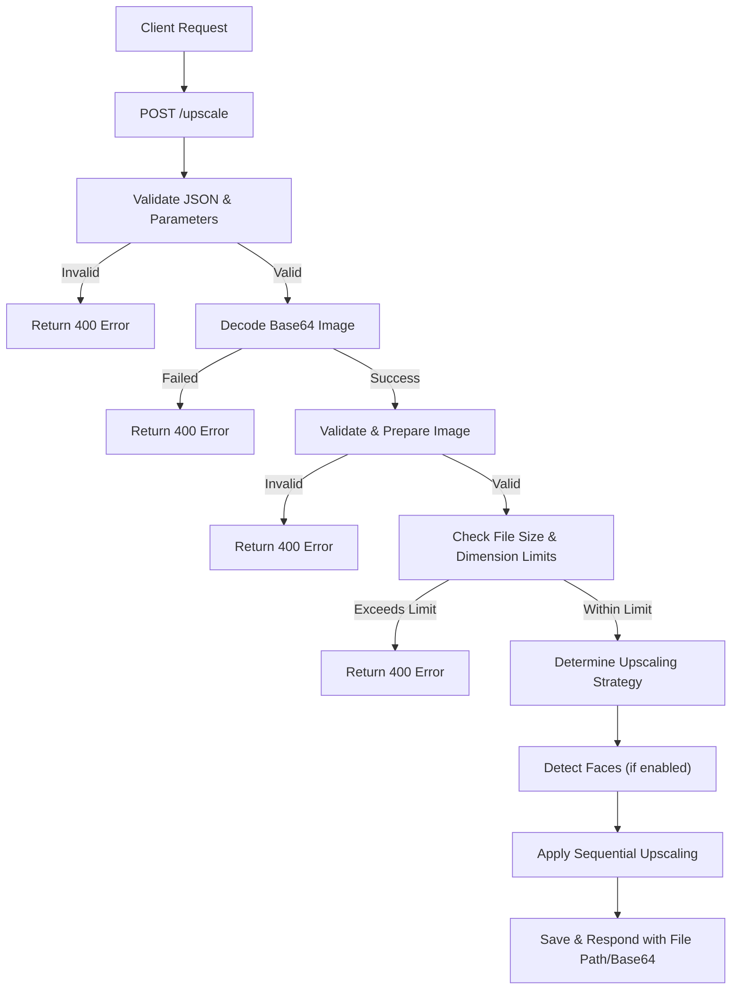
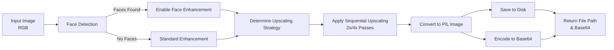

# Image Upscaling API

A high-performance image upscaling service using Real-ESRGAN models, with async HTTP API, face enhancement, and robust validation.

## Features

- **2x and 4x Image Upscaling** — Real-ESRGAN model-based enhancement
- **Face Enhancement** — Automatic face detection and enhancement during upscaling
- **Async Processing** — Built with Quart for async HTTP handling
- **Base64 Support** — Accepts and returns images as base64 strings
- **Validation** — File size (7MB max) and dimension limits, with dynamic thresholding per target resolution
- **Health Monitoring** — `/health` endpoint for status and limits
- **Heartbeat Registration** — Periodic registration with central service for service discovery

## Key Components

- **upscale.py** — Core upscaling pipeline, face detection, sequential upscaling logic
- **app.py** — Quart async API server (default port 10005), handles HTTP endpoints and background heartbeat
- **model_utility.py** — Model inference utilities (not shown)
- **utility.py** — Image validation, file handling, and executor setup

## API Endpoints

- `POST /upscale`  
    Upscales an image.  
    **Request JSON:**  
    - `image_b64` (required): Base64-encoded image data  
    - `target_resolution` (optional): `"2k"`, `"4k"`, or `"8k"` (default: `"4k"`)  
    - `enhance_faces` (optional): `true`/`false` (default: `true`)  
    **Response:**  
    - `file_path`: Path to upscaled image  
    - `base64`: Base64-encoded upscaled image  
    - `original_size`, `upscaled_size`, `total_scale`, `upscaling_strategy`, `faces_detected`, `faces_enhanced`, `processing_time`

- `GET /health`  
    Returns health status, supported resolutions, and max image size.

## Processing Flow



## Image Processing Pipeline



## Heartbeat & Health

- The server periodically registers itself with a central service for service discovery.
- `/health` endpoint provides status, supported resolutions, and max image size.

## Example Request

```json
POST /upscale
{
    "image_b64": "<base64-encoded-image>",
    "target_resolution": "4k",
    "enhance_faces": true
}
```

## Notes

- Only base64 image input is supported (no URL download).
- File size and dimension limits are enforced per target resolution.
- Face enhancement is automatically enabled if faces are detected and `enhance_faces` is true.

