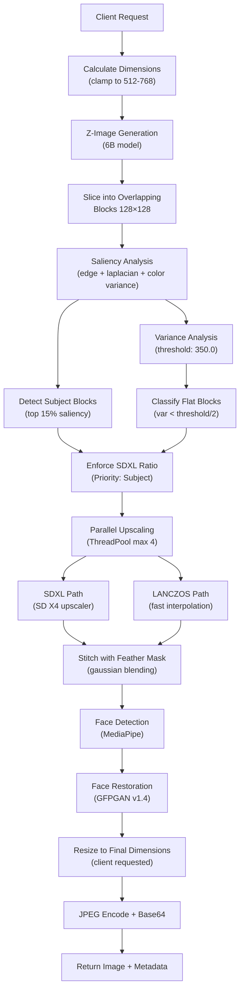

# Z-Image-Turbo Server

FastAPI server for Z-Image-Turbo (6B parameter text-to-image model from Tongyi-MAI) with intelligent block-based upscaling.

## Performance

- **512×512**: ~0.9s
- **1024×1024**: ~3.5s
- **VRAM**: ~20GB peak
- **Upscaling**: 4× LANCZOS or SD X4 per block (concurrent, max 4 blocks)

## Working Mechanism



## Technical Details

### Block Processing Pipeline

| Stage | Input | Process | Output |
|-------|-------|---------|--------|
| **Slicing** | 512-768px image | Stride-based overlap | N blocks, positions |
| **Saliency** | Image array | Sobel + Laplacian + variance | 0-1 normalized map |
| **Classification** | Blocks + saliency | Percentile thresholding | Subject/flat/detail sets |
| **Upscaling** | Classified blocks | Conditional (SDXL or LANCZOS) | 512px blocks (4×) |
| **Stitching** | Upscaled blocks | Feather mask blending | Seamless 2048-3072px output |

### Key Algorithms

**Saliency Computation:**
```
S(x,y) = 0.4·E(x,y) + 0.4·L(x,y) + 0.2·C(x,y)
```
- E: Sobel edge magnitude
- L: Laplacian (local contrast)
- C: RGB color variance
- Gaussian smoothed (σ=2)

**Subject Detection:**
- Threshold: 85th percentile of saliency
- Constraint: max_saliency > threshold AND mean_saliency > 0.8·threshold

**Flat Block Detection:**
- Variance < 175.0 → LANCZOS (very flat)
- Variance ≥ 175.0 → SDXL (detail retained)

**Upscaler Selection Enforcement:**
- Priority 1: Subject blocks → always SDXL
- Priority 2: Flat blocks → LANCZOS candidates
- Priority 3: Detail blocks → SDXL
- Ratio enforcement via moving blocks between sets

## API

### POST /generate

```json
{
  "prompts": ["a cat wearing sunglasses"],
  "width": 1024,
  "height": 1024,
  "steps": 9,
  "seed": 42
}
```

### Response

```json
{
  "image": "base64_jpeg_data",
  "width": 1024,
  "height": 1024,
  "seed": 42,
  "timing_report": {
    "Base Generation": 3.2,
    "Block Slicing": 0.1,
    "Block Upscaling": 8.5,
    "Block Stitching": 0.3,
    "Total Pipeline": 12.1
  }
}
```

> Build with 💖 for Pollinations.ai