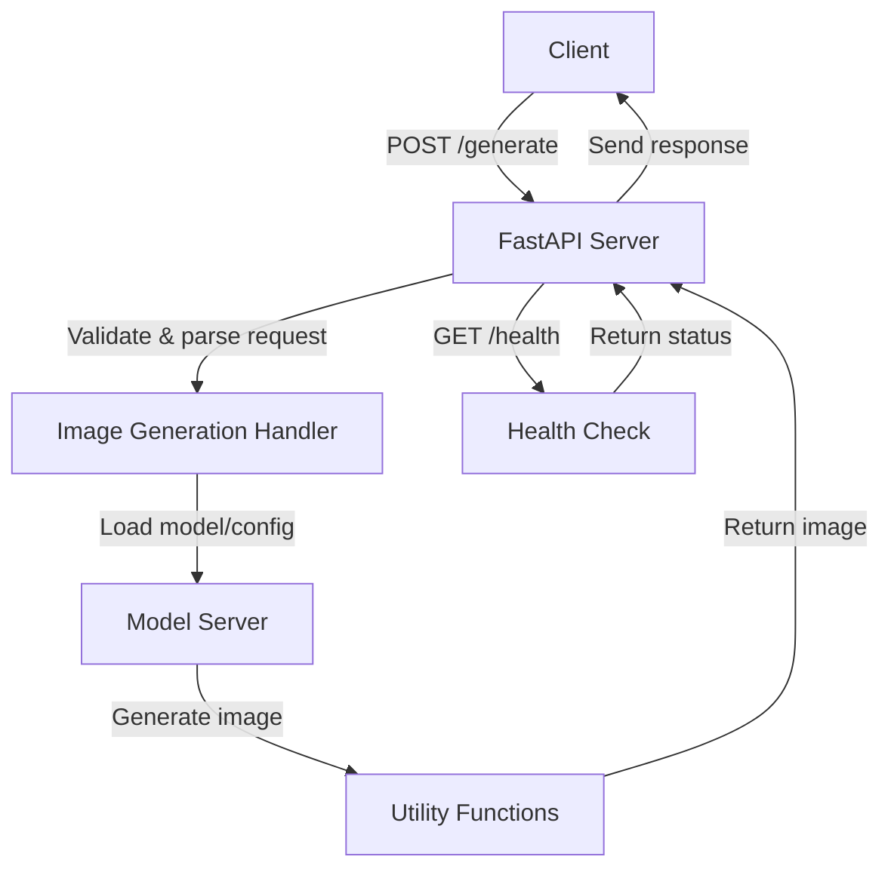

# Z-Image-Turbo Server

FastAPI server for Z-Image-Turbo (6B parameter text-to-image model from Tongyi-MAI).

## Performance

- **512×512**: ~0.9s
- **1024×1024**: ~3.5s
- **VRAM**: ~20GB peak

## Working Mechanism




## API

### POST /generate

```json
{
  "prompts": ["a cat wearing sunglasses"],
  "width": 1024,
  "height": 1024,
  "steps": 9,
  "seed": 42
}
```
> Build with 💖 for Pollinations.ai 