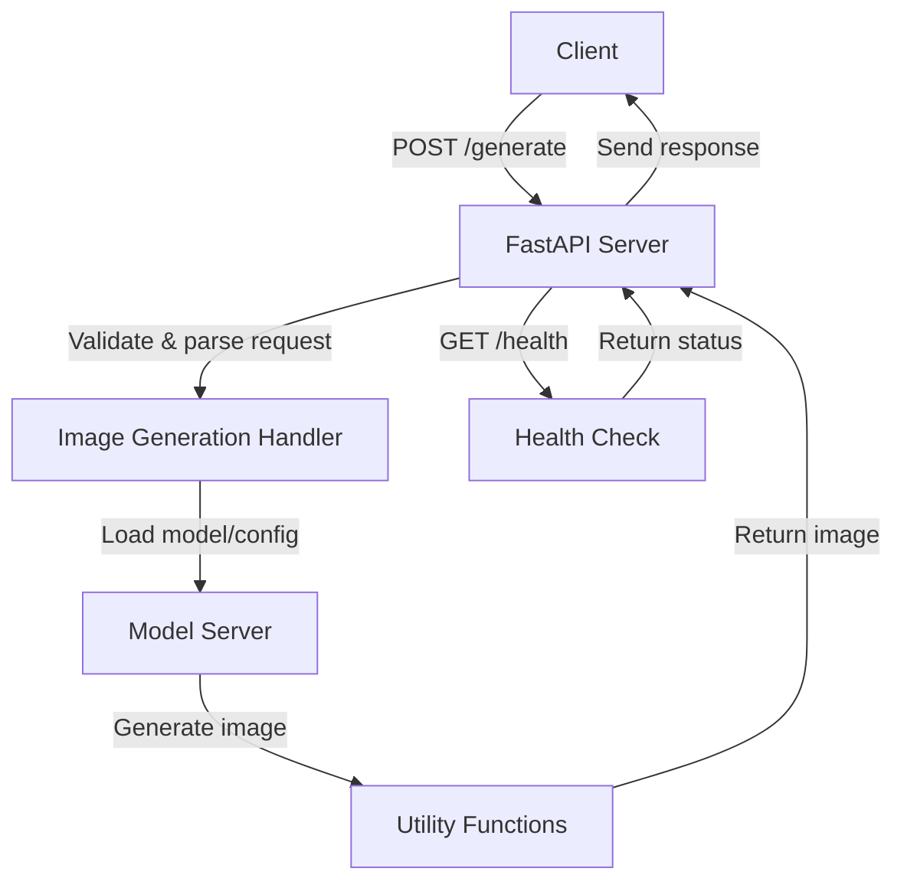

# Z-Image-Turbo Server

FastAPI server for Z-Image-Turbo (6B parameter text-to-image model from Tongyi-MAI).

## Performance

- **512×512**: ~0.9s
- **1024×1024**: ~3.5s
- **VRAM**: ~20GB peak

## Vast.ai deployment

Production migration uses a verified single-GPU Vast instance with at least
24GB VRAM and 80GB disk. RTX 5090 workers require the CUDA 12.8+ PyTorch
runtime installed by `setup-vast.sh`; the older cu124 Dockerfile is not
Blackwell-compatible. The setup also disables cuDNN's v8 API because its VAE
decode path exits with signal 11 on the tested RTX 5090 / driver 570 stack;
the legacy cuDNN API keeps the decode GPU-accelerated and stable. SPAN is run
without cuDNN on that stack for the same reason while remaining GPU-backed.

Create a remotely managed Cloudflare Tunnel whose public hostname routes to
`http://localhost:10002`, then provision each worker with the same tunnel token
and hostname:

```bash
PLN_GPU_TOKEN=... \
CLOUDFLARED_TUNNEL_TOKEN=... \
PUBLIC_HOSTNAME=zimage-vast.example.com \
bash setup-vast.sh
```

Using one remotely managed tunnel for the pool creates a Cloudflare replica per
Vast worker. Cloudflare balances requests across those replicas, while the
Pollinations registry sees one stable backend URL. Production currently uses
two RTX 5090 replicas so either worker can be removed without changing routing.

The setup defaults to `HEARTBEAT_ENABLED=false`, so a new worker cannot join
the production registry before validation. Run direct and tunnel verification,
then benchmark the real Z-Image pipeline:

```bash
bash verify-vast.sh
source .env.zimage
"$VENV/bin/python" benchmark-vast.py --duration 300 --concurrency 4
```

Enable production registration only after the worker passes verification and
the fleet projects to at least 1.25 completed images/second:

```bash
sed -i 's/export HEARTBEAT_ENABLED=false/export HEARTBEAT_ENABLED=true/' .env.zimage
/root/onstart.sh
```

Operational logs are `/root/zimage.log` and `/root/cloudflared.log`. Tokens are
stored only in mode-0600 files on the rental host.

## Working Mechanism


```mermaid
flowchart TD
  A[Client] -- POST /generate --> B[FastAPI Server]
  B -- Validate & parse request --> C[Image Generation Handler]
  C -- Load model/config --> D[Model Server]
  D -- Generate image --> E[Utility Functions]
  E -- Return image --> B
  B -- Send response --> A

  B -- GET /health --> F[Health Check]
  F -- Return status --> B
```


## API

### POST /generate

```json
{
  "prompts": ["a cat wearing sunglasses"],
  "width": 1024,
  "height": 1024,
  "steps": 9,
  "seed": 42
}
```
> Build with 💖 for Pollinations.ai
