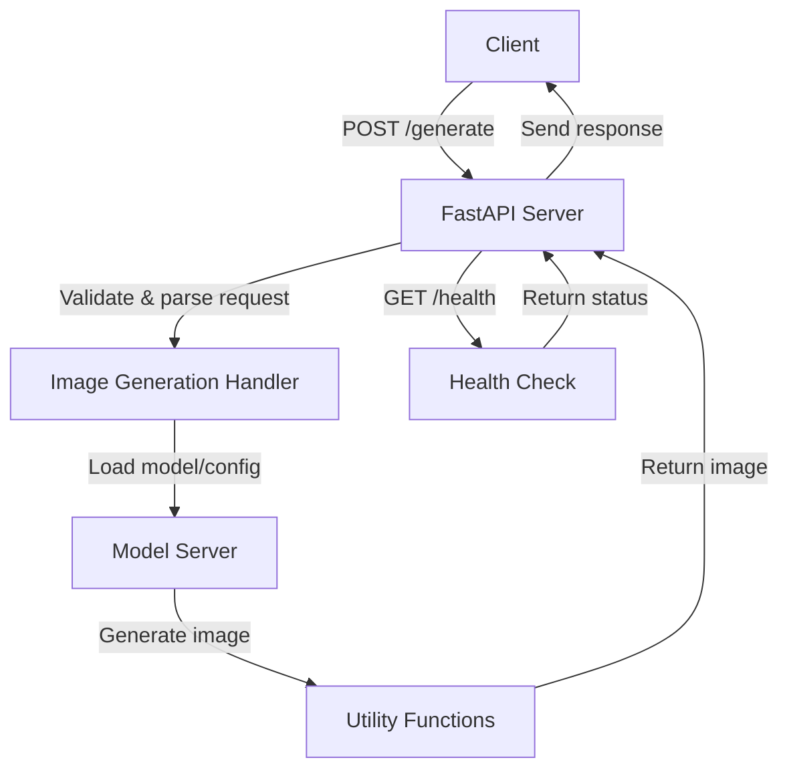

# Z-Image-Turbo Server

FastAPI server for Z-Image-Turbo (6B parameter text-to-image model from Tongyi-MAI).

## Performance

- **512×512**: ~0.9s
- **1024×1024**: ~3.5s
- **VRAM**: ~20GB peak

## Vast.ai deployment

Production migration uses a verified single-GPU Vast instance with at least
24GB VRAM and 80GB disk. RTX 5090 workers require the CUDA 12.8+ PyTorch
runtime installed by `setup-vast.sh`; the older cu124 Dockerfile is not
Blackwell-compatible. The setup also disables cuDNN's v8 API because its VAE
decode path exits with signal 11 on the tested RTX 5090 / driver 570 stack;
the legacy cuDNN API keeps the decode GPU-accelerated and stable. SPAN is run
without cuDNN on that stack for the same reason while remaining GPU-backed.

Create a remotely managed Cloudflare Tunnel whose public hostname routes to
`http://localhost:10002`, then provision each worker with the same tunnel token
and hostname:

```bash
PLN_GPU_TOKEN=... \
CLOUDFLARED_TUNNEL_TOKEN=... \
PUBLIC_HOSTNAME=zimage-vast.example.com \
bash setup-vast.sh
```

Using one remotely managed tunnel for the pool creates a Cloudflare replica per
Vast worker. Cloudflare balances requests across those replicas, while the
Pollinations registry sees one stable backend URL.

The setup defaults to `HEARTBEAT_ENABLED=false`, which prevents registry
registration but does not isolate a connector in the shared named tunnel.
Validate local health and generation while cloudflared is stopped. The setup
does not create `/root/.cloudflared/tunnel-enabled`, so reboots also remain
local-only. Creating that marker and starting `/root/onstart.sh` is the
production canary step: it waits for local `/health` and then joins the shared
tunnel pool, where it may immediately receive live traffic.

Run direct verification first, then start the tunnel and benchmark the real
Z-Image pipeline:

```bash
source .env.zimage
curl -fsS "http://127.0.0.1:$PORT/health"
# Run an authenticated local generation before starting the shared tunnel.
touch /root/.cloudflared/tunnel-enabled
/root/onstart.sh
bash verify-vast.sh
"$VENV/bin/python" benchmark-vast.py --duration 300 --concurrency 4
```

Enable production registration only after the worker passes verification and
the fleet projects to at least 1.25 completed images/second:

```bash
sed -i 's/export HEARTBEAT_ENABLED=false/export HEARTBEAT_ENABLED=true/' .env.zimage
/root/onstart.sh
```

Operational logs are `/root/zimage.log` and `/root/cloudflared.log`. Tokens are
stored only in mode-0600 files on the rental host. Some Vast hosts drop the SRV
DNS responses required by cloudflared despite resolving ordinary A records.
`setup-vast.sh` detects that condition and enables a reboot-safe local
DNS-over-HTTPS fallback; its log is `/root/tunnel-dns.log`. Hosts with working
SRV resolution retain the provider's resolver.

### July 2026 RTX 5090 canary

Instance `46003779` validated the hardened path on a California RTX 5090 at
`$0.351111/hr`:

- Full reboot restored the model, conditional DNS fallback, and all four
  Cloudflare Tunnel connections automatically.
- A 120-second concurrency-4 run completed 102 images with no errors:
  0.826 images/second, 4.69s p50, and 5.73s p95.
- 512×512, 1024×1024, and 768×1152 outputs were valid; a repeated fixed seed
  was byte-identical.
- The maximum accepted output area is 2,359,296 pixels (equivalent to
  1536×1536); larger requests return HTTP 422.
- A production soak observed successful requests and no model, tunnel, OOM, or
  traceback errors.

## Working Mechanism


```mermaid
flowchart TD
  A[Client] -- POST /generate --> B[FastAPI Server]
  B -- Validate & parse request --> C[Image Generation Handler]
  C -- Load model/config --> D[Model Server]
  D -- Generate image --> E[Utility Functions]
  E -- Return image --> B
  B -- Send response --> A

  B -- GET /health --> F[Health Check]
  F -- Return status --> B
```


## API

### POST /generate

```json
{
  "prompts": ["a cat wearing sunglasses"],
  "width": 1024,
  "height": 1024,
  "steps": 9,
  "seed": 42
}
```
> Build with 💖 for Pollinations.ai
