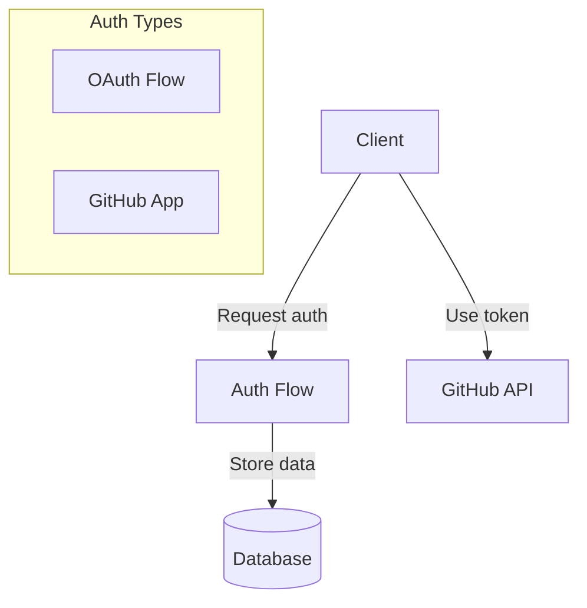
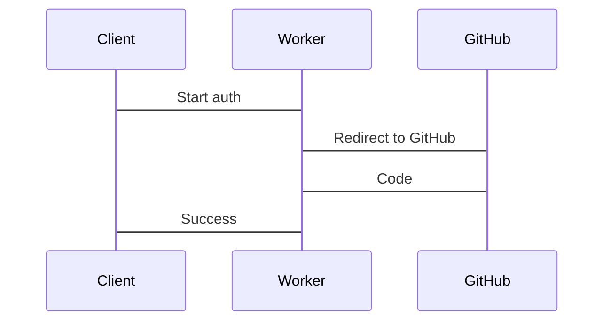
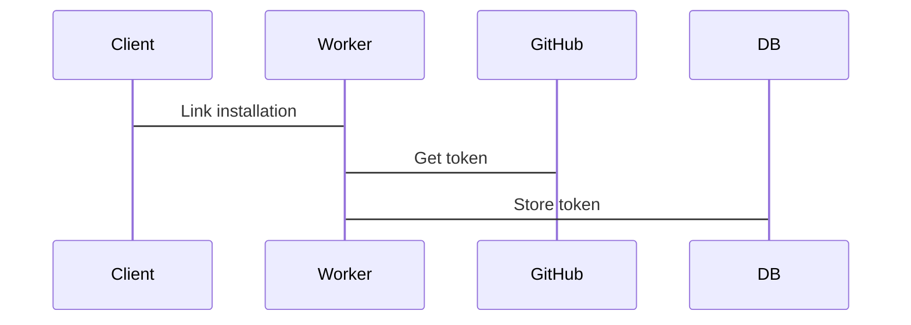

# GitHub Authentication System

A minimal GitHub OAuth and App authentication system for Pollinations MCP, built with Cloudflare Workers and D1.

## Key Features

- **Thin Proxy Design**: Minimal data transformation, direct pass-through of responses
- **OAuth Authentication**: Standard GitHub OAuth flow for user authentication
- **GitHub App Integration**: Higher rate limits via GitHub App installation tokens
- **Domain Whitelisting**: Security control for token usage
- **D1 Database**: Serverless storage for user data and tokens
- **Token Refresh**: Automatic refresh for expired tokens

## Architecture

## Authentication Flows

### OAuth Flow

- Client requests authentication via `/auth/start` endpoint
- Server creates session and returns GitHub authorization URL
- User authenticates on GitHub and is redirected to callback
- Server exchanges code for token and stores user data
- Client polls `/auth/status/:sessionId` for completion

### GitHub App Flow

- User links GitHub App installation to their account
- Server generates JWT for GitHub App authentication
- Server exchanges JWT for installation token
- Token is stored and refreshed automatically when expired

## API Endpoints

| Endpoint | Method | Description |
|----------|--------|-------------|
| `/auth/start` | GET | Initiates OAuth flow |
| `/auth/callback` | GET | OAuth callback |
| `/auth/status/:sessionId` | GET | Authentication status |
| `/app/link` | POST | Links GitHub App installation |
| `/token/:userId` | GET | Returns valid GitHub token |
| `/domains` | GET/POST/DELETE | Manages domain whitelist |

## Database Schema

### Users Table
- GitHub user ID and login
- OAuth access token
- GitHub App installation ID and token
- Token expiration timestamp
- Domain whitelist for security

### Auth Sessions Table
- Session ID for tracking OAuth flow
- State parameter for CSRF protection
- Status tracking (pending/complete/error)

## Implementation Notes

- JWT signing uses jose library for GitHub App authentication
- Token refresh happens automatically when tokens expire
- Domain verification ensures tokens are only used from approved domains
- Error handling follows the thin proxy principle with minimal transformation
- Built with Cloudflare Workers for serverless operation
