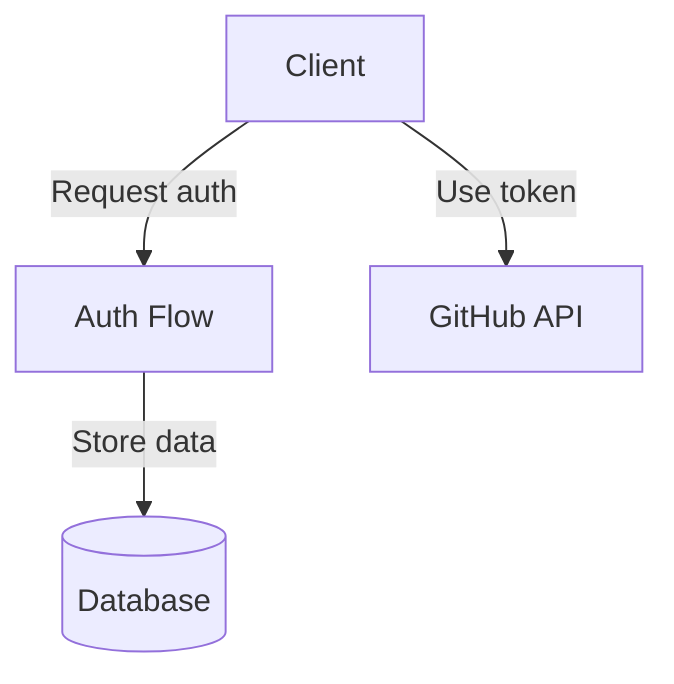
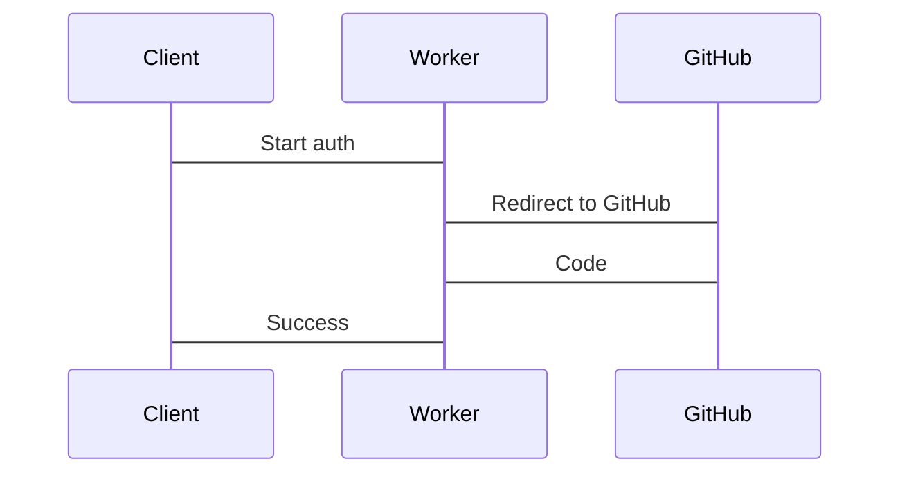

# GitHub Authentication System

A minimal GitHub OAuth and App authentication system for Pollinations MCP, built with Cloudflare Workers and D1, following the "thin proxy" design principle.

## Key Features

- **Thin Proxy Design**: Minimal data transformation, direct pass-through of responses
- **OAuth Authentication**: Standard GitHub OAuth flow for user authentication
- **GitHub App Integration**: Higher rate limits via GitHub App installation tokens
- **Domain Allowlisting**: Security control for token usage
- **D1 Database**: Serverless storage for user data and tokens

## Architecture

The system follows a simple architecture with minimal processing:



## Authentication Flows

### OAuth Flow

1. Client requests authentication via `/start` endpoint
2. Server creates session and returns GitHub authorization URL
3. User authenticates on GitHub and is redirected to callback
4. Server exchanges code for token and stores user data
5. Client polls `/status/:sessionId` for completion



## API Endpoints

| Endpoint | Method | Description |
|----------|--------|-------------|
| `/start` | GET | Initiates OAuth flow |
| `/callback` | GET | OAuth callback |
| `/status/:sessionId` | GET | Authentication status |
| `/api/user/:githubUserId/domains` | GET | Get user's allowlisted domains |
| `/api/user/:githubUserId/domains` | PUT | Update user's allowlisted domains |
| `/app/link` | POST | Links GitHub App installation |
| `/token/:userId` | GET | Returns valid GitHub token |
| `/health` | GET | Health check endpoint |

## Database Schema

The database schema is defined in `schema.sql` and includes:

### Users Table
```sql
CREATE TABLE IF NOT EXISTS users (
  github_user_id TEXT PRIMARY KEY,
  username TEXT NOT NULL,
  access_token TEXT,
  installation_id TEXT,
  installation_token TEXT,
  token_expires_at TEXT
);
```

### Auth Sessions Table
```sql
CREATE TABLE IF NOT EXISTS auth_sessions (
  id TEXT PRIMARY KEY,
  state TEXT NOT NULL,
  status TEXT NOT NULL,
  github_user_id TEXT,
  created_at TEXT NOT NULL,
  FOREIGN KEY (github_user_id) REFERENCES users(github_user_id)
);
```

## Development

### Prerequisites

- Node.js 18+
- npm or yarn
- Wrangler CLI (`npm install -g wrangler`)
- GitHub OAuth App credentials

### Setup

1. Clone the repository
2. Install dependencies:
   ```bash
   npm install
   ```
3. Create a `.dev.vars` file with your GitHub OAuth credentials:
   ```
   GITHUB_CLIENT_ID=your_client_id
   GITHUB_CLIENT_SECRET=your_client_secret
   REDIRECT_URI=http://localhost:8787/callback
   ```
4. Initialize the D1 database:
   ```bash
   npm run db:init
   ```

### Running Locally

Start the development server:
```bash
npm run dev
```

The server will be available at http://localhost:8787.

### Testing

The project includes several types of tests:

1. Run all tests:
   ```bash
   npm test
   ```

2. Run OAuth flow test (requires manual interaction):
   ```bash
   npm run test:oauth
   ```

3. Run integration tests:
   ```bash
   npm run test:integration
   ```

## Deployment

1. Set up the required secrets in Cloudflare:
   ```bash
   # Set the GitHub Client Secret as a Cloudflare secret
   echo "your_client_secret" | npx wrangler secret put GITHUB_CLIENT_SECRET --name github-app-auth
   ```

2. Configure the custom domain in wrangler.toml:
   ```toml
   # Custom Domain configuration
   [[routes]]
   pattern = "auth.pollinations.ai"
   custom_domain = true
   ```

3. Deploy the worker:
   ```bash
   npm run deploy
   ```

4. Create the D1 database in production:
   ```bash
   npx wrangler d1 create github_auth --production
   npx wrangler d1 execute github_auth --file=schema.sql --production
   ```

5. Verify the deployment:
   - Worker URL: https://github-app-auth.thomash-efd.workers.dev
   - Custom Domain: https://auth.pollinations.ai

## Design Principles

This project follows the "thin proxy" design principle:

1. **Minimal Data Transformation**: Pass through data with minimal changes
2. **Direct Response Handling**: Avoid unnecessary processing of responses
3. **Simple Error Handling**: Keep error handling straightforward
4. **No Unnecessary Metadata**: Don't add extra metadata to normalize APIs
5. **Keep It Simple**: Avoid complex logic when simple solutions work

## Project Structure

```
github-app-auth/
├── src/                  # Source code
│   ├── index.ts          # Main entry point
│   ├── db.ts             # Database operations
│   ├── handlers.ts       # API handlers
│   ├── github.ts         # GitHub API interactions
│   ├── githubApp.ts      # GitHub App functionality
│   └── types.ts          # TypeScript types
├── tests/                # Test files
│   ├── github-app.test.ts # Integration tests
│   ├── oauth-flow-test.ts # OAuth flow test
│   └── vitest.config.ts   # Test configuration
├── schema.sql            # Database schema
├── wrangler.toml         # Cloudflare configuration
└── package.json          # Dependencies and scripts
```

## License

ISC
