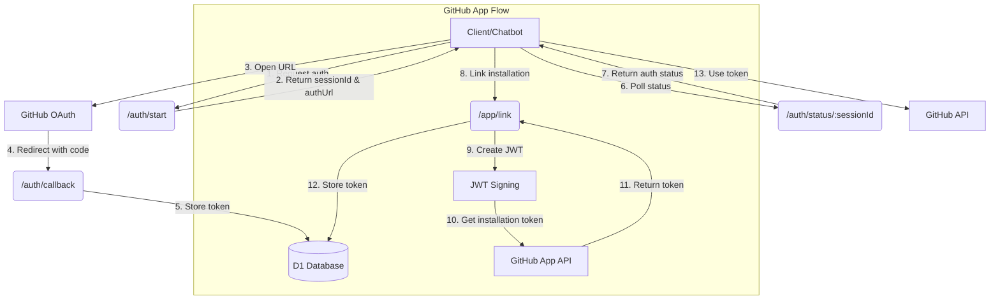
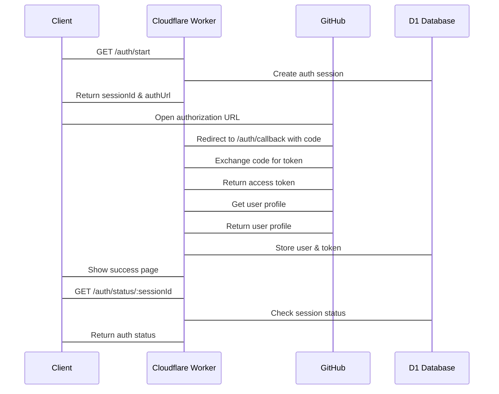
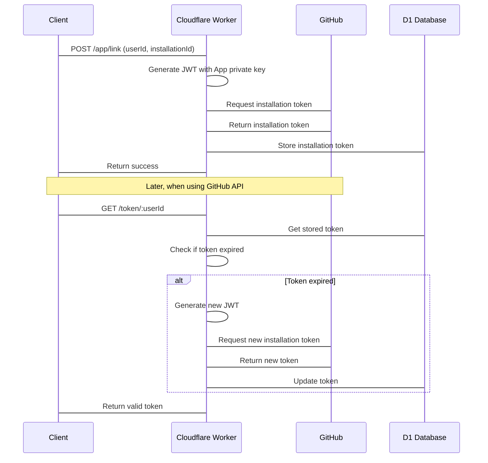

# GitHub Authentication System

A minimal GitHub OAuth and App authentication system for Pollinations MCP, built with Cloudflare Workers and D1.

## Architecture

## Authentication Flows

### OAuth Flow

### GitHub App Flow

## API Endpoints

| Endpoint | Method | Description |
|----------|--------|-------------|
| `/auth/start` | GET | Initiates OAuth flow, returns sessionId and authUrl |
| `/auth/callback` | GET | OAuth callback, exchanges code for token |
| `/auth/status/:sessionId` | GET | Returns authentication status for session |
| `/app/link` | POST | Links user with GitHub App installation |
| `/app/installations` | GET | Lists available GitHub App installations |
| `/token/:userId` | GET | Returns a valid GitHub token for user |
| `/domains` | GET/POST/DELETE | Manages domain whitelist for token usage |

## Database Schema

- **users**: Stores GitHub user info and tokens
  - `github_id`: GitHub user ID (primary key)
  - `github_login`: GitHub username
  - `access_token`: OAuth access token
  - `app_installation_id`: GitHub App installation ID
  - `installation_token`: GitHub App installation token
  - `token_expiry`: Token expiration timestamp
  - `domain_whitelist`: Allowed domains for token usage

- **auth_sessions**: Tracks OAuth flow
  - `session_id`: Unique session ID (primary key)
  - `user_id`: GitHub user ID (foreign key)
  - `state`: CSRF protection state
  - `status`: Authentication status (pending/complete/error)

## Implementation Notes

- Follows "thin proxy" design principle with minimal data transformation
- Uses JWT signing for GitHub App authentication
- Implements token refresh logic for expired tokens
- Supports domain whitelisting for security
- Built with Cloudflare Workers and D1 for serverless operation
