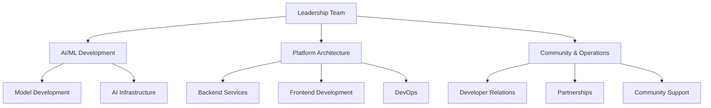

## Team Information

### Leadership Team
Our team combines expertise in AI/ML, platform development, and open-source community building.

#### Core Team Profiles
- **AI/ML Development Lead**
  - Expertise in machine learning models
  - Experience with large-scale AI deployments
  - Open source contribution background

- **Platform Architecture Lead**
  - Full-stack development expertise
  - Scalable systems design
  - Cloud infrastructure management

- **Community & Operations Lead**
  - Open source community management
  - Developer relations
  - Strategic partnerships

### Organizational Structure

### Team Growth Plan

#### Q1-Q2 2025
1. **Technical Expansion**
   - Senior ML Engineers (2)
   - Full-stack Developers (2)
   - DevOps Engineer (1)

2. **Operations**
   - Business Development Lead
   - Community Manager
   - Technical Documentation Writer

#### Q3-Q4 2025
1. **Technical Roles**
   - ML Research Scientists (2)
   - Platform Engineers (2)
   - Quality Assurance Engineer

2. **Business Development**
   - Partnership Manager
   - Marketing Lead
   - Customer Success Manager

### Current Team Distribution
- 60% Technical Roles
- 25% Operations & Community
- 15% Business Development

### Hiring Philosophy
1. **Core Values**
   - Open source contribution history
   - Community-oriented mindset
   - Technical excellence
   - Collaborative approach

2. **Remote-First Culture**
   - Distributed team structure
   - Asynchronous communication
   - Regular virtual collaboration
   - In-person team events

3. **Development Focus**
   - Continuous learning
   - Knowledge sharing
   - Innovation encouragement
   - Research opportunities 