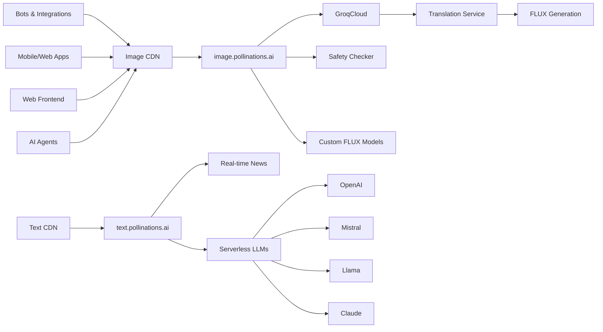

## Product & Technology Overview

### Platform Architecture

### Core Services

#### 1. Image Generation API
- Endpoint: `image.pollinations.ai/prompt/{prompt}`
- Features:
  - No authentication required
  - Customizable parameters
  - Multiple model support
  - Safety filtering
  - CDN delivery

#### 2. Text Generation API
- Endpoint: `text.pollinations.ai/{prompt}`
- Features:
  - Multiple LLM support
  - OpenAI compatibility
  - Streaming responses
  - Context management
  - Model selection

#### 3. Developer Tools
- React Hooks
- Python SDK
- API Documentation
- Code Examples
- Integration Guides

### Technical Infrastructure

#### Cloud Services
- AWS EC2 for CPU Operations
- GPU Cloud Partners:
  - AWS Activate
  - Google Cloud
  - OVH Cloud
  - Azure

#### Model Infrastructure
- Custom FLUX Models
- GroqCloud Integration
- Translation Services
- Safety Checking

#### Scaling & Performance
- Global CDN
- Load Balancing
- Auto-scaling
- Cache Optimization

### Development Roadmap

#### Q1 2025
1. **Infrastructure**
   - Enhanced GPU utilization
   - Improved credit management
   - Service reliability upgrades

2. **Features**
   - New model integrations
   - Advanced safety filters
   - Performance optimizations

#### Q2 2025
1. **Platform**
   - Enterprise features
   - Advanced analytics
   - Custom model support

2. **Developer Tools**
   - SDK improvements
   - New language support
   - Enhanced documentation

### Security & Privacy

#### Data Protection
- Zero data storage
- Anonymous usage
- Privacy by design
- GDPR compliance

#### Infrastructure Security
- DDoS protection
- Rate limiting
- Access controls
- Monitoring systems

### Intellectual Property

#### Open Source
- MIT License
- Public repositories
- Community contributions
- Documentation

#### Proprietary Components
- Custom models
- Infrastructure code
- Integration tools
- Enterprise features 