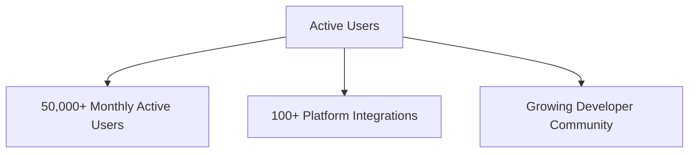
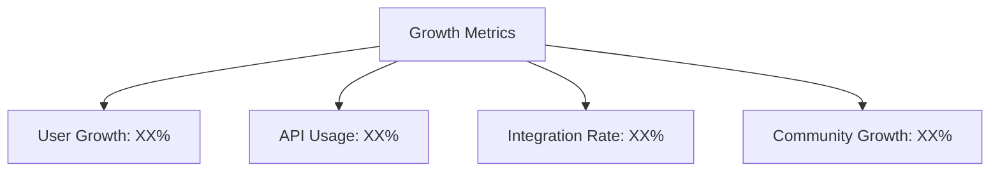

## Traction & Metrics

### Key Performance Indicators

#### User Growth

#### Usage Metrics
- 8+ million images generated monthly
- Current rate: 300,000 images per day
- 14 million images in last quarter
- Continuous growth trajectory

#### Service Distribution
- 90% Text-to-Image Generation
- 10% Text-to-Text Generation
- Growing multi-modal applications

### Integration Success Stories

#### Community Projects
1. **LLM Integrations**
   - SillyTavern
   - Qwen-Agent
   - LobeChat
   - Unity AI Lab

2. **Social Bots**
   - Discord Bot
   - WhatsApp Group
   - Telegram Bot
   - Community Platforms

3. **Mobile & Web Applications**
   - AI Image Generators
   - Chat Applications
   - Creative Tools
   - Educational Platforms

### Platform Performance

#### Reliability Metrics
- Service Uptime: XX%
- API Response Time: XXms
- Error Rate: <X%
- Request Success Rate: XX%

#### Infrastructure Scaling
- Peak Concurrent Users: XX,XXX
- Daily API Calls: XXX,XXX
- Data Processing: XX TB/day
- CDN Performance: XX ms latency

### Community Engagement

#### Developer Community
- GitHub Stars: XX,XXX
- Active Contributors: XXX
- Monthly Pull Requests: XX
- Documentation Views: XX,XXX

#### Support Metrics
- Discord Members: X,XXX
- Average Response Time: XX hours
- Support Tickets Resolved: XX%
- Community Satisfaction: XX%

### Growth Trajectory

#### Monthly Growth Rate

#### Future Projections
1. **Short Term (6 Months)**
   - User Base: XXX,XXX
   - Daily Generations: X,XXX,XXX
   - Platform Integrations: XXX

2. **Medium Term (12 Months)**
   - User Base: X,XXX,XXX
   - Daily Generations: XX,XXX,XXX
   - Platform Integrations: X,XXX

### Partnership Development

#### Current Partners
- Cloud Service Providers
  - AWS Activate
  - Google Cloud
  - OVH Cloud
  - Azure

#### Technology Partners
- LLMPlayground.net
- Karma.YT
- NVIDIA Inception
- Outlier Ventures

### Market Validation

#### User Testimonials
- Developer Feedback
- Integration Success Stories
- Community Reviews
- Partner Endorsements

#### Industry Recognition
- Technology Awards
- Media Coverage
- Industry Partnerships
- Community Recognition 