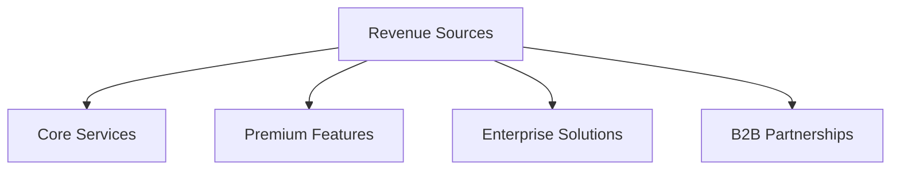

## Financial Overview

### Current Financial Status

#### Revenue Streams
1. **Core Services (Free)**
   - Image Generation API
   - Text Generation API
   - Basic Integration Tools

2. **Premium Services (Planned)**
   - Enterprise Features
   - Priority Processing
   - Advanced Analytics
   - Custom Solutions

3. **Future Revenue Sources**
   - B2B Partnerships
   - Enterprise Licensing
   - Premium API Access
   - Support Services

### Operating Costs

#### Infrastructure
1. **Cloud Services**
   - AWS EC2 Instances
   - GPU Processing
   - CDN Distribution
   - Storage Solutions

2. **Development Resources**
   - Team Salaries
   - Tools & Software
   - Testing Resources
   - Development Infrastructure

3. **Operational Expenses**
   - Administrative Costs
   - Legal & Compliance
   - Marketing & Community
   - Support Infrastructure

### Financial Projections

#### Revenue Growth

#### 12-Month Forecast
1. **Q1-Q2 2025**
   - Infrastructure Investment
   - Team Expansion
   - Product Development
   - Marketing Initiatives

2. **Q3-Q4 2025**
   - Revenue Generation
   - Market Expansion
   - Partnership Development
   - Scaling Operations

### Funding Requirements

#### Current Round
- Amount: $X,XXX,XXX
- Timeline: Q2 2025
- Type: Series A

#### Use of Funds
1. **Technology (40%)**
   - Infrastructure Scaling
   - Product Development
   - Technical Team Growth
   - R&D Initiatives

2. **Operations (30%)**
   - Team Expansion
   - Office Setup
   - Legal & Administrative
   - Marketing & Sales

3. **Reserve (30%)**
   - Working Capital
   - Contingency Fund
   - Strategic Opportunities
   - Market Expansion

### Financial Strategy

#### Short-Term (12 Months)
1. **Revenue Development**
   - Launch Premium Features
   - Implement B2B Strategy
   - Develop Enterprise Solutions
   - Optimize Operations

2. **Cost Management**
   - Infrastructure Optimization
   - Resource Allocation
   - Efficiency Improvements
   - Strategic Partnerships

#### Long-Term (24-36 Months)
1. **Growth Initiatives**
   - Market Expansion
   - Product Development
   - Team Scaling
   - Partnership Growth

2. **Sustainability**
   - Revenue Diversification
   - Cost Optimization
   - Market Position
   - Community Growth

### Key Financial Metrics

#### Performance Indicators
- Monthly Burn Rate
- Revenue Growth Rate
- Customer Acquisition Cost
- Lifetime Value Projections

#### Operational Metrics
- Infrastructure Costs
- Development Expenses
- Marketing Investment
- Support Costs 