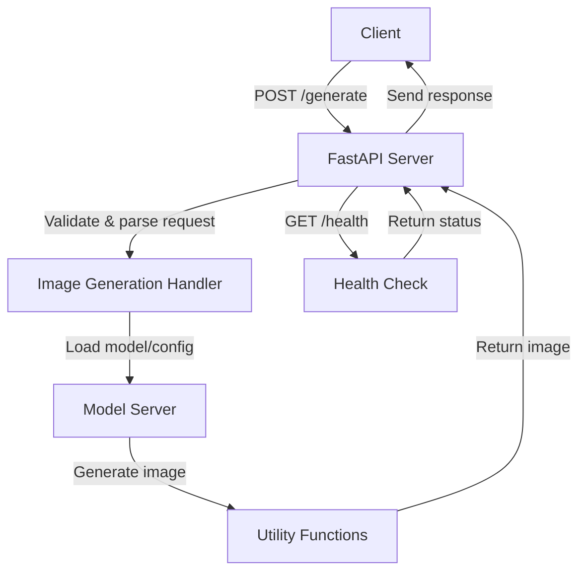

# Z-Image-Turbo Server

FastAPI server for Z-Image-Turbo (6B parameter text-to-image model from Tongyi-MAI).

## Performance

- **512×512**: ~0.9s
- **1024×1024**: ~3.5s
- **VRAM**: ~20GB peak

## Vast.ai deployment

Production migration uses a verified single-GPU Vast instance with at least
24GB VRAM and 80GB disk. RTX 5090 workers require the CUDA 12.8+ PyTorch
runtime installed by `setup-vast.sh`; the older cu124 Dockerfile is not
Blackwell-compatible. The setup also disables cuDNN's v8 API because its VAE
decode path exits with signal 11 on the tested RTX 5090 / driver 570 stack;
the legacy cuDNN API keeps the decode GPU-accelerated and stable. SPAN is run
without cuDNN on that stack for the same reason while remaining GPU-backed.

Create a remotely managed Cloudflare Tunnel whose public hostname routes to
`http://localhost:10002`, then provision each worker with the same tunnel token
and hostname:

```bash
PLN_GPU_TOKEN=... \
CLOUDFLARED_TUNNEL_TOKEN=... \
PUBLIC_HOSTNAME=zimage-vast.example.com \
bash setup-vast.sh
```

Using one remotely managed tunnel for the pool creates a Cloudflare replica per
Vast worker. Cloudflare balances requests across those replicas, while the
Pollinations registry sees one stable backend URL.

Each worker admits at most three generation requests: one running and two
waiting. Additional requests receive `503 Queue full`, which lets gen route
the request to the configured Fal fallback instead of building an unbounded
local queue. `QUEUE_LIMIT=3` is persisted by `setup-vast.sh` and can be
overridden when provisioning. This absorbs short local bursts before paying
for Fal while still bounding worst-case queue growth.

Deploy the gen fallback before enabling this queue limit on production workers.
After updating a worker, verify local saturation returns 503, normal generation
still succeeds, and production telemetry attributes any overflow to
`zimage-fal`. Only then drain and destroy a redundant Vast connector.

The setup defaults to `HEARTBEAT_ENABLED=false`, which prevents registry
registration but does not isolate a connector in the shared named tunnel.
Validate local health and generation while cloudflared is stopped. The setup
does not create `/root/.cloudflared/tunnel-enabled`, so reboots also remain
local-only. For isolated public-path qualification, use a dedicated canary
tunnel and hostname with registration disabled. Creating that marker and
starting `/root/onstart.sh` waits for local `/health` before connecting the
configured tunnel. If it is the shared production tunnel, the worker may
immediately receive live traffic, even with registration disabled.

Automated replacement preparation must stop before joining the shared
production tunnel. Follow the fleet-wide qualification and human approval
policy in
[`manage-vast-gpu-fleet`](../../../../.claude/skills/manage-vast-gpu-fleet/SKILL.md).

Run direct verification first, then start the isolated canary tunnel and
benchmark the real Z-Image pipeline (not a shared production connector):

```bash
source .env.zimage
curl -fsS "http://127.0.0.1:$PORT/health"
# PUBLIC_IP must be the dedicated canary hostname during qualification.
# Run an authenticated local generation before starting the canary tunnel.
touch /root/.cloudflared/tunnel-enabled
/root/onstart.sh
curl -fsS --retry 12 --retry-all-errors --retry-delay 2 --max-time 5 "https://$PUBLIC_IP/health"
bash verify-vast.sh
"$VENV/bin/python" benchmark-vast.py --duration 300 --concurrency 3
```

Compare measured throughput and latency with recent demand and the permitted
Fal spillover budget; do not assume a fixed capacity from the GPU name. The
older 1.25 images/second target was not demonstrated by the September canary.
Promotion requires explicit human approval of the measured capacity. After
approval and any separately approved connector-token replacement, configure
the production hostname and tunnel before enabling registration:

```bash
# Confirm PUBLIC_IP and the connector token identify the production tunnel.
sed -i 's/export HEARTBEAT_ENABLED=false/export HEARTBEAT_ENABLED=true/' .env.zimage
/root/onstart.sh
```

When retiring the old connector, removing `tunnel-enabled` prevents reconnects
after container restart but does not stop the running screen restart loop.
Drain cloudflared with its supervisor prevented from restarting it, and verify
that no live connector returns before declaring the replacement the sole worker.

Operational logs are `/root/zimage.log` and `/root/cloudflared.log`. Tokens are
stored only in mode-0600 files on the rental host. Some Vast hosts drop the SRV
DNS responses required by cloudflared despite resolving ordinary A records.
`setup-vast.sh` detects that condition and enables a reboot-safe local
DNS-over-HTTPS fallback; its log is `/root/tunnel-dns.log`. Hosts with working
SRV resolution retain the provider's resolver. When the production tunnel is
disabled, `/root/onstart.sh` restores the provider resolver before stopping the
local DNS helper so isolated model restarts keep outbound DNS. Hugging Face Xet
is disabled by default because its token/download path failed on otherwise
healthy Vast hosts; standard HTTP and process-level retries resume reliably
from the local cache.

### September 2026 RTX 5090 qualification

Instance `52731560` preserved the production checkpoint revision, Z-Image code,
and runtime dependencies. Qualification used a dedicated Cloudflare tunnel:

- 134/134 mixed-size generations completed in 122.502 seconds at concurrency
  3: **65.6 images/minute**, 2.737s p50, 2.752s p95, and 2.859s p99. This is
  measured benchmark throughput, not an SLA or a per-user allowance.
- Local/public fixed-seed parity passed at 512×512, 1024×1024, and 768×1152.
  Maximum 1536×1536 generation passed; oversized input returned 422 and
  unauthenticated requests returned 403.
- An eight-request burst admitted three and rejected five with intentional
  queue-full 503s, each within 61ms on the public path.
- Full container reboot restored the model in approximately eight seconds
  and all four tunnel connections in fourteen seconds; post-reboot parity
  passed. No CUDA, OOM, or traceback errors occurred during qualification.
- Local model readiness preceded initial tunnel readiness; the first public
  probe returned 530. Wait for public health before running verification.

### July 2026 RTX 5090 canary

Instance `46003779` validated the hardened path on a California RTX 5090 at
`$0.351111/hr`:

- Full reboot restored the model, conditional DNS fallback, and all four
  Cloudflare Tunnel connections automatically.
- A 120-second concurrency-4 run completed 102 images with no errors:
  0.826 images/second, 4.69s p50, and 5.73s p95.
- 512×512, 1024×1024, and 768×1152 outputs were valid; a repeated fixed seed
  was byte-identical.
- The maximum accepted output area is 2,359,296 pixels (equivalent to
  1536×1536); larger requests return HTTP 422.
- A production soak observed successful requests and no model, tunnel, OOM, or
  traceback errors.

## Working Mechanism




## API

### POST /generate

```json
{
  "prompts": ["a cat wearing sunglasses"],
  "width": 1024,
  "height": 1024,
  "steps": 9,
  "seed": 42
}
```
> Build with 💖 for Pollinations.ai
