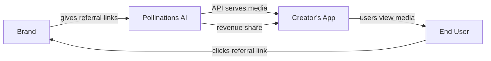
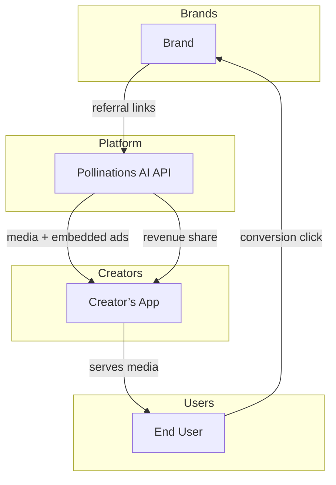
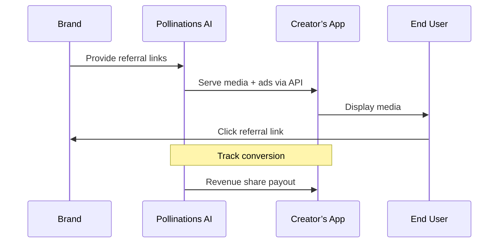

Thought for a few seconds


* **Yes, it makes sense**: Pollinations AI provides generative-media via an API to creators (teens, indie hackers), who build apps/bots. End users consume media in those apps; if they click a brand’s referral link embedded in the media, Pollinations earns revenue and shares it with the creator.

## Three Mermaid diagram options

### 1. Simple linear flowchart



### 2. Subgraphs for stakeholder groups



### 3. Sequence diagram with interactions




Thought for a few seconds


Here are three more “living ecosystem” ASCII layouts with **clearly marked flows** between nodes:

---

## Option 3: “Spiral Nutrient Cycle”

```
                   Consumer
                      ▲
                      │  “click & convert”
                      │
              ↗────────┴────────↖
      “media + ads”  Pollinations  “revenue-share”
                      AI  
              ↘────────┬────────↙
                      │  “serve API”
                      │
                   Affiliate
```

* **Flows:**

  * **Affiliate → Pollinations AI:** serve API
  * **Pollinations AI → Affiliate:** media + ads
  * **Affiliate → Consumer:** display & serve
  * **Consumer → Pollinations AI:** click & convert
  * **Pollinations AI → Affiliate:** revenue-share

---

## Option 4: “Organic Petal Ring”

```
              (Advertiser)
                   ☀
                   │  provides links
                   ▼
         ┌────────────────────┐
    “referral”│  Pollinations AI  │“media+ads”
         └────────────────────┘
          ▲       ▲      ▲
          │       │      │
  “payout”│       │      │“serve”
          │       │      │
      Affiliate ───▶ Consumer
          “display”    “consume”
```

* **Flows around the petal ring:**

  * Advertiser → Pollinations AI: referral links
  * Pollinations AI → Affiliate: media+ads
  * Affiliate → Consumer: display
  * Consumer → Pollinations AI: consume & click
  * Pollinations AI → Affiliate: payout

---

## Option 5: “Cell with Cytoplasm Streams”

```
         ┌─────────────┐
      ←─│ Advertiser  │─► “referral links”
         └─────┬───────┘
               │
               │
       ┌───────▼────────┐
       │  ● Pollinations ● │
       │  ●      AI      ● │
       └───────┬────────┘
               │
   “media & ads”│  “revenue-share”
               │
       ┌───────▼───────┐
       │   Affiliate   │
       └───────┬───────┘
               │
               ▼
          Consumer
         “display & click”
```

* **Streams:**

  * **Advertiser ↔ Pollinations AI:** referral links
  * **Pollinations AI → Affiliate:** media & ads
  * **Affiliate → Consumer:** display
  * **Consumer → Pollinations AI:** click & conversion
  * **Pollinations AI → Affiliate:** revenue-share

---

Feel free to tweak icons or labels to match your exact branding style!
