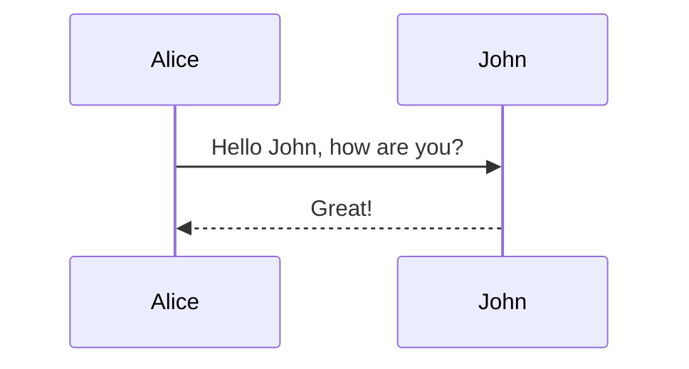

# Slidev Syntax Guide

This guide provides a comprehensive overview of Slidev syntax and features to help you create beautiful presentations with markdown.

## Basic Structure

Slidev presentations are written in Markdown files. The default entry file is `./slides.md`.

### Slide Separators

Use `---` with a new line before and after to separate slides:

```md
# Slide 1

Content for slide 1

---

# Slide 2

Content for slide 2
```

## Frontmatter & Configuration

### Headmatter (First Slide)

The first frontmatter block in your presentation is called "headmatter" and configures the entire slide deck:

```yaml
---
theme: default
title: My Presentation
background: https://source.unsplash.com/collection/94734566/1920x1080
class: text-center
highlighter: shiki
lineNumbers: false
drawings:
  persist: false
transition: slide-left
mdc: true
---
```

### Per-Slide Frontmatter

Each slide can have its own frontmatter configuration:

```yaml
---
layout: center
background: ./images/background-1.jpg
class: text-white
transition: fade
---
```

## Layouts

Slidev provides various built-in layouts:

| Layout | Description |
|--------|-------------|
| `default` | Basic layout for general content |
| `cover` | Title slide with prominent styling |
| `center` | Centers content horizontally and vertically |
| `intro` | Introduction slide with author info |
| `statement` | For making bold statements |
| `quote` | For displaying quotations |
| `section` | Section divider slide |
| `image` | Displays an image as the main content |
| `image-right` | Image on right, content on left |
| `image-left` | Image on left, content on right |
| `two-cols` | Two-column layout |
| `two-cols-header` | Two columns with a header |
| `iframe` | Embeds a webpage |
| `iframe-right` | Webpage on right, content on left |
| `iframe-left` | Webpage on left, content on right |
| `end` | Final slide |

Example usage:

```yaml
---
layout: two-cols
---

# Left Column
This appears on the left

::right::

# Right Column
This appears on the right
```

## Markdown Features

### Text Formatting

Standard Markdown formatting works:

```md
# Heading 1
## Heading 2

**Bold text**
*Italic text*
~~Strikethrough~~

- Bullet points
- Another point
  - Nested point

1. Numbered list
2. Second item
```

### Code Blocks

Code blocks with syntax highlighting:

```md
```js
console.log('Hello, Slidev!')
```
```

With line highlighting:

```md
```js {2|1-3|4}
let a = 1;
let b = 2;
let c = a + b;
console.log(c);
```
```

### LaTeX Support

Math equations using LaTeX:

```md
$$ E = mc^2 $$
```

### Diagrams

Mermaid diagrams:

```md

```

## Animations

### Click Animations

Show elements progressively with clicks:

```md
<v-click>This appears after a click</v-click>

<div v-click>This also appears after a click</div>

<v-clicks>
- This item appears first
- This item appears second
- This item appears third
</v-clicks>
```

Hide elements after clicking:

```md
<div v-click.hide>This disappears after a click</div>
```

### Motion Animations

Apply motion to elements:

```html
<div 
  v-motion
  :initial="{ x: -80 }"
  :enter="{ x: 0 }"
  :leave="{ x: 80 }"
>
  This slides in from the left
</div>
```

### Slide Transitions

Set transitions between slides:

```yaml
---
transition: slide-left
---
```

Available transitions:
- `fade` - Crossfade
- `fade-out` - Fade out then fade in
- `slide-left` - Slide to the left
- `slide-right` - Slide to the right
- `slide-up` - Slide upward
- `slide-down` - Slide downward
- `view-transition` - Uses View Transitions API

## Components

Slidev includes useful components:

```md
<Tweet id="1390115482657726468" />

<Youtube id="9uOzbSYZ9-Y" />

<Toc maxDepth="2" />
```

## Notes

Add presenter notes that only show in presenter view:

```md
# Slide Title

Slide content

<!-- This is a presenter note that only you can see -->
```

## Advanced Features

### Custom Styles

Add custom CSS to your slides:

```md
<style>
h1 {
  color: #6A5ACD;
}
</style>
```

### Scoped Styles

Apply styles only to the current slide:

```md
---
class: my-custom-class
---

# Styled Slide

<style>
.my-custom-class {
  background-color: #f8f8f8;
}
</style>
```

### Importing Slides

Import slides from other files:

```md
---
src: ./path/to/other-slides.md
---
```

## Tips & Best Practices

1. Keep slides simple and focused
2. Use layouts appropriate for your content
3. Leverage animations to guide attention
4. Use presenter notes for additional context
5. Test your presentation in presenter mode before delivering

## Running Slidev

Start the development server:
```bash
npx slidev
```

Build for production:
```bash
npx slidev build
```

Export to PDF:
```bash
npx slidev export
```
