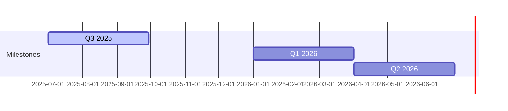

# 🌀 Pollinations.ai

## Roblox for AI

The lightning‑fast path from idea ➜ monetised generative‑AI product.

<!-- 
SLIDE GUIDANCE:
- Emphasize the "Roblox for AI" analogy - it's our core identity
- Connection worth making: Democratizing AI creation similar to how Roblox democratized game creation
- Consider adding a visual showing the parallel between Roblox (games) and Pollinations (AI)
- "Lightning-fast path" is good positioning - focus on speed-to-market advantage
-->

---

# 🚀 Traction

* **3 M** monthly active users • **80 M** media generated every month
* **14 M+** plays on flagship Roblox "AI Character RP" *(our live ad-revenue pilot)*
* 300+ live apps • 13 k Discord • 1.7 k⭐ GitHub
* *Key Markets: 30% CN, 13% US, 13% EU, 6% IN*

<!-- 
SLIDE GUIDANCE:
- DATA DISCREPANCY: Media generated metric varies between docs (80M vs 100M) - confirm latest before presentation
- Highlight Roblox integration as proof of concept for monetization model - this is a working example
- The 30% China presence is significant - emphasize our global reach as differentiator
- Consider converting the platform table below to logos/visuals for better impact
- Key growth metrics could be added if available (MoM/QoQ growth percentages)
-->

| Platforms | Communities | OSS    |
| --------- | ----------- | ------ |
| Roblox    | Discord     | GitHub |
| Pixelynx  | Twitch      | npm    |

---

# 😖 Problem

## Developers

* Complex & costly AI infra
* Keys, auth & billing pain
* No built‑in monetisation

## End Users

* Paywalls & forced sign‑ups
* Data‑privacy worries
* Limited customisation

*The current ecosystem forces painful trade-offs.*

<!-- 
SLIDE GUIDANCE:
- Frame problem as a dual pain point affecting both developers AND users
- Contrast this with our solution in next slide
- The problem statement is clear - but could potentially add 1-2 concrete examples of developer/user friction
- Emphasize the "forced trade-offs" concept - this sets up our value proposition (no trade-offs needed)
- Consider mentioning competition implicitly (without naming) by referencing their limitations
-->

---

# ✨ The Pollinations Fix

## ⚡ Zero‑Friction API

* Copy‑paste URL → instant media
* First call free • No ops

## 🚀 `pollinations‑init` Launchpad

* 1 command scaffold & deploy
* Built‑in ads & rev‑share

```bash
# Demo snippet
curl https://image.pollinations.ai/prompt/galactic%20otter
open myapp.com            # generated via pollinations‑init
```

<!-- 
SLIDE GUIDANCE:
- ENHANCEMENT NEEDED: Add bullet points about hosting/CI/CD handling - it's a key differentiator
- Consider adding: "Handles hosting, secrets, CI/CD" and "Developer never leaves editor"
- This is a good place for a quick demo or GIF showing the one-command workflow
- Explain how our architecture (end-to-end-architecture.md) enables the built-in monetization
- Consider mentioning the developer stays in their editor - no complex dashboards
- The curl example is compelling - worth doing this live during presentation
-->

---

# 🌍 Market & Business Model

## Market 📊

* Gen‑AI creator economy **>\$10 B** TAM
* Youth Ad Market: **\$247 B** TAM → **\$99 B** SAM → **\$0.5 B** SOM
* Doubling YoY (Gartner 2025) - *GenAI market*

## Two-Sided Market 🔄

* **Brands** → **Young Creators** → **End-Users**
* Creators monetize through 50% rev-share
* Users get free, innovative AI experiences

## Revenue Streams 💰

1. Contextual ads (CPM \$1–2) - *Live now (€250k ARR)*
2. Micro‑purchases (stickers, tokens) - *Planned Q1 2026*
3. Premium tiers (SLA, bigger models) - *Planned Q1 2026*
4. 50% app rev‑share (Roblox style) - *Pilot live*

<!-- 
SLIDE GUIDANCE:
- ADDED: Full TAM/SAM/SOM data from market-size.md with focus on Youth Ad Market
- ADDED: Two-sided market explanation highlighting the value flow between stakeholders
- ADDED: Status/timeline labels to each revenue stream for clarity
- Revenue run-rate (€250k ARR from text ads) is now explicitly mentioned
- Consider adding a simple flow diagram showing the Brands → Creators → Users value chain
- The SOM figure ($0.5B) provides a concrete, achievable target that's still impressive
- Note currency inconsistency between € and $ still exists - standardize before presentation
- Could consider adding projected 24-month run-rate from overview.md if time allows
-->

---

# 📈 GTM Flywheel & Moat


* MIT‑licensed ⚖️  + privacy‑first → **trust moat**
* Lowest friction wins dev mind‑share → flywheel above already spinning

<!-- 
SLIDE GUIDANCE:
- ENHANCEMENT NEEDED: Strengthen moat description with specific bullet points
- Consider restructuring as "Trust Moat," "Frictionless DevEx," "Network Effects," and "Technology"
- For Trust Moat: Highlight open source (MIT) & privacy-first approach
- For Network Effects: Explain "More apps → better data/platform → more apps" virtuous cycle
- For Technology: Mention "Scalable Edge AI + unique monetization plugins"
- Emphasize that this flywheel is already working - provide concrete example if possible
-->

---

# 🛣️ Roadmap



| Milestone | Highlights                              |
| --------- | --------------------------------------- |
| **Q3 25** | Core infra • per‑app DB • ad validation |
| **Q1 26** | Monetisation v1 • 50 % rev‑share        |
| **Q2 26** | Image/audio ads • dev tools v2          |

<!-- 
SLIDE GUIDANCE:
- ENHANCEMENT NEEDED: Add more specific technical milestones to timeline
- Q3 2025: Consider adding "per-app DB, MCP auth, Triton GPU optimization (-40% cost)"
- Q1 2026: Add "Stripe Connect for payouts, premium tiers, app hosting"
- Q2 2026: Highlight "richer ad formats (image/audio)"
- Connect roadmap to funding requirements - show how seed gets us to Q2 2026
- Timeline should match the phased monetization approach in overview.md
- Graph could include annotations for key revenue/user milestones
-->

---

# 👥 Team & Seed Ask

| Role   | Who                    | Super‑power                      |
| ------ | ---------------------- | -------------------------------- |
| CEO    | **Thomas Haferlach**   | Scales research models to products, ex‑Amazon AI |
| COO    | **Elliot Fouchy**      | Business execution & EU grants   |
| CTO    | **Core Dev Squad (4)** | Model & infra wizards            |
| DevRel | **Open Source Guild**  | 1.7 k⭐ on GitHub                 |

## Raising **\$2.5 – 3 M seed**

* 65 % GPU fleet & infra scale
* 25 % team growth (devrel, BD)
* 10 % runway buffer

<!-- 
SLIDE GUIDANCE:
- ENHANCEMENT NEEDED: Add COO Elliot Fouchy to team table with superpower
- DISCREPANCY: Thomas is listed as CEO here but as CTO in overview.md - confirm correct title
- Consider updating Thomas's superpower to: "Scales research models to products, ex-Amazon AI"
- Add expected runway note: "~24 months runway to reach monetization v2"
- Consider mentioning Thomas's personal runway ends Aug 2025 (from Laurent review) as urgency driver
- Mention EU grant success as credibility proof (~€1.2M secured previously)
- Emphasize team's complementary skills: technical depth + business execution
-->
