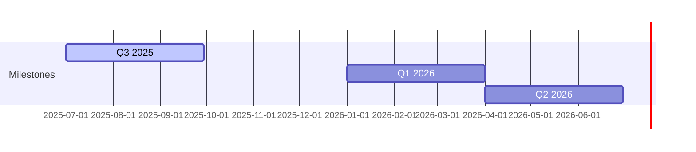

# 🌀 Pollinations.ai

## Unity for AI

The lightning‑fast path from idea ➜ monetised generative‑AI product.

<!--
SLIDE GUIDANCE:
-->

---

# 🚀 Traction

* **3 M** monthly active users • **100 M** media generated every month
* **14 M+** plays on flagship Unity-style ad integration *(our live ad-revenue pilot)*
* 300+ live apps • 13 k Discord • 1.8 k⭐ GitHub
* 30% MoM user growth

<div class="flex">
  <div class="flex-1">
    <p><strong>Key Markets:</strong> 30% CN, 13% US, 13% EU, 6% IN</p>
  </div>
  <div class="flex-1">
    
  </div>
</div>

<!--
SLIDE GUIDANCE:
The 30% China presence is significant - emphasize our global reach as differentiator
Pie chart for the markets
Add a graph - thomash thinks users is the best metric to show. we can calculate the percentage of media generations are users and extrapolate into the past based on our current users
Key growth metrics should be added : 30% MoM media generation
-->

---

# 😖 Problem

## Developers

* Complex & costly AI infra
* Keys, auth & billing pain
* No built‑in monetisation

## End Users

* Paywalls & forced sign‑ups
* Data‑privacy worries
* Limited customisation

*The current ecosystem forces painful trade-offs.*

<!--
SLIDE GUIDANCE:
- Frame problem as a dual pain point affecting both developers AND users
- Don't forget the AD providers. They are not reaching the indie creator apps. The money comes from there so they may be more important than the others in terms of priority/ or same importance
- The problem statement is clear - but could potentially add 1-2 concrete examples of developer/user friction
- Consider mentioning competition implicitly (without naming) by referencing their limitations (check context/parallels-unity-for-ai-and-others.md for more detail)
-->

---

# ✨ The Pollinations Fix

## ⚡ Zero‑Friction API

* Copy‑paste URL → instant media
* First call free • No ops

## 🚀 `pollinations‑init` Launchpad

* 1 command scaffold & deploy
* Unity-style SDK (10-line embed)
* Built‑in ads & rev‑share

```bash
# Demo snippet
curl https://image.pollinations.ai/prompt/galactic%20otter
open myapp.com            # generated via pollinations‑init
```

<!--
SLIDE GUIDANCE:
- copy/paste example not the best
- should we already mention hosting here?
- Consider adding: "Handles hosting" and "Developer never leaves editor"
- Explain how our architecture (end-to-end-architecture.md) enables the built-in monetization
- Mention UI-free approach. futuristic AI assistant integration. integrate into the user's tooling
- do we need a code example? maybe too technical. or a more exciting one with the output
- reference context/vision-mission.md
-->

---

# 🌍 Market & Business Model

## Market 📊

* Gen‑AI creator economy **>\$10 B** TAM
* Youth Ad Market: **\$247 B** TAM → **\$99 B** SAM → **\$0.5 B** SOM
* Doubling YoY (Gartner 2025) - *GenAI market*

## Two-Sided Market 🔄

* **Unity for AI**: 50% rev-share to devs, proven model
* **Brands → Young Creators → End-Users**
* Users get free AI experiences, brands reach youth demographic

## Revenue Streams 💰

1. Contextual ads (CPM \$1–2) - *Live now*
2. Micro‑purchases (stickers, tokens) - *Planned Q1 2026*
3. Premium tiers (SLA, bigger models) - *Planned Q1 2026*
4. 50% app rev‑share (Roblox style) - *Pilot live*

<!--
SLIDE GUIDANCE:
- source of truth for Revenue Streams is the file: context/roadmap.md
- untapped / developping market
- Potential positioning options from parallels doc: "GIPHY-meets-AdSense for AI", "Unsplash for AI—monetised out-of-the-box"
- Unity, AppLovin, and other platforms demonstrate lightweight SDKs with embedded ads are proven high-margin models
- Consider adding slide on how we're better/differently positioned than Unity/AppLovin for AI era (AI-native, better targeting)
- Market file to keep as source of truth : context/market-size.md
-->

---

# 📈 GTM Flywheel & Moat


## Market Moats

* **Trust Moat:** Open source (MIT) & privacy-first approach
* **Market Trend:** 4× more citizen devs than pros (Gartner)
* **Tech Advantage:** Native AI-powered ad targeting (like AppLovin's Axon 2.0)
* **Network Effect:** More apps → better data → better platform → more apps

<!--
SLIDE GUIDANCE:
- Unity generates $1.2B (66%) from ads via lightweight SDK with rev-share - directly parallel to our model
- potentially the best slide to add competition
- 4× more citizen devs than pros devs is the the beginning of the trend
- it feels like market trend should be in the previous slide to me
- one of our principle moats is that devs are embedding us in their open source repositories, making youtube videos, and spreading the word organically. discord bots in many guilds...
- Consider adding from parallels doc: "Anyone who can type a prompt is a potential Pollinations integrator" (maybe previous slide)
- Consider adding IDC forecast: 750M new cloud-native apps by 2026 - huge TAM expansion (previous slide?)
- Ad unit options to consider highlighting: native widgets, brand overlays, performance link ads
-->

---

# 🛣️ Roadmap



| Milestone | Highlights                              |
| --------- | --------------------------------------- |
| **Q3 25** | Core infra • per‑app DB • ad validation |
| **Q1 26** | Monetisation v1 • 50 % rev‑share        |
| **Q2 26** | Image/audio ads • dev tools v2          |

<!--
SLIDE GUIDANCE:
- Use context/roadmap.md as source of truth. Update all based on it
- Connect roadmap to funding requirements - show how seed gets us to Q2 2026
- Timeline should match the phased of context/roadmap.md
- Graph could include annotations for key revenue/user milestones
-->

---

# 👥 Team & Seed Ask

| Role   | Who                    | Super‑power                      |
| ------ | ---------------------- | -------------------------------- |
| CEO    | **Thomas Haferlach**   | Scales research models to products, ex‑Amazon AI |
| COO    | **Elliot Fouchy**      | Business execution & EU grants   |
| CTO    | **Core Dev Squad (4)** | Model & infra wizards            |
| DevRel | **Open Source Guild**  | 1.7 k⭐ on GitHub                 |

## Raising **\$2.5 – 3 M seed**

* 65 % GPU fleet & infra scale
* 25 % team growth (devrel, BD)
* 10 % runway buffer

<!--
SLIDE GUIDANCE:
- update all using this file: context/team.md
- Collaboration: The founders share a long history of collaboration, having worked together on various technology and creative projects for more than a decade, building strong synergy and shared vision.
-->
