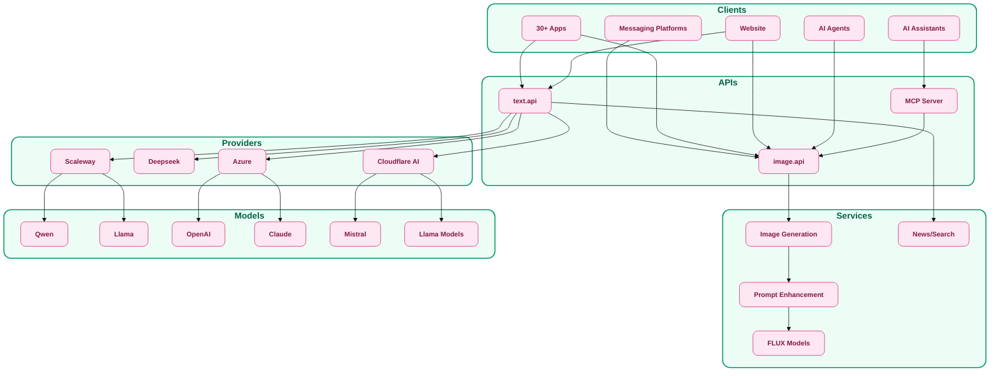

# pollinations.ai - Docs

::left::

- [📝 One-Pager](/16)
- [🎤 Pitch Deck](/18)

 

- [📑 Executive Summary](/2)
- [🔭 Vision & Mission](/3)
- [💰 Business Model](/4)
- [💹 Financial Model](/5)
- [🛣️ Roadmap](/6)
- [👥 Team](/7)

::right::

- [📈 Market Opportunity](/8)
- [🌍 Ecosystem Analysis](/9)
- [🤝 Add Partners](/10)
- [⚠️ Risk Register](/11)
- [🥊 Competitive Landscape](/12)
- [🚀 KPI & Traction Metrics](/13)
- [🏗️ Tech Architecture](/14)

 

- [🔍 Due Diligence](/15)

---
src: ./docs/01-executive-summary.md
---

---
src: ./docs/02-vision-mission.md
---

---
src: ./docs/03-business-model.md
---

---
src: ./docs/05-financial-model.md
---

---
src: ./docs/04-roadmap.md
---

---
src: ./docs/10-team.md
---

---
src: ./docs/03-market-opportunity.md
---

---
src: ./docs/03-blooming-ecosystem.md
---

---
src: ./docs/14-ad-partners.md
---

---
src: ./docs/11-risk-register.md
---

---
src: ./docs/09-competitive-landscape.md
---

---
src: ./docs/12-traction-metrics.md
---

---
src: ./docs/07-tech-architecture.md
---

---
src: ./docs/16-due-diligence.md
---

---

---

# **Pitch Deck**

---
class: text-center flex flex-col justify-center items-center h-full
---

# 

## Spark Creation, Unlock Ad Revenue
#

  <a href="https://pollinations.ai" class="no-underline">🐝 Start building with pollinations.ai</a>

<!--
* Hi everyone, I'm Thomas from **Pollinations.ai**
* AI allows **Everyone to be a coder**. Interacting with ChatGPT is **coding in natural language**.
* A prompt is the **source code** for AI applications.
* "We provide the **AI platform** for our vibrant community to easily build **gen AI apps**."
* "We partner with specialized **Ad Tech** companies to **monetize** the unique, untapped **ad inventory** provided by these apps."
* "Today I'll show you our **phased path** to **shared success**"
-->

---
layout: two-cols-header
---

# **🔗 Problem : Fragmented, Unfunded AI**

::left::

#

# **Indie/Vibe Coder** 
#
### ⚙️ **Complex AI Access & High Costs**
#
### 💰 **Monetization Blindspot for AI Content**

 

::right::

#

# **Advertisers & Ad Tech**
#
### 🍀 **Fragmented & Unique AI Inventory**
#
### 📊 **Generic Ads Don't Fit AI Context**

 

<!--
* "The GenAI boom creates distinct problems:"
* **"For Indie Coders (left):**
  * "**Complex AI access**, high **costs**, limited model variety.**Stifles creation**."
  * "If they build, a **monetization blindspot**. AI-specific tools **lacking**."
* **"For Advertisers & Ad Tech (right):**
  * "An **untapped AI frontier**, but **fragmented AI inventory** is hard to access."
  * "And **generic ads don't fit AI context**, leading to **poor engagement**."
* "**Pollinations solves** the **disconnect** between **difficult creation & access** vs. **ineffective monetization & reach**"
-->

---
layout: two-cols-header
---

# **✨ AI Creation Meets Monetization**

  

::left::

# 👩‍💻 Indie/Vibe Coder
### **→ Build & Monetize**
#

  
  
  

 
 

# 🏢 Advertisers
### **→ Reach AI-Natives**

 

  
  

  

::right::

Developers Create Apps with AI Media

↓

Apps Attract & Engage Users

↓

pollinations.ai Integrates Ad Solutions

↓

Revenue Generated & Shared

<!--
**Solution - Connecting Creation with Monetization**

**Our Core Value Proposition:**
* We take creators from **idea to income** with **zero upfront cost** - this is crucial

**For Indie/Vibe Coders:**
* We make **AI integration effortless** while providing a **clear path to profit**
* Their apps can **self-fund** their own compute costs through our ads!
* Un 2026, we'll launch **Nectar** with **50/50 revenue sharing** for top performers

**For Advertisers:**
* We're opening access to these previously **untapped AI-native audiences** through **context-aware dynamic ad placements**
* This drives much **higher engagement** than traditional ad formats

**In short:** We build the **infrastructure**, partner with **ad experts**, and **everyone shares** in the success
## End
-->

---
layout: two-cols
---

# 🚀 **Developer Adoption, It's Real.**

::right::

  <video class="w-1/1 rounded-lg shadow-lg" autoplay loop muted controls onloadedmetadata="this.currentTime = Math.random() * this.duration; this.playbackRate = 2.0;">
    <source src="/media/what-do-we-do_slideshow-3.mp4" type="video/mp4">
  </video>

  

  <video class="w-1/1 rounded-lg shadow-lg" autoplay loop muted controls onloadedmetadata="this.currentTime = Math.random() * this.duration; this.playbackRate = 2.0;">
    <source src="/media/what-do-we-do_slideshow-4.mp4" type="video/mp4">
  </video>

---

# **🎮 Creator Story: Pokémon Image Generation**

  

    

      
Watch how <strong>easy</strong> it is 
       
      To <strong>build</strong> engaging 
       
      AI applications  
       
      <strong>in seconds</strong> ⚡️

    

    

      
✨ Turn your AI dreams into reality in minutes with pollinations.ai 🚀

    

  

  
  

    <video class="w-full rounded-lg shadow-lg" autoplay loop muted controls onloadedmetadata="this.playbackRate = 2.0;">
      <source src="/media/pokemon-image-gen-2x-compressed.mp4" type="video/mp4">
    </video>
  

<!--
## Creator Story
* This is a real example of how creators use our platform
* They can quickly build engaging AI applications with minimal effort
* Our infrastructure handles all the complexity, letting them focus on creativity
* This creates unique ad inventory opportunities in these engaging experiences
-->

<!--
## Product Showcase Apps Cohort
*   Community builds diverse apps on our infra.
*   Examples: (For each video, briefly state)
    *   "[App Type 1]: [Key user], [Pollinations tech used]."
    *   "[App Type 2]: [Key user], [Pollinations tech used]."
    *   (Shows platform power & creativity).
## End
-->

---

# **☁️ Our Cloud Architecture**

  <h3 class="m-0"><strong>Scalable Infrastructure</strong> powering our ecosystem 🔌</h3>

<!--
## Our Architecture
* This is the technical foundation that powers everything you've seen
* Our architecture is designed for scale, reliability, and flexibility
* We connect diverse client applications to the best AI models through our services
* This modular design allows us to integrate new models and services quickly
-->
---
layout: two-cols
---

# 💬 **Pixpal.Chat** (web app)

 
 

  

    

      #1 on Bing
    

    

      and various assistants for
    

    

      AI image generation 🖼️
    

  

  

    

      Contextual & Personalized
    

    

      Ad Integration
    

    

      🎯
    

  

  
  

::right::

  
  

 
 

<!--
## Product Showcase - Ad Integration
* Pixpal, a community app using our infra, is **#1 on Bing** for 'AI Chat with Images'
* Here's our AI monetization: User asks about Greece in Pixpal
* Pollinations' AI **analyzes context**. Our system, with ad partners like **Garlic/Nex.ad**, delivers a **hyper-contextual ad**
* Note the **dynamically AI-generated image** (e.g., Santorini) and **targeted partner offer** (e.g., TalkPal)
* This approach is **smart**, **non-intrusive**, and **incredibly effective**. This is how creators will monetize
## End
-->

---
layout: two-cols
---

# **🎮 Roblox Case Study**

  <h2 class="m-0"><strong>Revenue Share Success</strong></h2>

 
 

  #1 on Roblox

  🏆 AI Game Category

 

  2M+

  👥 Monthly Active Users

 
 

  
  

::right::

  <video class="w-4/4 rounded-lg shadow-lg" autoplay loop muted>
    <source src="/media/roblox_video.mov" type="video/mp4">
  </video>

<!--
## Roblox Case Study - Real Revenue Sharing in Action
* Let me share a powerful **real-world example** of our model working today
* This is "AI Character RP" - currently the **#1 AI game** on Roblox
* It's reached an impressive **2M monthly active users** - real validation of what our infrastructure enables
* The monetization happens through the **Roblox platform** itself
* We've established a **custom revenue-sharing arrangement** with the developer
* This is essentially **piloting our Nectar model** that we'll roll out more broadly
* It proves our concept works in the **real world**, with **real users** and **real revenue**
## End
-->

---
layout: two-cols-header
---

# **🚀 Traction: Flywheel Already in Motion**

::left::

## 👥 **3M+** Mo Active End-Users
## 🎨 **100M+** Media Gen/Month
#

  <h3 class="m-0">📈 <strong>30%</strong> Month-o-Month Growth</h3>

 
 

## 🚀 **300+** Apps Live
## ⚡ **2+** Built Daily
#

  <h3 class="m-0">💬 <strong>13K+</strong> Discord Community</h3>

 
 

::right::

  

#

📊 Media Generated per Day

<!--
## Traction - Our Flywheel is Already Spinning
* Our flywheel is not just theoretical - it's **already in full motion**
* We've reached **3M+ monthly active users** generating over **100M pieces of media** per month
* We're seeing consistent **organic growth of 30%** month-over-month
* Our community has built over **300 apps**, with **2+ new ones** launching daily
* **Text generations** have actually surpassed images - now at **1.3M per day**
* Our ad pilot program has already delivered **14M impressions** - and we're learning fast
* This traction **validates our model** and shows we're solving a **real need** in the market
## End
-->

---
layout: two-cols-header
---

# **🌍 $20 B of Ads, One Drop‑In Line of Code**

::left::

 

## **€218 B** TAM 🌐
### Mobile + Web Ad Spend **Outside** Walled Gardens (2025)

 

## **€20 B** SAM 📣
### Ad spend on Indie Apps

  

# **€768 M** SOM 💻
### **3.8 %** of SAM → **massive runway**

::right::

  

<!--
### Market
*   TAM: €218B (Mobile/Web ads outside giants).
*   SAM: €20B (Indie App Ad Spend reachable via SDKs).
*   SOM: €768M (Our potential from AI-native apps).
*   Our infra + ad partners tap this growing market.
*   **We're Unity Ads for Gen‑AI micro‑apps** - Unity scaled ads from 0 → $1.6 B in revenue with similar developer base.
  
#### In Short
- We’re targeting a €218B ad market — mobile and web ads outside the big platforms.
- Our real focus is a €20B slice: indie apps that can use SDKs like ours.
- From that, we aim to capture €768M through Gen-AI micro-apps.
- Think Unity Ads — they scaled from 0 to $1.6B. We’re doing the same, but for AI.

#### Longer
- The total market we’re going after is huge — €218 billion in mobile and web ad spend, outside of the major platforms like Meta and TikTok.
- Our serviceable market is about €20 billion — that’s the indie apps where Unity-style SDKs can realistically plug in and monetize.
- From that, we’ve scoped out a clear beachhead: €768 million — that’s our share of AI-native apps, where we believe we can have the strongest impact.
- We are confident because we’re doing for Gen-AI micro-apps what Unity Ads did for mobile games — and they went from zero to over $1.6 billion in ad revenue, serving a very similar type of long-tail developer base.
- We’ve got the infrastructure and getting ready with ad-tech partners in place to tap this fast-growing space.

## End
-->

---
layout: two-cols
---

# **💰 From Prompt to Profit**

 
 
 

  

    
💼 Example: Mirexa app

    
(Text/Image Generator)

    

      

        
720K

        
Media/Month

      

      

        
144K

        
Ad Impressions/Month

      

      

        
€5

        
eCPM

      

      

        
€324

        
Monthly Creator Revenue

      

    

  

  
  

    
💰 Key Unit Economics

    
(per 1k Media Generations – 2027)

    

      

        
Ad Revenue (Net via Partners):

        
~€1.40

      

      

        
AI Compute Cost:

        
~€0.20

      

      

        
Net Revenue (Post Cloud & Nectar):

        
~€0.84

      

    

  

::right::

  

<!--
### From Prompt to Profit

#### Overview
* Let me walk you through our clear **3-step journey** for creators
* Step 1 - **Seed** (Live Today): We provide completely **free tools** and **ad-supported compute** through our partners
* This **removes all barriers** to entry and helps creators get started immediately
* Step 2 - **Flower** (H2 '25): Apps begin to **self-fund** their own compute costs through ad revenue
* At this stage, Pollinations earns **platform revenue** from our partners, and creators get **better models** and **higher limits**
* Step 3 - **Nectar** (H2 '26): For top-performing apps, we introduce a **50/50 net ad revenue share** from our partner revenue
* To put this in perspective: With 1M MAU and a $1.50 CPM, that's about **$13.5K net monthly revenue**, with **$6.75K going directly** to the developer
* This creates a **sustainable ecosystem** where **everyone wins** - creators, advertisers, and Pollinations

#### Unit economics
- **Each 1,000 media units generate €1.40** in ad revenue via contextual placements.
- **AI compute costs remain low at €0.20**, thanks to model efficiency at scale.
- After creator share, we retain **€0.84 net per 1k outputs**.
- This margin **covers infra in real-time** and scales linearly with demand.
- **Value is shared** with creators without compromising platform profitability.

- **Net Revenue per App/Year**: €626 (from table)
- **Lifetime** (App stays active): 2 years (conservative)
- **LTV per App**: €1,252
- **CAC per App** (e.g. devrel): €50 (Discord, hackathons, docs, demos)
- **LTV/CAC Ratio**: ~25x

## End
-->

---
layout: two-cols-header
---

  <h1><strong>👥 Team</strong></h1>
  

 

  

    

      
      

        <h2 class="font-bold text-xl mb-1">Thomas Haferlach</h2>
        
CEO

        
8+ yrs GenAI, Ex-Amazon, EU Funding Winner

      

    

    

      
      
    

  

  

    

      
      

        <h2 class="font-bold text-xl mb-1">Elliot Fouchy</h2>
        
COO

        
6+ yrs AI Ops, Built Efficient AI Infra

      

    

  

## 🔍 **Planned Hires**

::left::

### **1.** MLOps & Infrastructure Lead 🛠️ 

::right::

### **2.** Community & Creator Success 👥
### 🤝 **Kalam** (Incoming)

<!--
## Team - Experience Where It Matters Most
* I'm Thomas, the CEO - I bring **8+ years of generative AI** experience
* I've scaled platforms to over **100M requests per month** and worked at **Amazon AI**
* I also won **1.2m EU funding** for previous AI projects - I know how to **build and scale**
* My co-founder Elliot is our COO with **6+ years of AI operations** experience
* He's built **efficient AI infrastructure** for multiple scale-ups - crucial for our model
* **Lead MLOps / Infra Engineer** (H2 2025): GPU fleet optimization, Scaling Backend, Model-serving pipeline
* **Kalam** (Head of Community & Creator Success, H2 2025): Creator onboarding, XR/UGC initiatives, User acquisition

## End
-->

---
layout: two-cols-header
---

# **🤝 We are raising - reach out: hello@pollinations.ai**

::left::

# 🚀 **Now | Activate**
### - Native Ad Toolkit
#
### - Flower GA
#
### - Nectar pilot
#
### - Contextual-Ad Partners
#
### - Project Hosting
#
### - Polli Assistant

 

::right::

# 📈 **+12 mo | Scale**
### - Nectar GA
#
### - Monthly payouts
#
### - Ecosystem Fund
#
### - Dynamic & interactive ad formats

 

<!--
## Roadmap - Fueling the AI App Monetization Revolution
* Let me share our clear roadmap to fuel this **AI app monetization revolution**

* **Right Now - Activation Phase:**
  * We're shipping our **Native Ad Toolkit** for seamless partner integration
  * We're launching **Polli Assistant** to make creation even easier
  * We're expanding our **Nectar pilot** beyond Roblox to more app types
  * We're onboarding specialized **Contextual-Ad Partners** like Garlic
  * We're starting **Project Hosting** to further reduce barriers to entry

* **Next 12 Months - Scaling Phase:**
  * We'll launch **Nectar GA** with the **50/50 revenue sharing** model
  * We'll implement **monthly payouts** and create an **Ecosystem Fund**
  * We'll introduce **dynamic and interactive ad formats** with our partners
  * We'll build **global creator community programs** to drive adoption

* This roadmap systematically **builds our flywheel** and creates **value for all stakeholders**
## End
-->
