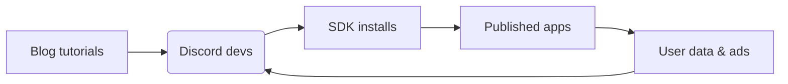
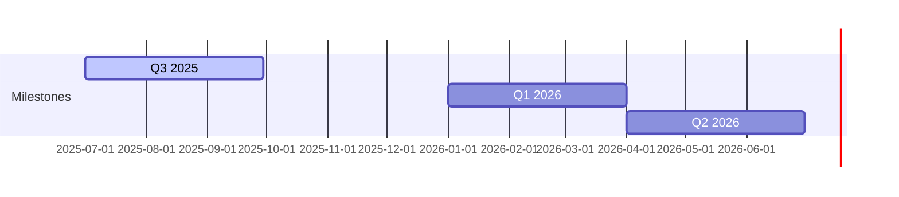

# 🌀 Pollinations.ai

## Unity for AI

The lightning‑fast path from idea ➜ monetised generative‑AI product.

<!-- 
SLIDE GUIDANCE:
- UPDATED: Changed analogy from "Roblox for AI" to "Unity for AI" - broader and more aligned with business model
- Unity generates $1.2B (66%) from ads via lightweight SDK with rev-share - directly parallel to our model
- Connection worth making: We provide comprehensive AI development & monetization similar to how Unity does for game developers
- Consider showing Unity's success metrics as validation of the model
- The "Unity for AI" better captures our broader offerings (text, chat, code assistance) beyond just media
- "Lightning-fast path" is good positioning - focus on speed-to-market advantage
-->

---

# 🚀 Traction

* **3 M** monthly active users • **80 M** media generated every month
* **14 M+** plays on flagship Unity-style ad integration *(our live ad-revenue pilot)*
* 300+ live apps • 13 k Discord • 1.7 k⭐ GitHub
* *Key Markets: 30% CN, 13% US, 13% EU, 6% IN*

| Platforms | Communities | OSS    |
| --------- | ----------- | ------ |
| Unity     | Discord     | GitHub |
| Pixelynx  | Twitch      | npm    |

<!--
SLIDE GUIDANCE:
UPDATED: Changed "Roblox 'AI Character RP'" to "Unity-style ad integration" to align with new analogy
DATA DISCREPANCY: Media generated metric varies between docs (80M vs 100M) - confirm latest before presentation
The 30% China presence is significant - emphasize our global reach as differentiator
Consider converting the platform table below to logos/visuals for better impact
Key growth metrics could be added if available (MoM/QoQ growth percentages)
Could add metrics on ad performance (fill rate, eCPM) from any beta tests to reinforce Unity parallel
-->

---

# 😖 Problem

## Developers

* Complex & costly AI infra
* Keys, auth & billing pain
* No built‑in monetisation

## End Users

* Paywalls & forced sign‑ups
* Data‑privacy worries
* Limited customisation

*The current ecosystem forces painful trade-offs.*

<!-- 
SLIDE GUIDANCE:
- Frame problem as a dual pain point affecting both developers AND users
- Contrast this with our solution in next slide
- The problem statement is clear - but could potentially add 1-2 concrete examples of developer/user friction
- Emphasize the "forced trade-offs" concept - this sets up our value proposition (no trade-offs needed)
- Consider mentioning competition implicitly (without naming) by referencing their limitations
-->

---

# ✨ The Pollinations Fix

## ⚡ Zero‑Friction API

* Copy‑paste URL → instant media
* First call free • No ops

## 🚀 `pollinations‑init` Launchpad

* 1 command scaffold & deploy
* Unity-style SDK (10-line embed)
* Built‑in ads & rev‑share

```bash
# Demo snippet
curl https://image.pollinations.ai/prompt/galactic%20otter
open myapp.com            # generated via pollinations‑init
```

<!-- 
SLIDE GUIDANCE:
- UPDATED: Added "Unity-style SDK (10-line embed)" to highlight the parallel with Unity's lightweight integration
- ENHANCEMENT NEEDED: Add bullet points about hosting/CI/CD handling - it's a key differentiator
- Consider adding: "Handles hosting, secrets, CI/CD" and "Developer never leaves editor"
- This is a good place for a quick demo or GIF showing the one-command workflow
- Explain how our architecture (end-to-end-architecture.md) enables the built-in monetization
- Consider mentioning the developer stays in their editor - no complex dashboards
- The curl example is compelling - worth doing this live during presentation
-->

---

# 🌍 Market & Business Model

## Market 📊

* Gen‑AI creator economy **>\$10 B** TAM
* Youth Ad Market: **\$247 B** TAM → **\$99 B** SAM → **\$0.5 B** SOM
* Doubling YoY (Gartner 2025) - *GenAI market*

## Two-Sided Market 🔄

* **Unity for AI**: 70% rev-share to devs, proven model
* **Brands → Young Creators → End-Users**
* Users get free AI experiences, brands reach youth demographic

## Revenue Streams 💰

1. Contextual ads (CPM \$1–2) - *Live now (€250k ARR)*
2. Micro‑purchases (stickers, tokens) - *Planned Q1 2026*
3. Premium tiers (SLA, bigger models) - *Planned Q1 2026*
4. 50% app rev‑share (Roblox style) - *Pilot live*

<!-- 
SLIDE GUIDANCE:
- UPDATED: Changed "Unity for AI Media" to "Unity for AI" for consistency across deck
- Potential positioning options from parallels doc: "GIPHY-meets-AdSense for AI", "Unsplash for AI—monetised out-of-the-box"
- Unity, AppLovin, and other platforms demonstrate lightweight SDKs with embedded ads are proven high-margin models
- Back-of-envelope math from parallels doc: At target €6-€12 eCPM with 70% creator share, 100M monthly impressions → €18-36M ARR
- Consider adding slide on how we're better positioned than Unity/AppLovin for AI era (AI-native, better targeting)
- Potential risk to address: viewability metrics, latency, brand safety (see Risk Map in parallels doc)
-->

---

# 📈 GTM Flywheel & Moat



## Market Moats

* **Trust Moat:** Open source (MIT) & privacy-first approach
* **Market Trend:** 4× more citizen devs than pros (Gartner)
* **Tech Advantage:** Native AI-powered ad targeting (like AppLovin's Axon 2.0)
* **Network Effect:** More apps → better data → better platform → more apps

<!-- 
SLIDE GUIDANCE:
- ADDED: Market trend from parallels doc about citizen developers outnumbering professional devs 4:1
- ADDED: Tech advantage comparable to AppLovin's Axon 2.0 AI engine for ad optimization
- ADDED: More structured moat descriptions as bullet points for clarity and impact
- Consider adding from parallels doc: "Anyone who can type a prompt is a potential Pollinations integrator"
- Could mention Replit's 20M+ users (125% growth in 18 months) as proof of youthful prompt-dev growth
- Consider adding IDC forecast: 750M new cloud-native apps by 2026 - huge TAM expansion
- Risk mitigation worth mentioning: Edge caching for low latency (200ms p95 SLA target)
- Ad unit options to consider highlighting: native widgets, brand overlays, performance link ads
-->

---

# 🛣️ Roadmap



| Milestone | Highlights                              |
| --------- | --------------------------------------- |
| **Q3 25** | Core infra • per‑app DB • ad validation |
| **Q1 26** | Monetisation v1 • 50 % rev‑share        |
| **Q2 26** | Image/audio ads • dev tools v2          |

<!-- 
SLIDE GUIDANCE:
- ENHANCEMENT NEEDED: Add more specific technical milestones to timeline
- Q3 2025: Consider adding "per-app DB, MCP auth, Triton GPU optimization (-40% cost)"
- Q1 2026: Add "Stripe Connect for payouts, premium tiers, app hosting"
- Q2 2026: Highlight "richer ad formats (image/audio)"
- Connect roadmap to funding requirements - show how seed gets us to Q2 2026
- Timeline should match the phased monetization approach in overview.md
- Graph could include annotations for key revenue/user milestones
-->

---

# 👥 Team & Seed Ask

| Role   | Who                    | Super‑power                      |
| ------ | ---------------------- | -------------------------------- |
| CEO    | **Thomas Haferlach**   | Scales research models to products, ex‑Amazon AI |
| COO    | **Elliot Fouchy**      | Business execution & EU grants   |
| CTO    | **Core Dev Squad (4)** | Model & infra wizards            |
| DevRel | **Open Source Guild**  | 1.7 k⭐ on GitHub                 |

## Raising **\$2.5 – 3 M seed**

* 65 % GPU fleet & infra scale
* 25 % team growth (devrel, BD)
* 10 % runway buffer

<!-- 
SLIDE GUIDANCE:
- ENHANCEMENT NEEDED: Add COO Elliot Fouchy to team table with superpower
- DISCREPANCY: Thomas is listed as CEO here but as CTO in overview.md - confirm correct title
- Consider updating Thomas's superpower to: "Scales research models to products, ex-Amazon AI"
- Add expected runway note: "~24 months runway to reach monetization v2"
- Consider mentioning Thomas's personal runway ends Aug 2025 (from Laurent review) as urgency driver
- Mention EU grant success as credibility proof (~€1.2M secured previously)
- Emphasize team's complementary skills: technical depth + business execution
-->
