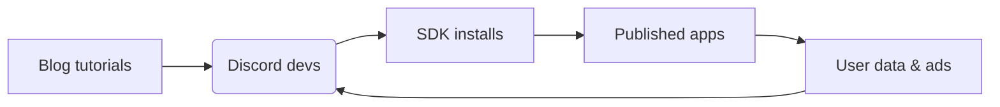
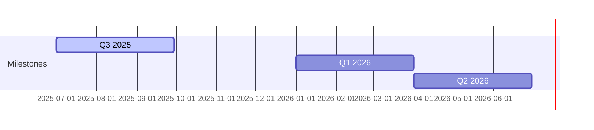

# 🌀 Pollinations.ai

## Roblox for AI

The lightning‑fast path from idea ➜ monetised generative‑AI product.

<!-- We democratise generative AI the way Roblox democratised game creation. -->

---

# 🚀 Traction

* **3 M** monthly active users • **100 M** media generated every month
* **14 M+** plays on flagship Roblox "AI Character RP"
* 150 + live apps • 13 k Discord • 1.7 k⭐ GitHub

| Platforms | Communities | OSS    |
| --------- | ----------- | ------ |
| Roblox    | Discord     | GitHub |
| Pixelynx  | Twitch      | npm    |

---

# 😖 Problem

## Developers

* Complex & costly AI infra
* Keys, auth & billing pain
* No built‑in monetisation

## End Users

* Paywalls & forced sign‑ups
* Data‑privacy worries
* Limited customisation

---

# ✨ The Pollinations Fix

## ⚡ Zero‑Friction API

* Copy‑paste URL → instant media
* First call free • No ops

## 🚀 `pollinations‑init` Launchpad

* 1 command scaffold & deploy
* Built‑in ads & rev‑share

```bash
# Demo snippet
curl https://image.pollinations.ai/prompt/galactic%20otter
open myapp.com            # generated via pollinations‑init
```

---

# 🌍 Market & Business Model

## Market 📊

* Gen‑AI creator economy **>\$10 B** TAM
* Doubling YoY (Gartner 2025)

## Revenue Streams 💰

1. Contextual ads (CPM \$1–2)
2. Micro‑purchases (stickers, tokens)
3. Premium tiers (SLA, bigger models)
4. 50 % app rev‑share (Roblox style)

---

# 📈 GTM Flywheel & Moat



* MIT‑licensed ⚖️  + privacy‑first → **trust moat**
* Lowest friction wins dev mind‑share → flywheel above already spinning

---

# 🛣️ Roadmap



| Milestone | Highlights                              |
| --------- | --------------------------------------- |
| **Q3 25** | Core infra • per‑app DB • ad validation |
| **Q1 26** | Monetisation v1 • 50 % rev‑share        |
| **Q2 26** | Image/audio ads • dev tools v2          |

---

# 👥 Team & Seed Ask

| Role   | Who                    | Super‑power                      |
| ------ | ---------------------- | -------------------------------- |
| CEO    | **Thomas Haferlach**   | Creative‑AI pioneer, ex‑Pixelynx |
| CTO    | **Core Dev Squad (4)** | Model & infra wizards            |
| DevRel | **Open Source Guild**  | 1.7 k⭐ on GitHub                 |

## Raising **\$2.5 – 3 M seed**

* 65 % GPU fleet & infra scale
* 25 % team growth (devrel, BD)
* 10 % runway buffer
