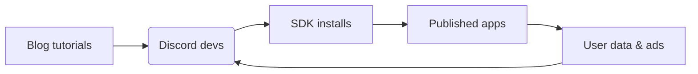

---

title: Pollinations.ai Pitch – Compact 8‑Slide
layout: default
theme: default
--------------

# Pollinations.ai — **Roblox for AI**

> The fastest on‑ramp from idea to monetized AI product.

<!-- notes:
- Full‑bleed AI collage background.
- One‑liner intro: "We democratise generative AI like Roblox did for games."
- Mention Berlin HQ & OSS ethos in one sentence.
-->

---

## 🚀 Traction (Slide 2)

* **3 M** MAU • **100 M** media generated/mo
* **14 M+** plays on Roblox "AI Character RP"
* 150 + third‑party apps • 13 k Discord • 1.7 k⭐ GitHub

<!-- notes:
- Display partner/app logos underneath numbers.
- Use Slidev `fragment` to reveal numbers sequentially.
-->

---

## 😖 Problem (Slide 3)

### Developers

* Complex & costly AI infra
* Keys, auth, billing pain
* No built‑in monetisation

### End Users

* Paywalls & forced sign‑ups
* Privacy worries (data retention)
* Limited customisation

<!-- notes:
- Optional big stat: "> $200 average monthly GPU bill per indie dev".
- Keep words < 40 total.
-->

---

## ✨ Solution & Demo (Slide 4)

### Zero‑Friction API

* Copy‑paste URL → instant img/text/audio
* First call free • No infra ops

### `pollinations‑init` Launchpad

* One command scaffolds & deploys AI app
* Built‑in ads, micro‑purchases, rev‑share

  
  
  

<!-- notes:
- Run a live URL demo (if online) ≤ 10 s.
- Point at thumbnails: Roblox RP, StoryMagic, Korus plugin.
-->

---

## 🌍 Market & Biz Model (Slide 5)

| Segment                | TAM         | Our Wedge              |
| ---------------------- | ----------- | ---------------------- |
| Gen‑AI creator economy | **>\$10 B** | Dev & creator plumbing |

**Revenue Levers**

1. Contextual ads
2. Micro‑purchases
3. Premium tiers
4. 50 % app rev‑share (Roblox‑style)

<!-- notes:
- Mention TAM doubling YoY (source: Gartner).
- Use icons for each revenue stream if visuals.
-->

---

## 📈 GTM & Moat (Slide 6)

* Lowest friction wins dev mindshare → flywheel above
* MIT‑licensed stack + privacy‑first = trust & contributions

<!-- notes:
- Emphasise self‑reinforcing loop already spinning (150 apps live).
-->

---

## 🛣️ Roadmap (Slide 7)

| Quarter     | Milestones                                      |
| ----------- | ----------------------------------------------- |
| **Q3 2025** | Core infra, per‑app DB, ad validation           |
| **Q1 2026** | MCP hosting GA, Monetisation v1, 50 % rev‑share |
| **Q2 2026** | Image/audio ads, dev tools v2, model expansion  |

<!-- notes:
- Use horizontal timeline if preferred; limit to 3 phases.
- Tie each to KPI (e.g., 5 M MAU by Q1 26).
-->

---

## 👥 Team & Seed Ask (Slide 8)

|                      |                                  |
| -------------------- | -------------------------------- |
| **Thomas Haferlach** | Creative‑AI pioneer, ex‑Pixelynx |
| **Core Dev Squad**   | 4 senior ML & infra engineers    |

**Raising \$2.5 – 3 M seed**

* 65 % GPU fleet & infra scaling
* 25 % team growth (devrel, BD)
* 10 % runway buffer

<!-- notes:
- Add headshots; 2‑line bios max.
- Close with "Join us" CTA + QR code to calendly/email.
-->

---
