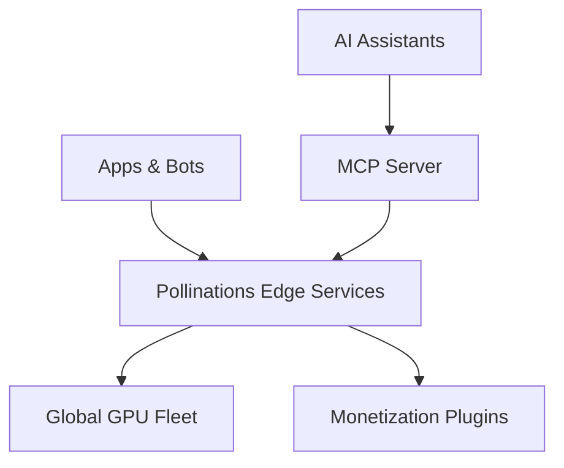

# pollinations.ai

## The Roblox for AI

---

## Index

- [Our Vision](#our-vision)
- [The Problem](#the-problem)
- [Our Solution](#our-solution)
- [Impressive Traction](#impressive-traction)
- [How It Works](#how-it-works)
- [Our Technology](#our-technology)
- [Monetization Strategy](#monetization-strategy)
- [Why This Works](#why-this-works)
- [Roadmap](#roadmap)
- [Join Us](#join-us)

---

# Our Vision

**Democratize generative AI:** make state-of-the-art creation tools free and open so anyone can build, share and monetize AI-powered experiences.

## Mission
Become the global, open platform where developers and non-coders alike can easily create, deploy and monetize AI applications.

## Who We Are
- Open-source gen AI startup based in Berlin
- 100% free to use, no signups, no API keys
- Privacy-first: zero data storage, anonymous usage

---

# The Problem

## For Developers
- AI infrastructure is complex and expensive
- API keys, authentication, and billing are painful
- Monetization requires separate infrastructure

## For End Users
- Most AI tools require signups and payments
- Privacy concerns with data collection
- Limited ability to customize experiences

---

# Our Solution

## No-Keys, No-Friction
- Copy-paste a URL to generate text, images, audio
- No login required for the first call
- Zero infrastructure management

## AI App Launchpad

- **One command** scaffolds & deploys your AI app.
- **Integrated SDK** in your editor for seamless development.
- **Built-in Monetization:** Activate revenue share, contextual ads, and micro-purchases.
- **Premium Tiers:** Access higher rate limits, advanced models, and larger context sizes.
- **Zero-ops hosting** and scaling handled automatically.

---

# Impressive Traction

## Current Stats (April 2025)
- **3M** Monthly Active End-Users
- **100M** Media Generated Monthly
- **150+** Known Third-party Integrations
- **13k** Discord Community Members
- **1700+** GitHub Stars

## Flagship Integration
"AI Character RP" on Roblox
- 14M+ plays
- Thousands of concurrent users
- First live ad-revenue pilot

---

# How It Works

## For Developers
1. Run `pollinations-init myapp.com` in any editor
2. Code MCP creates private repo with starter template
3. GitHub Actions automatically deploy to GitHub Pages
4. Front-end calls Pollinations APIs for AI generation

## For End Users
- Access AI-powered apps with no signup
- Generate images, text, and audio instantly
- Privacy-first approach with no data storage
- Seamless experience across all devices

---

# Our Technology

## Edge AI at Scale
- Global GPU fleet for image, text, and audio generation
- Cloudflare CDN with R2 cache for fast delivery
- MCP server for AI assistant integration
- React hooks for easy frontend integration

## Architecture

---

# Monetization Strategy

## Revenue Streams
- **Contextual Ads** in generated content
- **Micro-Purchases** for premium features
- **Premium Subscriptions** for higher usage tiers
- **App Shared Revenue Model** (Roblox-alike)

## Projected Growth
| Timeline | Ad-served Media | Gross Revenue | Pollinations Share |
|----------|----------------|---------------|-------------------|
| 12 mo    | 250M           | $250k/mo      | $125k/mo          |
| 24 mo    | 1.6B           | $8M/mo        | $4M/mo            |

---

# Why This Works

## Competitive Advantages
- **Lowest friction** on the market
- **Network effect moat**: more apps → better data → higher ad relevance
- **Clear monetization path** with revenue sharing
- **Experienced founding team** with AI expertise

## Value Proposition
- Developers stay in their code editor
- Zero-ops infrastructure management
- Infinite scale through GitHub Pages
- Aligned incentives through revenue sharing

---

# Roadmap

## Q3 2025
- Core Infrastructure
- Per-app database
- GitHub-based authentication
- Ad Monetization Validation

## Q1 2026
- Dev-app hosting via MCP
- Monetization Plugin v1
- 50% revenue-share activated
- Community growth

## Q2 2026
- Monetization Plugin v2
- Image and audio ads
- Enhanced developer tools
- Expanded model offerings

---

# Join Us

## Get Started Today
- Visit [pollinations.ai](https://pollinations.ai)
- Try our image and text generation
- Explore our [GitHub repo](https://github.com/pollinations/pollinations)
- Join our [Discord community](https://discord.gg/pollinations)

## Investment Opportunity
Seeking **$2.5M - $3M seed** to:
- Scale infrastructure
- Grow team
- Accelerate expansion
- Capture market leadership

---

# pollinations.ai

## The fastest on-ramp from idea to monetized AI product
