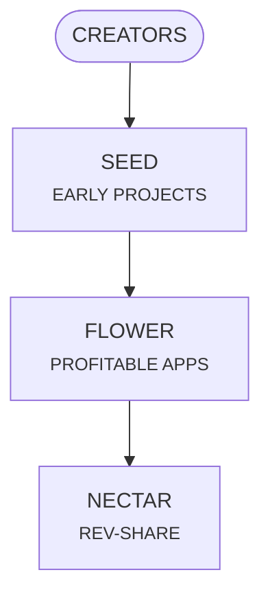

<!-- Slide 1: Title Slide -->

# 

## Spark Creation, Unlock Ad Revenue

<!--

## Speaker Notes for Slide 1: Title Slide
*   We're Pollinations.ai.
*   AI empowers everyone to create.
*   Our mission: Easy to build *and* monetize AI apps.
*   Zero upfront cost, shared success.
## End

-->

---
layout: two-cols-header
---

# **🔗 Challenge**
 

## ***The current ecosystem forces painful trade-offs*** 😞

#

::left::

#
# **App Creators**
### 🧪 Struggle to experiment and scale
#
### 💰 Struggle to monetize

::right::

#

# **Advertisers**
### 🎯 Struggle to reach audiences in new AI apps
#
### 💸 Miss out on contextual advertising opportunities

<!--
## Speaker Notes for Slide 2: Problem Statement
*   Creators: high costs, no clear path to earn.
*   Advertisers: can't reach engaged AI-native audiences.
*   It's a lose-lose.
## End

**Speaking Points - Problem:**
* **Creator & Developer Pain Points:**
  * Complex and expensive AI infrastructure
  * Critical gap: No clear monetization path for successful apps
  * Prohibitive AI access costs
  * Infrastructure complexity

-->

---
layout: two-cols-header
---

<!-- Slide 3: Solution -->

# **✨ The Fix : AI Creation Meets Monetization**
 

::left::

# 👩‍💻 Creators
## **Build & Monetize**
>### - Effortless AI Integration
>### - Clear Path to Profit
 

# 🏢 Advertisers
## **Reach AI-Natives**
>### - Untapped Ad Space
>### - AI-Powered Targeting

::right::

  
  
  <h3 class="text-center">From <strong><em>idea</em></strong> to <strong><em>income</em></strong>  with <strong><em>zero</em></strong> upfront cost 💰</h3>

<!--
## Speaker Notes for Slide 3: Solution
*   **Creators:** Effortless AI, clear path idea-to-income, starts free.
    * We manage infrastructure & scaling, you innovate on user experience.
    * Ads cover compute costs ➔ Unlock unlimited usage & 50/50 Net Ad Revenue Share (Partner Tier).
* **Focus on Frontend:** We handle all backend complexity
* **Access to highly engaged Gen-Z and Millennial audiences**
* **New Ad Inventory:** Access rapidly growing network of AI apps
## End

-->

---
layout: two-cols
---

<!-- Slide 4: Product Showcase Apps Cohort-->

  <video class="w-full rounded-lg shadow-lg" autoplay loop muted>
    <source src="/media/what-do-we-do_slideshow-1.mp4" type="video/mp4">
  </video>

  

  <video class="w-full rounded-lg shadow-lg" autoplay loop muted>
    <source src="/media/what-do-we-do_slideshow-2.mp4" type="video/mp4">
  </video>

::right::

  <video class="w-full rounded-lg shadow-lg" autoplay loop muted controls>
    <source src="/media/what-do-we-do_slideshow-3.mp4" type="video/mp4">
  </video>

  

  <video class="w-full rounded-lg shadow-lg" autoplay loop muted controls>
    <source src="/media/what-do-we-do_slideshow-4.mp4" type="video/mp4">
  </video>

<!--
## Speaker Notes for Slide 4: Product Showcase Apps Cohort
*   See what's built on Pollinations:
    *   Diverse, creative AI apps.
    *   Art tools, interactive AI.
*   The power of accessible AI.
## End
-->

---
class: text-center
---

<!-- Slide 5: Product Showcase - Ad -->

  <video class="w-full rounded-lg shadow-lg max-h-[70vh] object-contain" autoplay noloop muted>
    <source src="/media/pixpal-language-ad.mp4" type="video/mp4">
  </video>

<!--
## Speaker Notes for Slide 5: Product Showcase - Ad
*   Monetization in action:
    *   Seamless, contextual ad in an app.
*   How apps self-fund & move to profit-share.
*   Simple, effective, built-in.
## End
-->

---
layout: two-cols
---

<!-- Slide 6: Product Showcase - Roblox -->

# **🎮 Roblox Integration**
# (rev-share case study)

 
 

## 🏆 Roblox **#1 AI Game**

 

## 👥 **2M** MAU
 
 

## 💰 **$150/day** revenue

::right::

  <video class="w-4/4 rounded-lg shadow-lg" autoplay loop muted>
    <source src="/media/roblox_video.mov" type="video/mp4">
  </video>

<!--
## Speaker Notes for Slide 6: Product Showcase - Roblox
*   Standout success:
    *   #1 AI game on Roblox.
    *   2 million monthly users.
    *   Already earning $150/day.
* **User Value:** Players generate AI characters and interact in real-time
*   Proof of nectar model (pre-full launch).
## End

-->

---
layout: two-cols-header
---

<!-- Slide 4: Traction -->

# **🚀 Traction: Flywheel Already in Motion**

::left::

## **3M+** Monthly Active End-Users
## **100M+** Media Gen/Month
#
>#### - **30%** Month-o-Month Growth
>#### - **14M+ Ad impressions** from pilot program

 
 
 
 

## **300+** Apps Live | **2+** Built Daily
#
>#### - **13K+** Discord Community Members
>#### - **2M MAU** on a trending Roblox Game

::right::

Media Generated per Day

  

 

Real-Time Requests

  <video class="w-6/7 rounded-lg shadow-lg" autoplay loop muted playbackRate="2">
    <source src="/media/image-feed-text-feed.mov" type="video/mp4">
  </video>

<!--
## Speaker Notes for Slide 7: Traction
*   Our flywheel is spinning hard:
    *   3M+ monthly end-users.
    *   100M+ media generations/month.
    *   Growing 30% MoM.
*   300+ apps live (+3 every day), 14k engaged discord community.
*   Huge organic demand.
* **Proof of Model:** Traction validates both ease of building and potential for shared success
## End

-->

---
layout: two-cols-header
---

<!-- Slide 9: Market Opportunity -->

# **🌍 Tapping the $3.4B AI-Contextual Ad Market**

::left::    

 

## **247B TAM** 🌐  
Global AI-Contextual Ad Spend

## **3.4B SAM** 📣  
GenAI in Advertising segment

## **22M ARR** (2027)💻  
Indie AI-native apps

::right::

 

  <h2><em>Massive scale for   <strong>AI-driven ad monetization</strong></em></h2>
 
  

    
  

<!--
## Speaker Notes for Slide 8: Market Opportunity
*   Massive opportunity:
    *   Targeting $3.4B AI-contextual ad market (2025).
    *   Within $140B serviceable market.
*   Perfectly positioned for explosive growth.
## End

-->

---
layout: two-cols-header
---

<!-- Slide 10: Business Model -->

# **💰 How? From Free Tools to Shared Profits**

::left::

 
 

## **1. Create For Free**  🚀 (Live)

 
 

## **2. Scale & Self-Fund** 📈 (Beta)

 
 

## **3. Profit Together** 💰 (2026)

::right::

<!--
## Speaker Notes for Slide 9: Business Model
* **3-Step Journey Explained:**
    1. **Create For Free (Live):** Easy entry with free tools attracts a wide developer base
    2. **Scale & Self-Fund (H2 2025):** Successful apps integrate ads, cover costs, unlock unlimited usage
    3. **Profit Together (H2 2026):** Strategic retention through 50/50 revenue sharing

* **Key Benefits:**
    * Prevents platform churn by growing *with* successful creators
    * Incentivizes high-quality, high-traffic app creation
    * Improves unit economics over time as AI costs decrease

* **Note:** Successful apps = ad revenue > compute costs
## End

## The Pollinations Flywheel 🚀
* **Empowering Creators:** Build & monetize innovative AI apps
* **Attracting Advertisers:** Reach engaged audiences in AI contexts

## How do we make money? 🔄
* Multi-billion dollar AI-contextual advertising market

* **Revenue Model:** 50/50 ad revenue share with developers
* **Unit Economics:** 1M MAU → 10M Ad Impressions → $15K Revenue → $7.5K to Developers
* **Live Pilots:** Contextual ads (CPM $1-2), Affiliate referrals

-->

---
layout: two-cols-header
---

<!-- Slide 11: Competition -->

# **🛡️ Competition**

<table>
  <thead>
    <tr>
      <th><b></b></th>
      <th><b>pollinations.ai</b></th>
      <th>Hugging Face</th>
      <th>Roblox</th>
      <th>GIPHY</th>
    </tr>
  </thead>
  <tbody>
    <tr>
      <td><b>Open & Free API</b></td>
      <td>✅</td>
      <td>✅</td>
      <td>❌</td>
      <td>✅</td>
    </tr>
    <tr>
      <td><b>No Login Required</b></td>
      <td>✅</td>
      <td>❌</td>
      <td>❌</td>
      <td>✅</td>
    </tr>
    <tr>
      <td><b>Multi-modal (Text, Img, Audio)</b></td>
      <td>✅</td>
      <td>✅</td>
      <td>❌</td>
      <td>❌</td>
    </tr>
    <tr>
      <td><b>Ad-Based Monetization</b></td>
      <td>✅&nbsp;&nbsp;&nbsp;(2026)</td>
      <td>❌</td>
      <td>✅</td>
      <td>✅</td>
    </tr>
  </tbody>
</table>

 
 

## **From Prompt to Profit:** *The Context-Aware AI Platform*

<!--
## Speaker Notes for Slide 10: Competition
*   Unique offering:
    *   Free open API, no login to start.
    *   Multi-modal AI.
    *   Built-in ad monetization & rev-share.
*   "Unity Ads for Generative AI," but smarter.
*   We take creators from prompt to profit.
## End

**vs AI Model Providers** (OpenAI, HugingFace):
Free access AND built-in revenue path

**vs Ad-Supported AI Products** (Perplexity):
Empower third-party developers with revenue sharing

* **Trust Factor:** Open Source & Privacy-First approach builds developer trust.

-->

---
layout: two-cols-header
---

<!-- Slide 12: Team -->

# **👥 Experienced Team to Scale Monetization**

::left::

## **Thomas Haferlach** CEO
### 🔭 Sets vision & Strategy
### 💡 Drives breakthrough innovation
#
## **Elliot Fouchy** COO
### 🚀 Executes strategy & Finance
### 🛠️ Leads delivery & Operations

#

::right::

## **Strategic Hires**
#
### **1️⃣ Growth and Marketing Specialist**
#
### **2️⃣ MLOps & Infrastructure Lead**
#
### **3️⃣ Community & Games Lead**
#
### **4️⃣ Rev Share Specialist** (2026) 

<!--
## Speaker Notes for Slide 11: Team
*   Thomas (CEO): Drives vision.
*   Elliot (COO): Focused on execution.
* 6+ years fully dedicated to AI product R&D
*   Scaled tech before.
*   Hiring for: growth, MLOps, community, rev-share.
## End

-->

---
layout: two-cols-header
---

<!-- Slide 13: Call to Action -->

# **🤝 Fueling the AI App Monetization Revolution**

::left::

# 🚀 Now | **Activate**
>### - Seeds -> Flowers
>### - Roll out monetization model
>### - Rich ads

 
 

# 📈 +12mo | **Scale**
>### - Launch ad rev-share across platform
>### - Optimize ad targeting with AI
>### - Build global community structure

::right::

  

    <h2 class="text-right">Contact</h2>
    <h3 class="text-right"><em><strong>hello@pollinations.ai</strong></em></h3>
  

<!--
## Speaker Notes for Slide 12: Call to Action
*   Our plan:
    *   **Now:** Activate ad rev-share, scale community, prove model.
    *   **Next 12 months:** Scale with richer ad tech, global community.
*   Revolutionizing AI app monetization.
*   Let's talk: **hello@pollinations.ai**.
## End

### Activation Phase (Now): 
This funding is critical to fully launch our ad revenue-sharing model, rapidly scale our developer community, and conclusively prove the viability and profitability of our unique approach.

### Scaling Phase (+12 Months): 
We will then leverage this foundation to deepen integrations, refine our AI-driven ad targeting, and establish a dominant global community presence.

**Speaking Points - Partner with Us:**
* **Strategic Vision:** To execute our roadmap and scale Pollinations.AI, we seek strategic partnerships and future investment.

* **Strategic Importance:** These investments are crucial to solidifying Pollinations.AI as a leading open platform for monetized AI creativity and hitting our growth milestones.

* **Partnership Vision:** Eager to connect with partners and investors who share our vision for an open, accessible, and creator-centric AI future.

SLIDE GUIDANCE:
*For the areas listed on the slide, potential elaborations include:*
*   **Tech & Product Development:** SDK v2, AI AdTech, consideration for Premium Offerings, New AI Modalities.
*   **Growth & Monetization:** Scaling revenue & global user base, optimizing Ad Rev-Share engine.
*   **Community & Ecosystem Expansion:** Empowering "Vibe Coders," Developer Grants, Strategic Partnerships.
*   **Platform Scale & Infrastructure:** Enhanced GPU Capacity, Global Low-Latency Performance.
--> 

---
layout: two-cols-header
---

<!-- Slide 14: Documentation Links -->

# pollinations.ai - Docs

::left::

- [🎤 Pitch Deck](/00)
- [📑 Executive Summary](/16)
- [🔭 Vision & Mission](/17)
- [📈 Market Opportunity](/18)
- [🌍 Ecosystem Analysis](/19)
- [💰 Business Model](/20)
- [💹 Financial Model](/21)
- [🛣️ Roadmap](/22)

::right::

- [👥 Team](/23)
- [🏗️ Tech Architecture](/24)
- [🔌 SDK & Ad Integration](/25)
- [🤝 Add Partners](/26)
- [⚠️ Risk Register](/27)
- [🥊 Competitive Landscape](/28)
- [🚀 KPI & Traction Metrics](/29)
- [🔍 Due Diligence](/30)

---
src: ./docs/01-executive-summary.md
---

---
src: ./docs/02-vision-mission.md
---

---
src: ./docs/03-market-opportunity.md
---

---
src: ./docs/03-blooming-ecosystem.md
---

---
src: ./docs/03-business-model.md
---

---
src: ./docs/05-financial-model.md
---

---
src: ./docs/04-roadmap.md
---

---
src: ./docs/10-team.md
---

---
src: ./docs/07-tech-architecture.md
---

---
src: ./docs/08-sdk-ad-integration.md
---

---
src: ./docs/14-ad-partners.md
---

---
src: ./docs/11-risk-register.md
---

---
src: ./docs/09-competitive-landscape.md
---

---
src: ./docs/12-traction-metrics.md
---

---
src: ./docs/16-due-diligence.md
---