#  pollinations.ai

## Unity for AI

**The lightning‑fast path from idea ➜ monetized generative‑AI product.**
<!--
SLIDE GUIDANCE:
Do you think maybe starting the first slide with the name of another company is too early? we should focus on pollinations. or it goes in the speaker notes
-->

---
layout: two-cols
---

# **🚀 Traction**

* **3 M** monthly active users • **100 M** media generated every month
* **14 M+** plays on flagship Unity-style ad integration *(our live ad-revenue pilot)*
* 300+ live apps • 13 k Discord • 1.8 k⭐ GitHub
* **30% MoM user growth**

::right::

Our significant presence in China (30%) demonstrates our global reach

<!--
SLIDE GUIDANCE:

<strong>Key Markets:</strong> 30% CN, 13% US, 13% EU, 6% IN

The 30% China presence is significant - emphasize our global reach as differentiator
Key growth metrics should be added : 30% MoM media generation
-->

---
layout: two-cols
---

# **😖 Problem**

## Developers
* Complex AI infrastructure
* Authentication headaches
* No built‑in monetisation

## End Users
* Paywalls everywhere
* Privacy concerns
* Limited customisation

## Ad Providers
* Missing youth demographic
* No AI-native targeting

::right::

*The current ecosystem forces painful trade-offs.*

<!--
SLIDE GUIDANCE:
- Frame problem as a dual pain point affecting both developers AND users
- Don't forget the AD providers. They are not reaching the indie creator apps. The money comes from there so they may be more important than the others in terms of priority/ or same importance
- The problem statement is clear - but could potentially add 1-2 concrete examples of developer/user friction
- Consider mentioning competition implicitly (without naming) by referencing their limitations (check context/parallels-unity-for-ai-and-others.md for more detail)
-->

---
layout: two-cols
---

# ✨ The Pollinations Fix ✨ **AI App Factory**

*   **AI Sets Up:** Launch instantly via assistant.
*   **You Focus on Frontend:** Build the UI/UX.
*   **Plug & Play AI:** Simple URLs for media features.
*   **Backend Handled:** We run infra, scale, & ads.

*The easiest path to a live, monetized AI app.*

::right::

<!--
SLIDE GUIDANCE:
- Synthesized from Alt 2 & 3.
- Kept "AI App Factory" (Alt 3).
- Used "AI Sets Up" (Alt 2/3) + "Launch instantly" (Alt 3 speed).
- Used "You Focus on Frontend" (Alt 2 developer role).
- Improved "Plug-in AI" to "Plug & Play AI" + "Simple URLs".
- Used "Backend Handled" (Alt 2 clarity) + "infra, scale & ads" (Alt 2/3 specifics).
- Kept strong tagline (Alt 3).
-->

<!-- SPEAKER NOTES:
- Developers use their AI coding assistant (integrated with our tools) to bootstrap projects from various starter kits (React, Unity, etc.), automating repo creation, config, and deployment.
- This frees the developer to concentrate *only* on building the user-facing application.
- Adding generative AI (image, text, audio) requires just simple HTTPS calls to our Edge APIs.
- Pollinations manages the entire backend: scalable hosting (e.g., GitHub Pages), CI/CD, model serving, security, auth, usage metering, and the monetization layer (serving ads, managing rev-share payouts). Zero server ops for the dev.
-->
---
layout: two-cols
---

# **🌍 Market & Business Model**

::right::

💰 Generative AI creator economy **>\$10 B** TAM
📈 Generative AI market doubling YoY (Gartner 2025)

## Two-Sided Market 🔄

* **Unity for AI**: 50% revenue share to Creators, proven model
* **Brands → Young Creators → End-Users**
* Users get free AI experiences, brands reach youth demographic

## Revenue Streams 💰

1. Contextual ads (CPM \$1–2) - *Live now*
2. 50% app rev‑share (Roblox style) - *Pilot live*

<!--
SLIDE GUIDANCE:
-Extra revenue stream:
   1. Micro‑purchases (stickers, tokens) - *Planned Q1 2026*
   2. Premium tiers (SLA, bigger models) - *Planned Q1 2026*
- untapped / developping market
- Potential positioning options from parallels doc: "GIPHY-meets-AdSense for AI", "Unsplash for AI—monetised out-of-the-box"
- Unity, AppLovin, and other platforms demonstrate lightweight SDKs with embedded ads are proven high-margin models
- Consider adding slide on how we're better/differently positioned than Unity/AppLovin for AI era (AI-native, better targeting)
- Market file to keep as source of truth : context/market-size.md
-->

---
layout: two-cols
---

# 📈 **GTM Flywheel & Moat**

* **Trust Moat:** 📖 Open source (MIT) & Privacy-first approach
* **Market Trend:** 📊 4× More citizen devs than pros (Gartner)
* **Tech Advantage:** 🧠 Native AI-powered ad targeting (like AppLovin's Axon 2.0)
* **Network Effect:** 🔄 More apps → Better data → Better platform → More apps

::right::

<!--
SLIDE GUIDANCE:
- Unity generates $1.2B (66%) from ads via lightweight SDK with rev-share - directly parallel to our model
- potentially the best slide to add competition
- 4× more citizen devs than pros devs is the the beginning of the trend
- one of our principle moats is that devs are embedding us in their open source repositories, making youtube videos, and spreading the word organically. discord bots in many guilds...
- Consider adding from parallels doc: "Anyone who can type a prompt is a potential Pollinations integrator" (maybe previous slide)
- Consider adding IDC forecast: 750M new cloud-native apps by 2026 - huge TAM expansion (previous slide?)
- Ad unit options to consider highlighting: native widgets, brand overlays, performance link ads
-->

---

# **🛣️ Roadmap (Q3 2025 → Q2 2026)**

```mermaid
gantt
  dateFormat  Q%q %Y
  axisFormat  %q'Q%y
  section 12‑Month Plan
  Observability & Context      :active, a1, 2025-07-01, 90d
  Rev‑Share + Yield Lift      :a2, 2025-10-01, 90d
  Seed Kick‑off         :a3, 2026-01-01, 90d
  Post‑Seed Scale‑up          :a4, 2026-04-01, 90d
```

|    |                                                                    | 
| --------- | --------------------------------------------------------------------------------- | 
| **Q3 25** | Real‑time ad‑telemetry • context embeddings • infra cost/gen ↓ 15 %               | 
| **Q4 25** | Dev wallet + **50 % rev‑share** live • brand‑safety classifier                    | 
| **Q1 26** | **Seed raise opens** • 6 M MOU • ARR run‑rate **€2 M** • multi‑format ads         |
| **Q2 26** | Deploy seed capital • SDK v2 • ARR run‑rate **€3 M**                              |

<!--
SLIDE GUIDANCE:
-->

---

# 👥 **Team**

|  |  |  |
|------|------|-------|
| **CEO** | **Thomas Haferlach** | Sets vision & Strategy, Drives breakthrough |
| **COO** | **Elliot Fouchy** | Executes strategy & Finance; Leads delivery |

## 

### **+ 🧠 Engineering & Data**  
**Senior ML & Infra Team** : GPU fleet optimization, Contextual ad targeting, ML performance metrics

##
### **+ 🌐 Marketing & Community**
**Growth & Developer Relations** : User acquisition, Brand partnerships, Discord/GitHub community (13k/1.8k⭐)

<!--
SLIDE GUIDANCE:
> 10-year partnership shipping creative-AI products: high-trust founders aligned on vision & execution
-->

---

# **💰 Raising**

## **€2.5 – 3 M seed**

|  |  |  |
|------------|------------|---------|
| Infrastructure | 30% | Scale compute capacity & Optimize costs |
| Team Growth | 50% | Expand team and business development |
| Buffer | 20% | Operational safety net |

<!--
SLIDE GUIDANCE:
- Use table format for clearer visualization of fund allocation
- Add purpose column to provide context for each allocation
- Keep consistent with financial presentation style
-->

<!--
SLIDE GUIDANCE:
- 💫 **Founders have shipped creative‑AI products together for 10 years: a tested, high‑trust partnership built on shared vision and execution**
- update all using this file: context/team.md
- Collaboration: The founders share a long history of collaboration, having worked together on various technology and creative projects for more than a decade, building strong synergy and shared vision.
-->