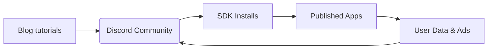

---

title: Pollinations.ai Pitch
layout: default
theme: default
--------------

# Pollinations.ai — **Roblox for AI**

> The fastest on‑ramp from idea to monetized AI product.

<!-- notes:
- Open with a full‑bleed AI‑generated background (use vibrant creator collage).
- Deliver the one‑sentence elevator pitch in <15 s.
- Mention Berlin roots & open‑source ethos very briefly.
-->

---

## 🚀 Traction

* **3 M** monthly active users (MAU)
* **100 M** media pieces generated / month
* **14 M+** plays on flagship Roblox "AI Character RP"
* 150 + third‑party apps • 13 k Discord • 1.7 k⭐ GitHub

<!-- notes:
- Flash the numbers one‑by‑one for emphasis (Slidev reveal).
- Overlay small partner logos as frosting.
- Keep narrative under 30 s before moving to the problem.
-->

---

## 😖 Problem

### Developers

* Complex AI infra & GPU costs
* API keys, auth, billing headaches
* No built‑in monetisation

### End Users

* Forced sign‑ups & paywalls
* Privacy concerns (data retention)
* Limited customisation in AI tools

<!-- notes:
- Drop a single big stat: ">$200 ↗ average monthly GPU bill per indie dev".
- Aim for emotional pain; speak to hackathon audience.
-->

---

## ✨ Solution & Live Demo

### Zero‑Friction API

* Copy‑paste URL → instant img/text/audio
* No keys, no infra, first call is free

### `pollinations‑init` Launchpad

* One command scaffolds & deploys
* Rev‑share, ads, micro‑purchases built‑in

  
  
  

<!-- notes:
- Run a 10‑second live URL demo if internet available.
- Point at three thumbnails: Roblox RP, StoryMagic, Korus plugin.
-->

---

## 🌍 Market & Business Model

|                        | TAM         | Pollinations wedge              |
| ---------------------- | ----------- | ------------------------------- |
| Gen‑AI creator economy | **>\$10 B** | AI plumbing for devs & creators |

**Revenue Levers**

1. Contextual ads
2. Micro‑purchases (packs, credits)
3. Premium subscriptions
4. 50 % app revenue share (Roblox‑style)

<!-- notes:
- Highlight rapid TAM growth (doubling YoY) with quick chart or number callout.
- Stress diversity of revenue → resilience.
-->

---

## 📈 Go‑to‑Market & Moat

* Lowest friction wins dev mindshare → flywheel above
* MIT‑licensed stack + privacy‑first = trust & contributions

<!-- notes:
- Explain flywheel in 15 s.
- Cite existing 150+ apps as proof the loop already spins.
-->

---

## 🛣️ Roadmap

| Quarter     | Key Milestones                                   |
| ----------- | ------------------------------------------------ |
| **Q3 2025** | Core infra, per‑app DB, ad validation            |
| **Q1 2026** | MCP hosting GA, Monetisation v1, 50 % rev‑share  |
| **Q2 2026** | Image/audio ads, dev‑tooling v2, model expansion |

<!-- notes:
- Use horizontal timeline if you prefer visuals; keep to 3 phases max.
- Tie each milestone to KPI (e.g., MAU 5 M by Q1 26).
-->

---

## 👥 Team & Seed Ask

|                      |                                  |
| -------------------- | -------------------------------- |
| **Thomas Haferlach** | Creative‑AI pioneer, ex‑Pixelynx |
| **Core Dev Squad**   | 4 senior ML & infra engineers    |

**Raising \$2.5 – 3 M seed**

* 65 % GPU fleet & infra scaling
* 25 % team growth (devrel, BD)
* 10 % runway buffer

<!-- notes:
- Display headshots; keep bios to one brag line.
- Finish with clear next‑step: "Let’s talk if you want in on the Roblox‑for‑AI platform." Cue QR or contact.
-->

---
