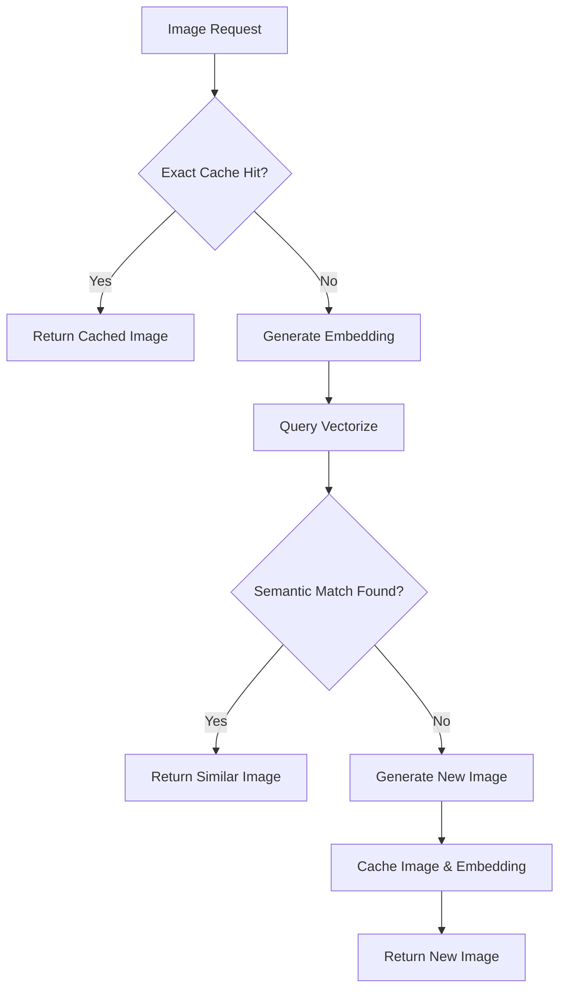

# Issue #1326: Cloudflare Image Caching with Text Embeddings Implementation Plan

**Issue Reference:** [#1326](https://github.com/pollinations/pollinations/issues/1326)  
**Created:** June 19, 2025  
**Status:** Planning Phase  
**Priority:** High  

## Executive Summary

This plan outlines the implementation of semantic image caching using Cloudflare Vectorize for the Pollinations image service. The solution will enhance the existing R2-based cache by adding text embedding similarity search, allowing retrieval of semantically similar images when exact cache matches are not found.

## Background & Context

### Original Problem
- Current R2 cache only supports exact URL/parameter matches
- Users requesting semantically similar prompts cannot benefit from existing cached images
- Waste of computational resources generating similar images repeatedly
- Opportunity to improve user experience with faster responses for similar requests

### Current State (2025)
- ✅ **Vectorize is Generally Available** (as of 2024)
- ✅ **Existing R2 cache infrastructure** in `image.pollinations.ai/cloudflare-cache/`
- ✅ **Shared authentication utilities** available
- ✅ **Workers AI integration** patterns established
- ✅ **Experience from text service vectorcache** implementation (Memory: #abbb7742)

### Technology Stack
- **Cloudflare Vectorize**: Vector database for embedding storage and similarity search
- **Workers AI**: `@cf/baai/bge-base-en-v1.5` model for generating text embeddings (768 dimensions)
- **Cloudflare R2**: Existing image storage backend
- **Cloudflare Workers**: Existing cache proxy infrastructure

## Technical Architecture

### High-Level Flow


### Components to Implement

#### 1. Enhanced Cache Layer (`src/semantic-cache.js`)
```javascript
// Semantic caching functionality using functional approach
export const createSemanticCache = (env) => ({
  r2: env.IMAGE_BUCKET,
  vectorize: env.VECTORIZE_INDEX,
  ai: env.AI,
  similarityThreshold: 0.85, // Configurable
});

export const findSimilarImage = async (cache, prompt, params) => {
  // Generate embedding for prompt with resolution bucket
  // Query Vectorize for similar vectors in appropriate bucket
  // Return cache key if similarity above threshold
};

export const cacheImageWithEmbedding = async (cache, prompt, params, imageBuffer, cacheKey) => {
  // Store image in R2 (existing functionality)
  // Generate and store embedding in Vectorize with resolution bucket metadata
};
```

#### 2. Embedding Generation Service (`src/embedding-service.js`)
```javascript
export const createEmbeddingService = (ai) => ({
  ai,
  model: "@cf/baai/bge-base-en-v1.5",
});

export const generateEmbedding = async (service, prompt, params) => {
  // Normalize prompt text with resolution bucket
  // Include relevant parameters in embedding context
  // Generate 768-dimensional vector
};

export const normalizePromptForEmbedding = (prompt, params) => {
  // Create consistent text representation
  // Include style, model, quality parameters
  // Exclude non-semantic parameters but include resolution bucket
};

export const getResolutionBucket = (width, height) => {
  // Categorize image dimensions into buckets for semantic matching
};
```

#### 3. Resolution Bucketing Strategy (`src/resolution-buckets.js`)
```javascript
// Resolution bucket definitions for semantic matching
export const RESOLUTION_BUCKETS = {
  SQUARE_SMALL: { range: '<=512x512', bucket: 'sq_sm' },
  SQUARE_MEDIUM: { range: '513-1024x513-1024', bucket: 'sq_md' },
  SQUARE_LARGE: { range: '>=1025x1025', bucket: 'sq_lg' },
  PORTRAIT_SMALL: { range: 'h>w, <=768h', bucket: 'pt_sm' },
  PORTRAIT_MEDIUM: { range: 'h>w, 769-1536h', bucket: 'pt_md' },
  PORTRAIT_LARGE: { range: 'h>w, >=1537h', bucket: 'pt_lg' },
  LANDSCAPE_SMALL: { range: 'w>h, <=768w', bucket: 'ls_sm' },
  LANDSCAPE_MEDIUM: { range: 'w>h, 769-1536w', bucket: 'ls_md' },
  LANDSCAPE_LARGE: { range: 'w>h, >=1537w', bucket: 'ls_lg' },
};

export const getResolutionBucket = (width, height) => {
  const aspectRatio = width / height;
  const maxDimension = Math.max(width, height);
  
  if (aspectRatio >= 0.9 && aspectRatio <= 1.1) {
    // Square
    if (maxDimension <= 512) return RESOLUTION_BUCKETS.SQUARE_SMALL.bucket;
    if (maxDimension <= 1024) return RESOLUTION_BUCKETS.SQUARE_MEDIUM.bucket;
    return RESOLUTION_BUCKETS.SQUARE_LARGE.bucket;
  } else if (height > width) {
    // Portrait
    if (height <= 768) return RESOLUTION_BUCKETS.PORTRAIT_SMALL.bucket;
    if (height <= 1536) return RESOLUTION_BUCKETS.PORTRAIT_MEDIUM.bucket;
    return RESOLUTION_BUCKETS.PORTRAIT_LARGE.bucket;
  } else {
    // Landscape
    if (width <= 768) return RESOLUTION_BUCKETS.LANDSCAPE_SMALL.bucket;
    if (width <= 1536) return RESOLUTION_BUCKETS.LANDSCAPE_MEDIUM.bucket;
    return RESOLUTION_BUCKETS.LANDSCAPE_LARGE.bucket;
  }
};
```

#### 4. Existing Image Migration Service (`src/migration-service.js`)
```javascript
// Functions for migrating existing cached images to Vectorize
export const migrateExistingImages = async (env, options = {}) => {
  // Batch process existing R2 images
  // Extract metadata from cache keys
  // Generate embeddings and store in Vectorize
};

export const extractMetadataFromCacheKey = (cacheKey) => {
  // Handle different cache key formats that evolved over time
  
  // Current format: hash of sanitized prompt + params
  // Legacy formats: may include direct prompt encoding
  
  try {
    // Attempt to reverse-engineer from URL structure
    // Parse query parameters that were hashed into key
    const decoded = decodeURIComponent(cacheKey);
    
    // Extract width/height from image metadata if available
    // This might require fetching the image header
    
    return {
      prompt: extractedPrompt,
      width: extractedWidth,
      height: extractedHeight,
      params: extractedParams
    };
  } catch (error) {
    return { prompt: null, error: error.message };
  }
};
```

{{ ... }}

## Existing Image Vectorization Strategy

### Challenge: Migrating Historical Cache
The existing R2 cache contains thousands of images with cache keys that encode the original prompts and parameters. We need to extract this information and generate corresponding vector embeddings.

### Resolution Bucketing Approach
Images will be categorized into resolution buckets to ensure semantic similarity matching occurs within appropriate size constraints:

#### Bucket Categories
```javascript
const RESOLUTION_BUCKETS = {
  // Square formats
  'sq_sm':  '≤512×512',     // Profile pics, thumbnails
  'sq_md':  '513-1024×513-1024', // Social media posts
  'sq_lg':  '≥1025×1025',   // High-res squares
  
  // Portrait formats  
  'pt_sm':  '≤768h',        // Mobile screens
  'pt_md':  '769-1536h',    // Standard portraits
  'pt_lg':  '≥1537h',       // High-res portraits
  
  // Landscape formats
  'ls_sm':  '≤768w',        // Small banners
  'ls_md':  '769-1536w',    // Desktop wallpapers
  'ls_lg':  '≥1537w',       // Ultra-wide formats
};
```

### Migration Process

#### Phase 0: Pre-Migration Analysis (2 days)
**Goal:** Understand existing cache structure and plan migration approach

#### Tasks:
1. **Cache Analysis**
   - Analyze R2 bucket contents and cache key patterns
   - Estimate total number of images to migrate
   - Identify different cache key formats used over time

2. **Resolution Distribution Analysis**
   ```javascript
   // Sample analysis script
   const analyzeCacheDistribution = async (env) => {
     const objects = await env.IMAGE_BUCKET.list({ limit: 1000 });
     const resolutionCounts = {};
     
     for (const obj of objects.objects) {
       const metadata = extractMetadataFromCacheKey(obj.key);
       const bucket = getResolutionBucket(metadata.width, metadata.height);
       resolutionCounts[bucket] = (resolutionCounts[bucket] || 0) + 1;
     }
     
     return resolutionCounts;
   };
   ```

3. **Migration Capacity Planning**
   - Estimate Vectorize storage requirements per bucket
   - Calculate migration timeline based on rate limits
   - Plan batch processing strategy

#### Phase 0.5: Migration Infrastructure (3 days)
**Goal:** Build tools and infrastructure for safe migration

#### Tasks:
1. **Migration Worker Creation**
   ```javascript
   // src/migrate-worker.js - Dedicated worker for migration
   export default {
     async fetch(request, env, ctx) {
       const url = new URL(request.url);
       const action = url.pathname.slice(1);
       
       switch (action) {
         case 'analyze':
           return await analyzeCacheDistribution(env);
         case 'migrate-batch':
           return await migrateBatch(env, request);
         case 'status':
           return await getMigrationStatus(env);
         default:
           return new Response('Migration Worker', { status: 200 });
       }
     }
   };
   ```

2. **Progress Tracking System**
   ```javascript
   // Track migration progress in KV or D1
   const updateMigrationProgress = async (env, bucket, processed, total) => {
     await env.MIGRATION_PROGRESS.put(`bucket_${bucket}`, JSON.stringify({
       processed,
       total,
       lastUpdated: Date.now(),
       status: processed >= total ? 'complete' : 'in_progress'
     }));
   };
   ```

3. **Error Handling & Recovery**
   - Failed migration retry logic
   - Partial migration recovery
   - Validation of migrated embeddings

#### Phase 0.75: Pilot Migration (2 days)
**Goal:** Test migration process on small subset

#### Tasks:
1. **Small Batch Test**
   - Migrate 100-200 images from each resolution bucket
   - Validate embedding generation accuracy
   - Test semantic similarity matching

2. **Performance Validation**
   - Measure migration throughput
   - Monitor Vectorize API usage and costs
   - Validate query performance with mixed old/new data

3. **Rollback Planning**
   - Implement migration rollback procedures
   - Test data consistency checks
   - Plan production rollback scenarios

### Migration Execution Strategy

#### Batch Processing Approach
```javascript
const migrateBatch = async (env, startKey = null, batchSize = 50) => {
  const listOptions = { limit: batchSize };
  if (startKey) listOptions.cursor = startKey;
  
  const objects = await env.IMAGE_BUCKET.list(listOptions);
  const results = { processed: 0, errors: [], nextCursor: objects.cursor };
  
  for (const obj of objects.objects) {
    try {
      // Extract metadata from cache key
      const metadata = extractMetadataFromCacheKey(obj.key);
      if (!metadata.prompt) {
        results.errors.push({ key: obj.key, error: 'No prompt extractable' });
        continue;
      }
      
      // Generate embedding
      const embedding = await generateEmbedding(
        createEmbeddingService(env.AI),
        metadata.prompt,
        metadata.params
      );
      
      // Store in Vectorize with resolution bucket metadata
      const resolutionBucket = getResolutionBucket(metadata.width, metadata.height);
      await env.VECTORIZE_INDEX.upsert([{
        id: `migrate_${obj.key}`,
        values: embedding,
        metadata: {
          cacheKey: obj.key,
          resolutionBucket,
          prompt: metadata.prompt,
          migratedAt: Date.now(),
          ...metadata.params
        }
      }]);
      
      results.processed++;
    } catch (error) {
      results.errors.push({ key: obj.key, error: error.message });
    }
  }
  
  return results;
};
```

#### Cache Key Metadata Extraction
```javascript
const extractMetadataFromCacheKey = (cacheKey) => {
  // Handle different cache key formats that evolved over time
  
  // Current format: hash of sanitized prompt + params
  // Legacy formats: may include direct prompt encoding
  
  try {
    // Attempt to reverse-engineer from URL structure
    // Parse query parameters that were hashed into key
    const decoded = decodeURIComponent(cacheKey);
    
    // Extract width/height from image metadata if available
    // This might require fetching the image header
    
    return {
      prompt: extractedPrompt,
      width: extractedWidth,
      height: extractedHeight,
      params: extractedParams
    };
  } catch (error) {
    return { prompt: null, error: error.message };
  }
};
```

### Migration Timeline & Resource Planning

#### Resource Requirements
- **Migration Worker**: Dedicated Cloudflare Worker for batch processing
- **Vectorize Capacity**: ~100K-500K vectors across 9 resolution buckets
- **Processing Time**: ~2-4 weeks depending on cache size
- **Cost Estimate**: Migration ~$5-15 one-time, ongoing ~$2-5/month

#### Migration Schedule
```
Week 1: Pre-Migration & Infrastructure
├── Days 1-2: Cache analysis and capacity planning
├── Days 3-5: Migration infrastructure development
└── Days 6-7: Pilot migration and validation

Week 2-3: Batch Migration Execution
├── Bucket-by-batch processing (50-100 images/batch)
├── Continuous monitoring and error handling
└── Progress tracking and reporting

Week 4: Validation & Cleanup
├── Semantic similarity validation
├── Performance testing with full dataset
└── Migration infrastructure cleanup
```

#### Monitoring & Validation
```javascript
const validateMigration = async (env) => {
  // Sample validation checks
  const checks = {
    embeddingCount: await env.VECTORIZE_INDEX.query([0, 0, ...], { topK: 1 }),
    bucketDistribution: await analyzeBucketDistribution(env),
    semanticAccuracy: await testSemanticMatching(env),
    performanceMetrics: await measureQueryPerformance(env)
  };
  
  return {
    status: checks.embeddingCount > 0 ? 'success' : 'failed',
    details: checks
  };
};
```

{{ ... }}

### Phase 1: Infrastructure Setup (3 days)
**Goal:** Set up Vectorize index and Workers AI integration

#### Tasks:
1. **Create Vectorize Index with Resolution Buckets**
   ```bash
   wrangler vectorize create pollinations-image-cache --dimensions=768 --metric=cosine
   ```

2. **Update wrangler.toml**
   ```toml
   [[vectorize]]
   binding = "VECTORIZE_INDEX"
   index_name = "pollinations-image-cache"

   [ai]
   binding = "AI"
   
   # For migration worker
   [[kv_namespaces]]
   binding = "MIGRATION_PROGRESS"
   id = "migration-progress-kv"
   ```

3. **Update Environment Configuration**
   - Add Vectorize bindings to production deployment
   - Configure Workers AI access
   - Set up migration progress tracking
   - Update deployment scripts

4. **Create Base Infrastructure**
   - Implement embedding service functions
   - Create Vectorize query utilities with resolution bucket filtering
   - Add configuration constants
   - Build migration infrastructure

**Deliverables:**
- Vectorize index created with bucket support
- Workers AI integration configured
- Base service functions implemented
- Migration tooling ready

### Phase 2: Semantic Cache Implementation (5 days) 
**Goal:** Implement core semantic caching functionality with resolution awareness

#### Tasks:
1. **Implement Semantic Cache Functions**
   - Vector similarity search with bucket filtering
   - Threshold-based matching logic
   - Integration with existing R2 cache

2. **Update Cache Key Generation**
   - Create semantic-aware cache keys with resolution buckets
   - Maintain backward compatibility
   - Add metadata for vector IDs and buckets

3. **Integrate Embedding Generation**
   - Prompt normalization functions with bucket context
   - Parameter inclusion strategy
   - Batch processing for efficiency

4. **Update Main Worker Logic**
   - Add semantic cache lookup with bucket filtering
   - Fallback to exact cache, then generation
   - Analytics integration

**Deliverables:**
- Functional semantic cache system with resolution bucketing
- Updated worker with semantic lookup
- Comprehensive logging and monitoring

{{ ... }}

### Embedding Strategy
```javascript
// Prompt normalization for embedding - functional approach with resolution context
export const normalizePromptForEmbedding = (prompt, params) => {
  const semanticParams = [
    'style', 'model', 'enhance', 'quality',
    // Include resolution bucket for context but exclude exact dimensions
  ];
  
  const resolutionBucket = getResolutionBucket(params.width || 1024, params.height || 1024);
  
  const context = [
    prompt.toLowerCase().trim(),
    `bucket:${resolutionBucket}`,
    ...semanticParams.map(key => 
      params[key] ? `${key}:${params[key]}` : ''
    ).filter(Boolean)
  ].join(' ');
  
  return context;
};
```

### Cache Key Strategy
```javascript
// Hybrid cache key generation - functional approach with bucket awareness
export const generateHybridCacheKey = (prompt, params) => {
  const exactKey = generateCacheKey(prompt, params); // Existing function
  const resolutionBucket = getResolutionBucket(params.width || 1024, params.height || 1024);
  const semanticId = crypto.createHash('md5')
    .update(normalizePromptForEmbedding(prompt, params))
    .digest('hex').slice(0, 8);
  
  return {
    exactKey,
    semanticId,
    vectorId: `img_${resolutionBucket}_${semanticId}`,
    resolutionBucket
  };
};
```

{{ ... }}

### Expected Metrics
- **Semantic Cache Hit Rate:** 15-25% additional hits beyond exact matches
- **Migration Coverage:** 80-90% of existing cache successfully vectorized
- **Resolution Accuracy:** >95% semantic matches within appropriate size ranges
- **Embedding Generation Time:** ~50-100ms per request
- **Vectorize Query Time:** ~10-30ms per query (with bucket filtering)
- **Total Additional Latency:** ~100-150ms (only for cache misses)

### Cost Analysis (Monthly)
Based on Vectorize pricing and expected usage with resolution bucketing:

```
Estimated Monthly Usage (with migration):
- 500,000 stored images across 9 buckets → 500,000 vectors
- 1,000,000 queries/month (with bucket filtering for efficiency)
- Vector dimensions: 768

Cost Calculation:
- Stored vectors: 500,000 × 768 × ($0.05/100M) = $0.19
- Query vectors: 1,000,000 × 768 × ($0.01/1M) = $0.77

Total Monthly Cost: ~$0.96
Migration Cost (one-time): ~$5-15
```

{{ ... }}

## Migration Risk Assessment & Mitigation

### High Risk
1. **Cache Key Extraction Failure**
   - **Risk:** Unable to reverse-engineer prompts from existing cache keys
   - **Mitigation:** Implement multiple extraction strategies, accept partial migration

2. **Migration Performance Impact**
   - **Risk:** Migration process impacts production performance
   - **Mitigation:** Rate limiting, off-peak processing, dedicated migration worker

### Medium Risk
3. **Resolution Bucket Accuracy**
   - **Risk:** Incorrect bucket assignment leads to poor semantic matching
   - **Mitigation:** Extensive testing, bucket refinement based on usage patterns

4. **Vectorize Capacity Limits**
   - **Risk:** Exceeding Vectorize storage or query limits during migration
   - **Mitigation:** Phased migration, usage monitoring, alternative storage strategies

{{ ... }}
