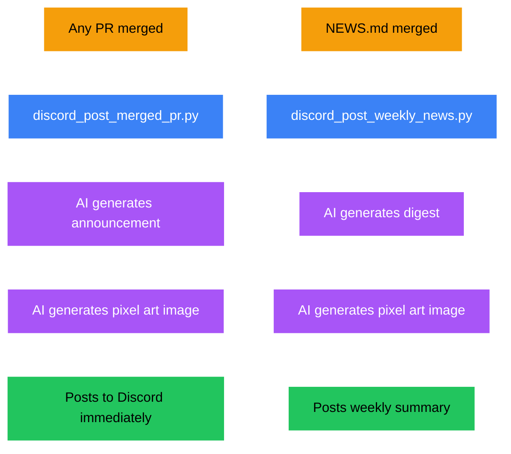

# Discord Pipeline

Automatic PR announcements and weekly news digests posted via webhook.

## Overview

| | |
|---|---|
| **Frequency** | On every PR merge + weekly |
| **Content type** | Text + 1 image |
| **Image size** | 2048x2048px |
| **Image model** | `nanobanana-pro` |
| **Text model** | `gemini-large` |
| **Tone** | Dev community announcement |
| **Human review** | No — automatic |
| **Publishing API** | Discord Webhook |

## Pipeline Flow

## Two Triggers

1. **PR Merge** — `pull_request_target` closed+merged triggers `discord_post_merged_pr.py` immediately
2. **Weekly NEWS** — Push to `main` matching `social/news/*.md` triggers `discord_post_weekly_news.py`

## Scripts

| Script | Purpose |
|--------|---------|
| `scripts/discord_post_merged_pr.py` | Posts individual PR announcement + image to Discord |
| `scripts/discord_post_weekly_news.py` | Posts weekly news digest + image to Discord |

## Prompts

| File | Purpose |
|------|---------|
| `prompts/discord/merged_pr_system.md` | System prompt for PR announcements |
| `prompts/discord/merged_pr_user.md` | User prompt with PR details |
| `prompts/discord/weekly_news_system.md` | System prompt for weekly digest |
| `prompts/discord/weekly_news_user.md` | User prompt with news content |
| `prompts/discord/image_prompt_system.md` | System prompt for image generation |

## Secrets Required

`DISCORD_WEBHOOK_URL`, `POLLINATIONS_TOKEN`, `GITHUB_TOKEN`
