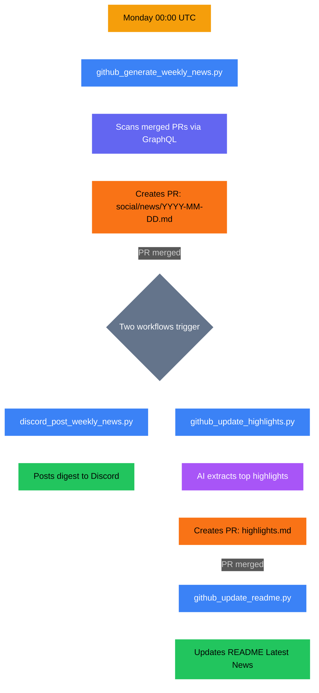

# GitHub / NEWS Pipeline

Weekly news generation, highlights updates, and README updates — all automated via chained workflows.

## Overview

| | |
|---|---|
| **Frequency** | Weekly (Monday) |
| **Trigger** | Cron `0 0 * * 1` (Mon midnight UTC) |
| **Content type** | Markdown (news + highlights) |
| **Text model** | `gemini-large` |
| **Human review** | Yes — PR before each step |

## Pipeline Flow

## 4-Step Chain

| Step | Trigger | Script | Creates | Triggers next |
|------|---------|--------|---------|---------------|
| 1. Generate weekly news | Cron Mon 00:00 UTC | `github_generate_weekly_news.py` | PR with `social/news/YYYY-MM-DD.md` | On PR merge: steps 2 + 3 |
| 2. Post to Discord | Push to `main` with `social/news/*.md` | `discord_post_weekly_news.py` | Discord message | -- |
| 3. Update highlights | PR merge with `social/news/*.md` | `github_update_highlights.py` | PR with `social/news/transformed/highlights.md` | On PR merge: step 4 |
| 4. Update README | PR merge with `social/news/transformed/highlights.md` | `github_update_readme.py` | Updates repo `README.md` "Latest News" section | -- |

## Scripts

| Script | Purpose |
|--------|---------|
| `scripts/github_generate_weekly_news.py` | Scans PRs, generates weekly news markdown |
| `scripts/github_update_highlights.py` | Extracts top highlights from news |
| `scripts/github_update_readme.py` | Updates repo README with latest highlights |

## Prompts

| File | Purpose |
|------|---------|
| `prompts/github/weekly_news_system.md` | System prompt for weekly news |
| `prompts/github/weekly_news_user.md` | User prompt for news generation |
| `prompts/github/weekly_news_user_final.md` | Final formatting prompt |
| `prompts/github/highlights_system.md` | System prompt for highlights |
| `prompts/github/highlights_user.md` | User prompt with NEWS content |

## Secrets Required

`POLLINATIONS_TOKEN`, `GITHUB_TOKEN`, `POLLY_BOT_APP_ID`, `POLLY_BOT_PRIVATE_KEY`
