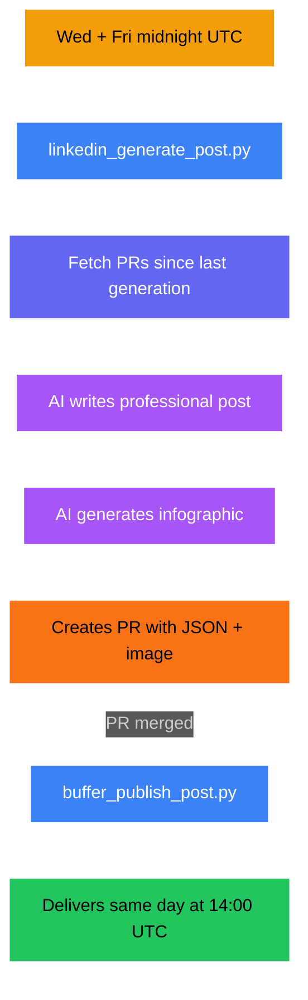

# LinkedIn Pipeline

Twice-weekly professional posts highlighting merged PRs and milestones, published via Buffer.

## Overview

| | |
|---|---|
| **Generation** | Wed + Fri at midnight UTC |
| **Delivery** | Same day at 14:00 UTC via Buffer |
| **Lookback** | 5 days (Wed) / 2 days (Fri) — matches gap since last generation |
| **Content type** | Text + 1 infographic image |
| **Image size** | 2048x2048px |
| **Image model** | `nanobanana-pro` |
| **Text model** | `gemini-large` |
| **Tone** | Professional, investor-signal, milestone-focused |
| **Human review** | Yes — PR before publish |
| **Publishing API** | Buffer GraphQL (`api.buffer.com`) |
| **Fallback** | Thought leadership post (when no PRs) |

## Pipeline Flow

## Scripts

| Script | Purpose |
|--------|---------|
| `scripts/linkedin_generate_post.py` | Fetches PRs, generates post JSON + image |
| `scripts/buffer_publish_post.py` | Publishes to Buffer with scheduled delivery |

## Prompts

| File | Purpose |
|------|---------|
| `prompts/linkedin/system.md` | System prompt — professional tone, infographic style |
| `prompts/linkedin/user_with_prs.md` | User prompt when PRs are available |
| `prompts/linkedin/user_thought_leadership.md` | Fallback user prompt (no PRs) |

Uses shared placeholders: `{about}`, `{visual_style}`, `{pr_summary}`, `{pr_count}`

## Post Output

JSON stored at `news/transformed/linkedin/posts/YYYY-MM-DD.json`

## Workflow Inputs

| Variable | Purpose | Default |
|----------|---------|---------|
| `DAYS_BACK` | Days to scan for PRs | Auto: 5 (Wed) / 2 (Fri) |
| `FORCE_THOUGHT_LEADERSHIP` | Skip PRs, generate thought leadership | false |

## Secrets Required

`BUFFER_ACCESS_TOKEN`, `POLLINATIONS_TOKEN`, `GITHUB_TOKEN`, `POLLY_BOT_APP_ID`, `POLLY_BOT_PRIVATE_KEY`
