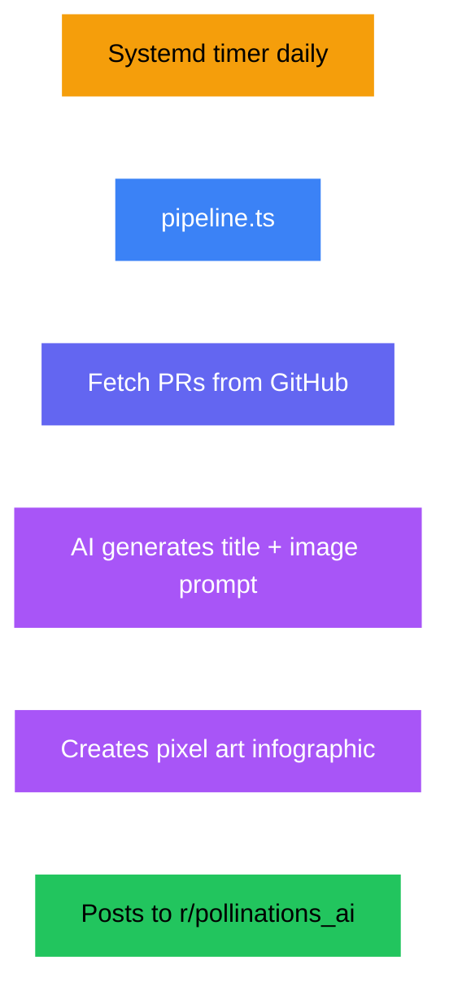

# Reddit Pipeline

Daily pixel art posts to r/pollinations_ai via a self-hosted Devvit app (TypeScript).

## Overview

| | |
|---|---|
| **Frequency** | Daily |
| **Trigger** | Systemd timer |
| **Content source** | Merged PRs from GitHub |
| **Content type** | Text + 1 image |
| **Image size** | 2048x2048px |
| **Image model** | `nanobanana-pro` |
| **Text model** | `gemini-large` |
| **Tone** | Factual, informative, dev meme energy |
| **Human review** | No — automatic |
| **Publishing API** | Devvit (Reddit API) |

## Pipeline Flow

## Architecture

Unlike other platforms (Python + GitHub Actions), Reddit uses a **self-hosted TypeScript Devvit app**.

| Component | File | Purpose |
|-----------|------|---------|
| Entry Point | `reddit/src/main.ts` | Devvit app, posts to Reddit on AppUpgrade |
| Content Pipeline | `reddit/src/pipeline.ts` | Fetches PRs, generates prompt, title, image |
| Prompt Loader | `reddit/src/loadPrompt.ts` | Loads prompts with `{about}` and `{visual_style}` injection |
| System Prompt | `reddit/src/system_prompt.ts` | Embedded AI prompt |
| Deploy Script | `reddit/bash/deploy.sh` | Orchestrates full pipeline |

## Prompts

Reddit uses **external prompt files** loaded by `loadPrompt.ts`, plus an embedded system prompt:

| File | Purpose |
|------|---------|
| `prompts/reddit/system.md` | System prompt — factual tone, dev meme pixel art |
| `prompts/reddit/user_with_prs.md` | User prompt when PRs are available |
| `reddit/src/system_prompt.ts` | Embedded fallback system prompt |

Uses shared placeholders: `{about}`, `{visual_style}`, `{pr_summary}`

## Deployment

See `reddit/README.md` for the full Devvit deployment guide.

## Secrets Required

Configured on the self-hosted server (not GitHub Secrets): Devvit credentials, `POLLINATIONS_TOKEN`, `GITHUB_TOKEN`
