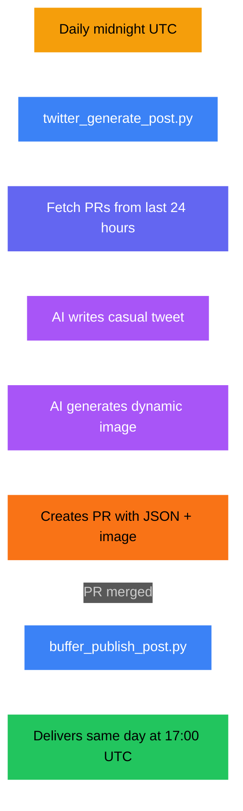

# Twitter/X Pipeline

Daily tweets with substance and personality, published via Buffer.

## Overview

| | |
|---|---|
| **Generation** | Daily at midnight UTC |
| **Delivery** | Same day at 17:00 UTC via Buffer |
| **Lookback** | 1 day — matches gap since last generation |
| **Content type** | Text + 1 image |
| **Image size** | 2048x2048px |
| **Image model** | `nanobanana-pro` |
| **Text model** | `gemini-large` |
| **Tone** | Builder credibility, substance with personality |
| **Human review** | Yes — PR before publish |
| **Publishing API** | Buffer GraphQL (`api.buffer.com`) |
| **Fallback** | Engagement post (when no PRs) |

## Pipeline Flow

## Scripts

| Script | Purpose |
|--------|---------|
| `scripts/twitter_generate_post.py` | Fetches PRs, generates tweet JSON + image |
| `scripts/buffer_publish_post.py` | Publishes to Buffer with scheduled delivery |

## Prompts

| File | Purpose |
|------|---------|
| `prompts/twitter/system.md` | System prompt — builder voice, 280-char limit |
| `prompts/twitter/user_with_prs.md` | User prompt when PRs are available |
| `prompts/twitter/user_engagement.md` | Fallback user prompt (no PRs) |

Uses shared placeholders: `{about}`, `{visual_style}`, `{pr_summary}`, `{pr_count}`

## Post Output

JSON stored at `news/transformed/twitter/posts/YYYY-MM-DD.json`

## Workflow Inputs

| Variable | Purpose | Default |
|----------|---------|---------|
| `DAYS_BACK` | Days to scan for PRs | 1 |
| `FORCE_ENGAGEMENT` | Skip PRs, generate engagement content | false |

## Secrets Required

`BUFFER_ACCESS_TOKEN`, `POLLINATIONS_TOKEN`, `GITHUB_TOKEN`, `POLLY_BOT_APP_ID`, `POLLY_BOT_PRIVATE_KEY`
