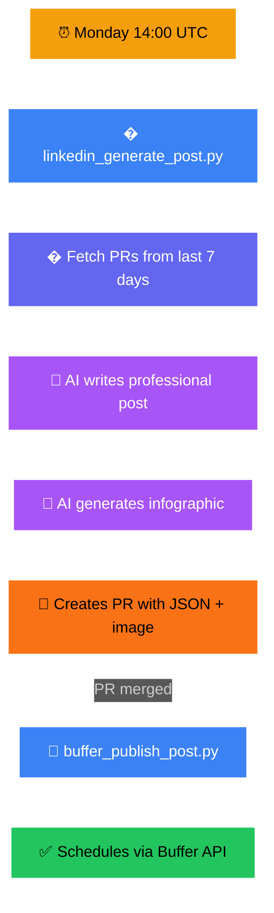
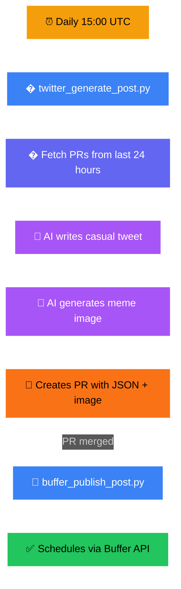
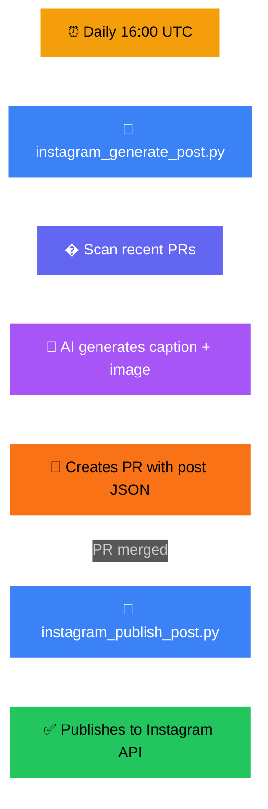
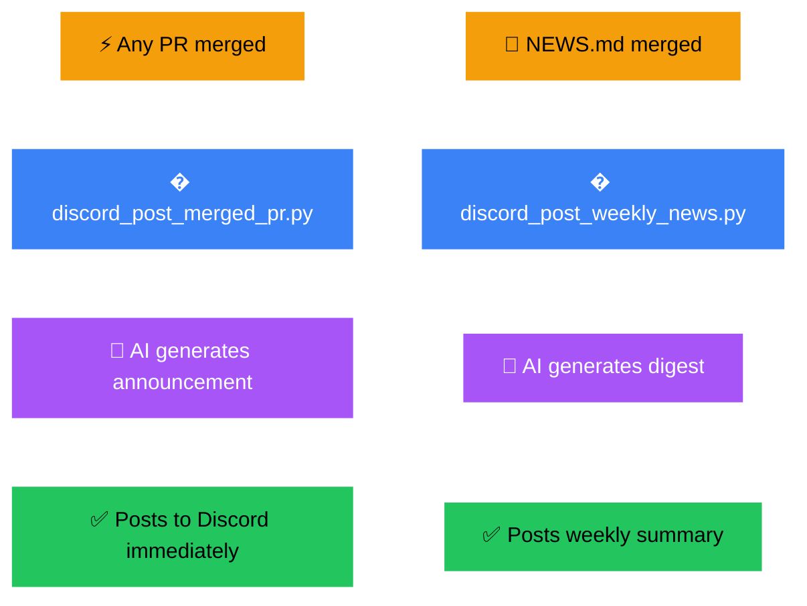
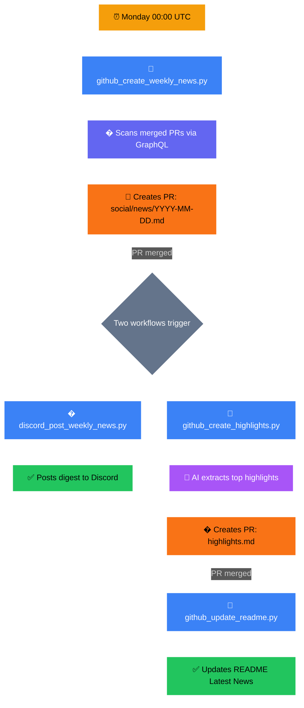
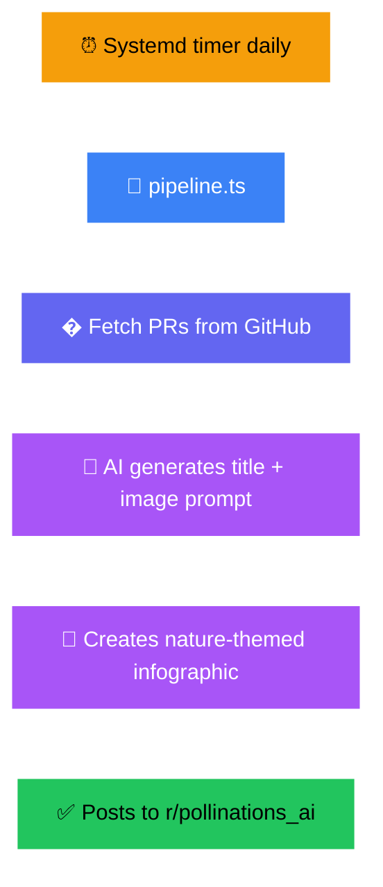

# Social Media Automation

Automated social media posting for pollinations.ai across multiple platforms.

---

## Platform Overview

| Platform | Trigger | Publishing | Notes |
|----------|---------|------------|-------|
| **LinkedIn** | Cron: Mon 14:00 UTC | Buffer | Primary target - professional presence |
| **Twitter/X** | Cron: Daily 15:00 UTC | Buffer | Primary target - dev community |
| **Instagram** | Cron: Daily 16:00 UTC | Direct API | Pixel art style |
| **Discord** | On PR merge / On NEWS merge | Webhook | Real-time, no Buffer |
| **Reddit** | Systemd timer (daily) | Devvit | Self-hosted TypeScript pipeline |
| **Facebook** | — | — | 🚧 Not yet implemented |

### Key Differences

- **LinkedIn & Twitter/X** - Primary platforms. Use Buffer for scheduling. AI generates content + images, human reviews PR before publishing.
- **Instagram** - Uses Instagram Graph API directly (not Buffer). Same PR-based review workflow.
- **Discord** - Direct webhook posting. Two triggers: (1) Any PR merged → announcement, (2) NEWS.md merged → weekly digest.
- **Reddit** - Completely separate pipeline. Self-hosted on EC2 with systemd timers. TypeScript-based (Devvit), not Python.

---

## Pipeline Overview

### 🎨 Color Legend

| Color | Meaning |
|:-----:|---------|
| 🟡 **Yellow** | Trigger (cron schedule, event) |
| 🔵 **Blue** | Script execution |
| � **Indigo** | Data processing |
| 🟪 **Purple** | AI generation |
| � **Orange** | PR creation (human review) |
| � **Green** | Final output/publish |

---

### LinkedIn Flow (Weekly)



### Twitter/X Flow (Daily)



### Instagram Flow (Daily)



### Discord Flow (On PR Merge + Weekly)



### GitHub Flow (Weekly)



### Reddit Flow (Daily - Self-hosted)



| Component | File | Purpose |
|-----------|------|---------|
| Entry Point | `reddit/src/main.ts` | Devvit app, posts to Reddit on AppUpgrade |
| Content Pipeline | `reddit/src/pipeline.ts` | Fetches PRs, generates prompt, title, image |
| System Prompt | `reddit/src/system_prompt.ts` | AI prompt for nature-themed infographics |
| Deploy Script | `reddit/bash/deploy.sh` | Orchestrates full pipeline |

> **Note:** Reddit uses embedded prompts in `reddit/src/system_prompt.ts`, NOT external `.md` files. See `reddit/README.md` for deployment guide.

---

## What Triggers Buffer Publishing?

| PR Type | Triggers Buffer? |
|---------|------------------|
| Regular code PR | ❌ No |
| Documentation PR | ❌ No |
| PR with `social/news/transformed/**/posts/*.json` | ✅ Yes |

---

## Prompts Reference

### Shared Components

| File | Purpose | Placeholder |
|------|---------|-------------|
| `_shared/about.md` | Company description, Pollen system, tier info | `{about}` |

**How it works:** When `linkedin_generate_post.py` or `twitter_generate_post.py` loads a prompt via `common.py`'s `load_prompt()`, it automatically replaces `{about}` with the shared content.

**Currently integrated:**
- ✅ **LinkedIn** - `linkedin/system.md` uses `{about}`
- ✅ **Twitter** - `twitter/system.md` uses `{about}`

**Not using shared components:**
- Instagram, Discord, GitHub scripts have their own `load_prompt()` functions with prompts fully self-contained

### Discord Prompts

| File | Purpose | Used By |
|------|---------|---------|
| `discord/merged_pr_system.md` | System prompt for PR announcements | `discord_post_merged_pr.py` |
| `discord/merged_pr_user.md` | User prompt with PR details | `discord_post_merged_pr.py` |
| `discord/weekly_news_system.md` | System prompt for weekly digest | `discord_post_weekly_news.py` |
| `discord/weekly_news_user.md` | User prompt with news content | `discord_post_weekly_news.py` |

### GitHub Prompts

| File | Purpose | Used By |
|------|---------|---------|
| `github/highlights_system.md` | System prompt for highlights | `github_create_highlights.py` |
| `github/highlights_user.md` | User prompt with NEWS content | `github_create_highlights.py` |
| `github/weekly_news_system.md` | System prompt for weekly news | `github_create_weekly_news.py` |
| `github/weekly_news_user.md` | User prompt for news generation | `github_create_weekly_news.py` |
| `github/weekly_news_user_final.md` | Final formatting prompt | `github_create_weekly_news.py` |

### Instagram Prompts

| File | Purpose | Used By |
|------|---------|---------|
| `instagram/system.md` | System prompt with brand guidelines, pixel art style | `instagram_generate_post.py` |
| `instagram/user_with_prs.md` | User prompt when PRs available | `instagram_generate_post.py` |
| `instagram/user_brand_content.md` | User prompt for brand content (no PRs) | `instagram_generate_post.py` |

### LinkedIn Prompts

| File | Purpose | Used By |
|------|---------|---------|
| `linkedin/system.md` | System prompt for professional tone | `linkedin_generate_post.py` |
| `linkedin/user_with_prs.md` | User prompt when PRs available | `linkedin_generate_post.py` |
| `linkedin/user_thought_leadership.md` | User prompt for thought leadership | `linkedin_generate_post.py` |

### Twitter Prompts

| File | Purpose | Used By |
|------|---------|---------|
| `twitter/system.md` | System prompt for casual/meme style | `twitter_generate_post.py` |
| `twitter/user_with_prs.md` | User prompt when PRs available | `twitter_generate_post.py` |
| `twitter/user_engagement.md` | User prompt for engagement content | `twitter_generate_post.py` |

### Reddit Prompts

| File | Purpose | Used By |
|------|---------|---------|
| `reddit/src/system_prompt.ts` | **EMBEDDED** system prompt (not external file) | `reddit/src/pipeline.ts` |

> ⚠️ **TODO:** Reddit prompts are currently embedded in TypeScript (`reddit/src/system_prompt.ts`). 
> Consider extracting to `prompts/reddit/*.md` files for consistency with other platforms.

---

## Directory Structure

```
social/
├── README.md              # This file
├── buffer-schedule.yml    # Buffer posting schedule
│
├── prompts/               # AI prompts (externalized)
│   ├── _shared/           # Shared components (about.md)
│   ├── discord/           # Discord announcement prompts
│   ├── github/            # Weekly news & highlights prompts
│   ├── instagram/         # Instagram post prompts
│   ├── linkedin/          # LinkedIn post prompts
│   ├── reddit/            # Reddit prompts (reference only - actual prompts embedded)
│   └── twitter/           # Twitter post prompts
│
├── scripts/               # Python automation scripts
│   ├── common.py          # Shared utilities (prompt loading, API calls)
│   ├── buffer_publish_post.py
│   ├── buffer_utils.py
│   ├── discord_post_merged_pr.py
│   ├── discord_post_weekly_news.py
│   ├── github_create_highlights.py
│   ├── github_create_weekly_news.py
│   ├── github_update_readme.py
│   ├── instagram_generate_post.py
│   ├── instagram_publish_post.py
│   ├── linkedin_generate_post.py
│   └── twitter_generate_post.py
│
├── news/                  # Generated content
│   └── transformed/       # Post JSONs and images
│       ├── linkedin/posts/
│       ├── twitter/posts/
│       └── instagram/posts/
│
└── reddit/                # Devvit app (TypeScript, self-hosted)
    ├── src/
    │   ├── main.ts        # Entry point
    │   ├── pipeline.ts    # Content generation
    │   └── system_prompt.ts # Embedded AI prompt
    └── bash/deploy.sh     # Deployment script
```

---

## Configuration

### Environment Variables

| Variable | Purpose | Used By |
|----------|---------|---------|
| `GITHUB_TOKEN` | GitHub API access | All scripts |
| `POLLINATIONS_TOKEN` | AI generation API | All scripts |
| `BUFFER_ACCESS_TOKEN` | Buffer publishing | LinkedIn, Twitter |
| `DISCORD_WEBHOOK_URL` | Discord posting | Discord scripts |
| `INSTAGRAM_USER_ID` | Instagram Graph API | Instagram scripts |
| `INSTAGRAM_ACCESS_TOKEN` | Instagram Graph API | Instagram scripts |

### Workflow Inputs

| Variable | Purpose | Platforms |
|----------|---------|-----------|
| `DAYS_BACK` | Days to scan for PRs | LinkedIn (7), Twitter (1), Instagram (1) |
| `FORCE_THOUGHT_LEADERSHIP` | Skip PRs, generate thought leadership | LinkedIn |
| `FORCE_ENGAGEMENT` | Skip PRs, generate engagement content | Twitter |
| `FORCE_BRAND_CONTENT` | Skip PRs, generate brand content | Instagram |

---

## Editing Prompts

1. Edit file in `prompts/{platform}/`
2. Test via manual workflow trigger
3. Review generated PR

| Variable | Description |
|----------|-------------|
| `{pr_summary}` | Formatted list of merged PRs |
| `{pr_titles}` | PR title list |
| `{pr_count}` | Number of PRs |
| `{about}` | Shared company description (from `_shared/about.md`) |
