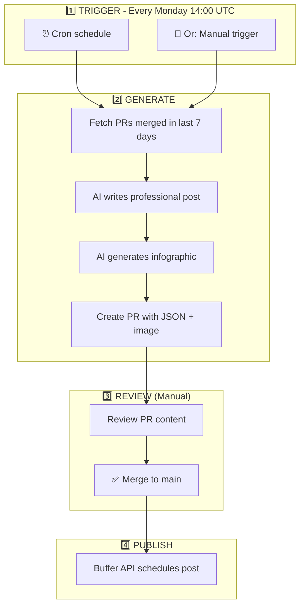
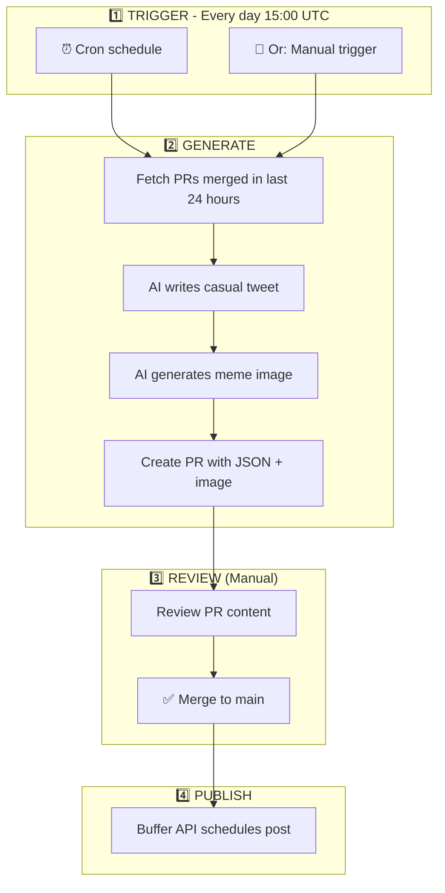

# Social Media Automation

## LinkedIn Flow (Weekly)



**Prompts:** `prompts/linkedin/system.md`, `user_with_prs.md`, `user_thought_leadership.md`

## Twitter/X Flow (Daily)



**Prompts:** `prompts/twitter/system.md`, `user_with_prs.md`, `user_engagement.md`

**Constraint:** 280 character limit, 1-2 hashtags max

## What Triggers Buffer Publishing?

| PR Type | Triggers Buffer? |
|---------|------------------|
| Regular code PR | ❌ No |
| Documentation PR | ❌ No |
| PR with `social/news/transformed/**/posts/*.json` | ✅ Yes |

## Reddit

Self-hosted [Devvit](https://developers.reddit.com/docs/) app for **r/pollinations_ai**.

**Location:** `social/reddit/`

```bash
cd social/reddit && npm install && devvit upload
```

## Configuration

| Env Variable | Purpose |
|-------------|---------|
| `POLLINATIONS_TOKEN` | AI generation API |
| `BUFFER_ACCESS_TOKEN` | Buffer publishing |
| `DAYS_BACK` | Days to scan for PRs (7 LinkedIn, 1 Twitter) |
| `FORCE_THOUGHT_LEADERSHIP` | LinkedIn: skip PRs, generate thought leadership |
| `FORCE_ENGAGEMENT` | Twitter: skip PRs, generate engagement content |

## Directory Structure

```
social/
├── buffer-schedule.yml # Buffer posting times
├── prompts/           # AI prompts for post generation
│   ├── linkedin/
│   └── twitter/
├── scripts/           # Python automation
│   ├── common.py      # Shared utilities
│   ├── linkedin_generate_post.py
│   ├── twitter_generate_post.py
│   └── buffer_publish_post.py
├── news/transformed/  # Generated post JSONs
│   ├── linkedin/posts/
│   └── twitter/posts/
└── reddit/            # Devvit app
```

## Editing Prompts

1. Edit file in `prompts/{platform}/`
2. Test via manual workflow trigger
3. Review generated PR

| Variable | Description |
|----------|-------------|
| `{pr_summary}` | Formatted list of merged PRs |
| `{pr_titles}` | PR title list |
| `{pr_count}` | Number of PRs |
