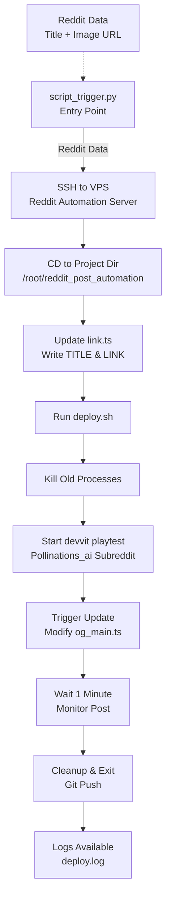

# Reddit Posting Bot (Devvit)

Posts updates to [r/pollinations_ai](https://www.reddit.com/r/pollinations_ai/) via the Devvit SDK.

## Architecture

**Triggered by:**
- `publish_daily.py` — on daily PR merge
- `publish_weekly.py` — Sunday 18:00 UTC cron

**Required secrets:** `REDDIT_VPS_HOST`, `REDDIT_VPS_USER`, `REDDIT_VPS_SSH_KEY`

## Files

| File | Purpose |
|---|---|
| `src/main.ts` | Devvit app — reads config, uploads image, posts to Reddit |
| `bash/deploy.sh` | Deployment script triggered via SSH from CI |
| `devvit.json` | Devvit app config (permissions, triggers) |

> Created with  by [Ayushman Bhattacharya](https://github.com/Circuit-Overtime)
