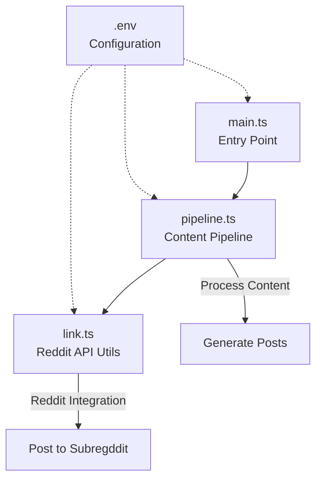

# polly-ai 🤖

Automated Reddit bot for r/pollinations_ai subreddit that posts updates about pollinations.ai.

## Architecture

> Created with 💖 by [Ayushman Bhattacharya](https://github.com/Circuit-Overtime)