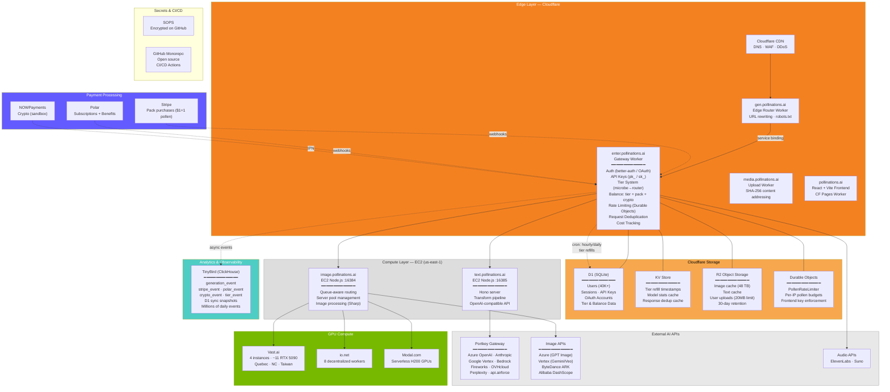

# Diagram 2: Infrastructure & Services Architecture

Current state — all infrastructure services, storage, and data flow.

```mermaid
graph TB
    subgraph EDGE["Edge Layer — Cloudflare"]
        CDN["Cloudflare CDN<br/>DNS · WAF · DDoS"]
        GEN["gen.pollinations.ai<br/>Edge Router Worker<br/>URL rewriting · robots.txt"]
        ENTER["enter.pollinations.ai<br/>Gateway Worker<br/>━━━━━━━━━━━━━━<br/>Auth (better-auth / OAuth)<br/>API Keys (pk_ / sk_)<br/>Tier System (microbe→router)<br/>Balance: tier + pack + crypto<br/>Rate Limiting (Durable Objects)<br/>Request Deduplication<br/>Cost Tracking"]
        MEDIA["media.pollinations.ai<br/>Upload Worker<br/>SHA-256 content addressing"]
        FRONTEND["pollinations.ai<br/>React + Vite Frontend<br/>CF Pages Worker"]
    end

    subgraph CF_STORAGE["Cloudflare Storage"]
        D1["D1 (SQLite)<br/>━━━━━━━━━━━━━━<br/>Users (40K+)<br/>Sessions · API Keys<br/>OAuth Accounts<br/>Tier & Balance Data"]
        KV["KV Store<br/>━━━━━━━━━━━━━━<br/>Tier refill timestamps<br/>Model stats cache<br/>Response dedup cache"]
        R2["R2 Object Storage<br/>━━━━━━━━━━━━━━<br/>Image cache (48 TB)<br/>Text cache<br/>User uploads (20MB limit)<br/>30-day retention"]
        DO["Durable Objects<br/>━━━━━━━━━━━━━━<br/>PollenRateLimiter<br/>Per-IP pollen budgets<br/>Frontend key enforcement"]
    end

    subgraph COMPUTE["Compute Layer — EC2 (us-east-1)"]
        TEXT_EC2["text.pollinations.ai<br/>EC2 Node.js :16385<br/>━━━━━━━━━━━━━━<br/>Hono server<br/>Transform pipeline<br/>OpenAI-compatible API"]
        IMAGE_EC2["image.pollinations.ai<br/>EC2 Node.js :16384<br/>━━━━━━━━━━━━━━<br/>Queue-aware routing<br/>Server pool management<br/>Image processing (Sharp)"]
    end

    subgraph GPU["GPU Compute"]
        VAST["Vast.ai<br/>4 instances · ~11 RTX 5090<br/>Quebec · NC · Taiwan"]
        IONET["io.net<br/>8 decentralized workers"]
        MODAL["Modal.com<br/>Serverless H200 GPUs"]
    end

    subgraph EXTERNAL_API["External AI APIs"]
        PORTKEY["Portkey Gateway<br/>━━━━━━━━━━━━━━<br/>Azure OpenAI · Anthropic<br/>Google Vertex · Bedrock<br/>Fireworks · OVHcloud<br/>Perplexity · api.airforce"]
        IMG_API["Image APIs<br/>━━━━━━━━━━━━━━<br/>Azure (GPT Image)<br/>Vertex (Gemini/Veo)<br/>ByteDance ARK<br/>Alibaba DashScope"]
        AUDIO_API["Audio APIs<br/>ElevenLabs · Suno"]
    end

    subgraph ANALYTICS["Analytics & Observability"]
        TINYBIRD["TinyBird (ClickHouse)<br/>━━━━━━━━━━━━━━<br/>generation_event<br/>stripe_event · polar_event<br/>crypto_event · tier_event<br/>D1 sync snapshots<br/>Millions of daily events"]
    end

    subgraph PAYMENTS["Payment Processing"]
        STRIPE["Stripe<br/>Pack purchases ($1=1 pollen)"]
        POLAR["Polar<br/>Subscriptions + Benefits"]
        NOWPAY["NOWPayments<br/>Crypto (sandbox)"]
    end

    subgraph SECRETS["Secrets & CI/CD"]
        SOPS["SOPS<br/>Encrypted on GitHub"]
        GITHUB["GitHub Monorepo<br/>Open source<br/>CI/CD Actions"]
    end

    %% Request flow
    CDN --> GEN
    GEN -->|"service binding"| ENTER
    ENTER --> TEXT_EC2
    ENTER --> IMAGE_EC2
    ENTER --> AUDIO_API

    %% Storage connections
    ENTER --- D1
    ENTER --- KV
    ENTER --- R2
    ENTER --- DO

    %% Compute to providers
    TEXT_EC2 --> PORTKEY
    IMAGE_EC2 --> VAST
    IMAGE_EC2 --> IONET
    IMAGE_EC2 --> MODAL
    IMAGE_EC2 --> IMG_API

    %% Analytics
    ENTER -.->|"async events"| TINYBIRD

    %% Payments
    STRIPE -.->|webhooks| ENTER
    POLAR -.->|webhooks| ENTER
    NOWPAY -.->|IPN| ENTER

    %% Cron
    ENTER -.->|"cron: hourly/daily<br/>tier refills"| D1

    style EDGE fill:#F48120,color:#fff
    style CF_STORAGE fill:#f7a84e,color:#000
    style COMPUTE fill:#ddd,stroke:#999
    style GPU fill:#76b900,color:#fff
    style EXTERNAL_API fill:#e8e8e8,stroke:#999
    style ANALYTICS fill:#4ECDC4,color:#fff
    style PAYMENTS fill:#635BFF,color:#fff
```
