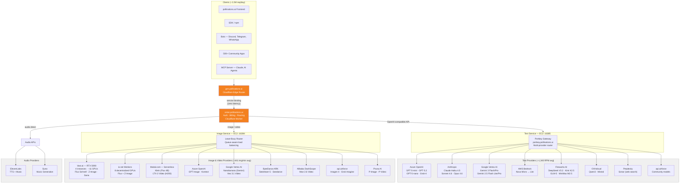

# Diagram 1: Model & Provider Architecture

Current state — all AI models and where they run today.

```mermaid
graph TB
    subgraph CLIENTS["Clients (~2.2M req/day)"]
        WEB[pollinations.ai Frontend]
        SDK["SDK / npm"]
        BOTS["Bots — Discord, Telegram, WhatsApp"]
        APPS["500+ Community Apps"]
        MCP["MCP Server — Claude, AI Agents"]
    end

    GEN["gen.pollinations.ai<br/>Cloudflare Edge Router"]
    ENTER["enter.pollinations.ai<br/>Auth · Billing · Routing<br/>Cloudflare Worker"]

    CLIENTS --> GEN
    GEN -->|"service binding<br/>(zero latency)"| ENTER

    subgraph TEXT_SVC["Text Service — EC2 :16385"]
        PORTKEY["Portkey Gateway<br/>portkey.pollinations.ai<br/>Multi-provider router"]
    end

    subgraph IMAGE_SVC["Image Service — EC2 :16384"]
        LB["Least-Busy Router<br/>Queue-aware load balancing"]
    end

    ENTER -->|"OpenAI-compatible API"| TEXT_SVC
    ENTER -->|"image / video"| IMAGE_SVC
    ENTER -->|"audio direct"| AUDIO_DIRECT["Audio APIs"]

    %% TEXT PROVIDERS
    subgraph TEXT_PROVIDERS["Text Providers (~1,340 RPM avg)"]
        AZURE_OAI["Azure OpenAI<br/>GPT-5-mini · GPT-5.2<br/>GPT-5-nano · Grok-4"]
        ANTHROPIC["Anthropic<br/>Claude Haiku 4.5<br/>Sonnet 4.6 · Opus 4.6"]
        VERTEX["Google Vertex AI<br/>Gemini 3 Flash/Pro<br/>Gemini 2.5 Flash Lite/Pro"]
        BEDROCK["AWS Bedrock<br/>Nova Micro → Lite"]
        FIREWORKS["Fireworks AI<br/>DeepSeek V3.2 · Kimi K2.5<br/>GLM-5 · MiniMax M2.5"]
        OVH["OVHcloud<br/>Qwen3 · Mistral"]
        PERPLEXITY["Perplexity<br/>Sonar (web search)"]
        AIRFORCE_T["api.airforce<br/>Community models"]
    end

    PORTKEY --> AZURE_OAI
    PORTKEY --> ANTHROPIC
    PORTKEY --> VERTEX
    PORTKEY --> BEDROCK
    PORTKEY --> FIREWORKS
    PORTKEY --> OVH
    PORTKEY --> PERPLEXITY
    PORTKEY --> AIRFORCE_T

    %% IMAGE/VIDEO PROVIDERS
    subgraph IMG_PROVIDERS["Image & Video Providers (~441 img/min avg)"]
        VAST["Vast.ai — RTX 5090<br/>4 instances · ~11 GPUs<br/>Flux Schnell · Z-Image · Sana"]
        IONET["io.net Workers<br/>8 decentralized GPUs<br/>Flux + Z-Image"]
        MODAL["Modal.com — Serverless<br/>Klein (Flux 4B)<br/>LTX-2 Video (H200)"]
        AZURE_IMG["Azure OpenAI<br/>GPT Image · Kontext"]
        VERTEX_IMG["Google Vertex AI<br/>Nanobanana (Gemini)<br/>Veo 3.1 Video"]
        ARK["ByteDance ARK<br/>Seedream 5 · Seedance"]
        DASHSCOPE["Alibaba DashScope<br/>Wan 2.6 Video"]
        AIRFORCE_I["api.airforce<br/>Imagen 4 · Grok Imagine"]
        PRUNA["Pruna AI<br/>P-Image · P-Video"]
    end

    LB --> VAST
    LB --> IONET
    LB --> MODAL
    LB --> AZURE_IMG
    LB --> VERTEX_IMG
    LB --> ARK
    LB --> DASHSCOPE
    LB --> AIRFORCE_I
    LB --> PRUNA

    %% AUDIO
    subgraph AUDIO_PROVIDERS["Audio Providers"]
        ELEVENLABS["ElevenLabs<br/>TTS + Music"]
        SUNO["Suno<br/>Music Generation"]
    end

    AUDIO_DIRECT --> ELEVENLABS
    AUDIO_DIRECT --> SUNO

    style ENTER fill:#F48120,color:#fff
    style GEN fill:#F48120,color:#fff
    style TEXT_PROVIDERS fill:#f0f0f0,stroke:#999
    style IMG_PROVIDERS fill:#f0f0f0,stroke:#999
    style AUDIO_PROVIDERS fill:#f0f0f0,stroke:#999
```
