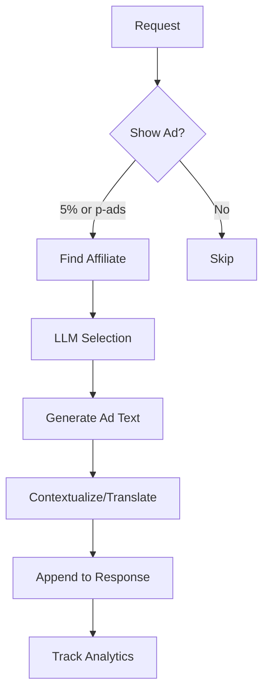

# Current Ad System Summary - text.pollinations.ai

## Overview
The current ad system uses a static affiliate-based approach with LLM-powered selection and contextualization.

## Key Components

### 1. **Data Source** (`/affiliate/affiliates.js`)
- ~30 hardcoded affiliates with metadata:
  - ID, name, product, description
  - Categories, tags, trigger words
  - Blocked countries
  - Tracking links (redirect through pollinations.ai/redirect/)
  - Weight/priority values
  - NSFW flags

### 2. **Ad Selection** (`adLlmMapper.js`)
- `findRelevantAffiliate()`: Uses OpenAI to match content with affiliates
- Country-based filtering
- NSFW content filtering
- Fallback to Ko-fi donation (5% or 30% probability)

### 3. **Ad Generation** (`adLlmMapper.js`)
- `generateAffiliateAd()`: Creates contextualized ad text
- Translation/localization using LLM
- Markdown formatting with emoji prefix: "🌸 **Ad** 🌸"

### 4. **Display Logic** (`shouldShowAds.js`)
- Default: 5% probability
- "p-ads" marker: 100% probability (force ads)
- Bad domain detection: 100% probability
- Trigger word detection for relevance

### 5. **Integration Points**
- **Streaming**: `streamingAdWrapper.js` - Transform stream adds ads at end
- **Non-streaming**: Direct integration in response
- **Analytics**: Google Analytics + custom logging

### 6. **Analytics Tracking**
- Ad impressions
- Skip reasons
- Affiliate performance
- Country/referrer data

## Current Flow

## Migration Impact

### What Changes
1. Static affiliate list → Dynamic nex.ad API
2. LLM selection → nex.ad's algorithm
3. Custom ad text → nex.ad's native ads
4. Simple redirect links → nex.ad click tracking

### What Stays
1. Probability logic (5% default, 100% with marker)
2. Streaming support
3. Analytics integration
4. Markdown formatting
5. "Thin proxy" architecture

## Key Files to Modify
- `initRequestFilter.js` - Main ad generation logic
- `adLlmMapper.js` - Replace with nex.ad client
- `streamingAdWrapper.js` - Update ad insertion
- `shouldShowAds.js` - Keep probability logic
- `adLogger.js` - Update for new data structure
