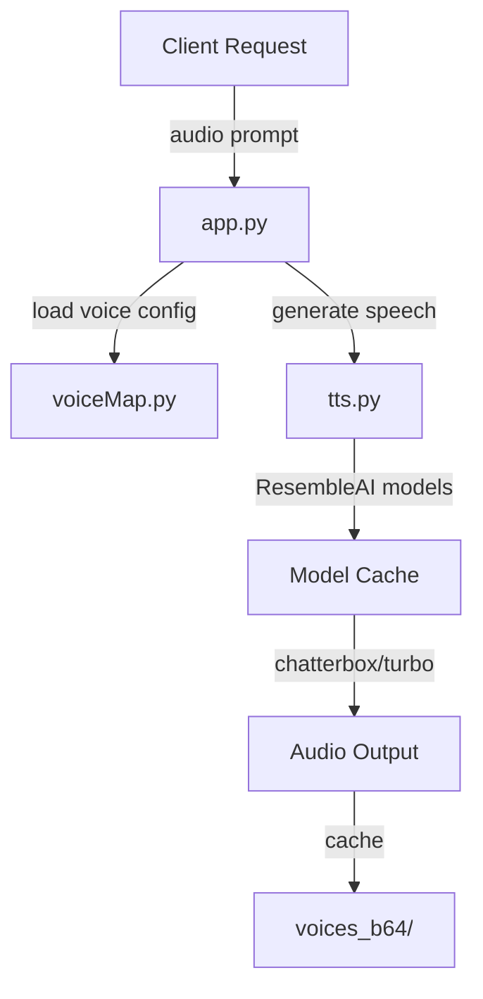

# Audio API

## Architecture

```mermaid
graph TD
    A[Client Request] -->|audio prompt| B[app.py]
    B -->|load voice config| C[voiceMap.py]
    B -->|generate speech| D[tts.py]
    D -->|ResembleAI models| E[Model Cache]
    E -->|chatterbox/turbo| F[Audio Output]
    F -->|cache| G[voices_b64/]
```

