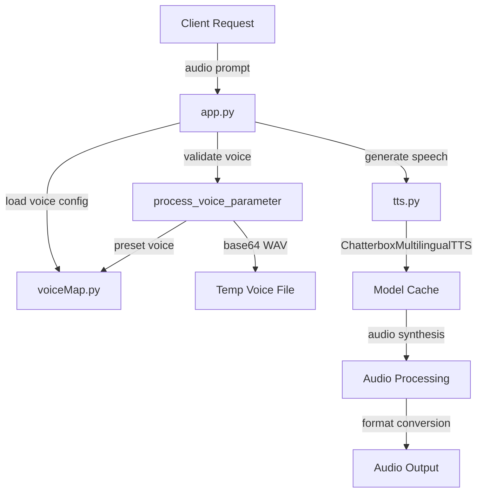

# Audio API - Multilingual TTS Service

A production-ready Text-to-Speech API with multilingual support, voice cloning, and expressive speech synthesis using ChatterboxMultilingualTTS.

## Architecture



## Quick Start

### Health Check
```bash
curl http://localhost:8001/
```

### Basic Synthesis
```bash
curl -X POST http://localhost:8001/synthesize \
  -H "Content-Type: application/json" \
  -d '{
    "input": "Hello, how are you?",
    "voice": "alloy",
    "language_id": "en",
    "response_format": "wav"
  }' \
  -o output.wav
```

## API Endpoint

### POST `/synthesize`

Generate speech from text with customizable voice, language, and expression parameters.

#### Request Parameters

| Parameter | Type | Default | Description |
|-----------|------|---------|-------------|
| `input` | string | **required** | Text to synthesize |
| `voice` | string | `"alloy"` | Preset voice name OR base64-encoded WAV (5-8 seconds) |
| `language_id` | string | `"en"` | Language code (see Supported Languages) |
| `response_format` | string | `"wav"` | Output format: wav, mp3, aac, flac, opus, pcm |
| `speed` | float | `0.5` | Playback speed: 0.0 (slow) to 1.0 (fast) → 0.5x to 1.5x |
| `exaggeration` | float | `0.0` | Speech dramatization: 0.0+ (use 0.7+ for dramatic effect) |
| `cfg_weight` | float | `7.0` | Style guidance: 0.1+ (lower=expressive, higher=neutral) |
| `normalize` | boolean | `false` | Full text normalization (removes punctuation if true) |

#### Response

**Success (200):**
- Binary audio data with content type matching `response_format`
- Headers:
  - `X-Request-ID`: Request identifier
  - `Content-Disposition`: Filename with format extension
  - `Content-Length`: Audio data size in bytes

**Error (400, 503):**
```json
{
  "error": "Error description"
}
```

## Supported Languages

23 languages available via `language_id` parameter:

```
ar (Arabic)
da (Danish)
de (German)
el (Greek)
en (English)
es (Spanish)
fi (Finnish)
fr (French)
he (Hebrew)
hi (Hindi)
it (Italian)
ja (Japanese)
ko (Korean)
ms (Malay)
nl (Dutch)
no (Norwegian)
pl (Polish)
pt (Portuguese)
ru (Russian)
sv (Swedish)
sw (Swahili)
tr (Turkish)
zh (Chinese)
```

## Voice Options

### Preset Voices
Use voice names directly from the preset collection:

```bash
curl -X POST http://localhost:8001/synthesize \
  -H "Content-Type: application/json" \
  -d '{
    "input": "Hello world",
    "voice": "alloy"
  }' \
  -o output.wav
```

Available preset voices: `alloy`, `nova`, `echo`, `onyx`, `shimmer`, `fable` (exact names depend on voiceMap.py)

### Voice Cloning (Base64 WAV)
Pass base64-encoded WAV audio (5-8 seconds) as the voice parameter:

```bash
# Encode your WAV file to base64
base64 -w 0 my_voice.wav > voice_b64.txt

# Use in API request
curl -X POST http://localhost:8001/synthesize \
  -H "Content-Type: application/json" \
  -d '{
    "input": "Hello in my voice",
    "voice": "'$(cat voice_b64.txt)'",
    "language_id": "en"
  }' \
  -o output.wav
```

**Requirements:**
- WAV format (RIFF/WAVE)
- Duration: 5-8 seconds
- Auto-trimmed if longer than 8 seconds
- Stored temporarily, cleaned up after synthesis


## Audio Formats

| Format | MIME Type | Use Case | Bitrate |
|--------|-----------|----------|---------|
| `wav` | audio/wav | Lossless, uncompressed | No compression |
| `mp3` | audio/mpeg | Web streaming | 192 kbps |
| `aac` | audio/aac | Apple/mobile | 128 kbps |
| `flac` | audio/flac | High-quality archival | Lossless |
| `opus` | audio/opus | Modern streaming | 128 kbps |
| `pcm` | audio/pcm | Raw samples | No compression |

## Parameter Details

### Speed Normalization
- Range: `0.0` to `1.0`
- Maps to playback factor: `0.5x` to `1.5x`
- `0.0` = 50% speed (very slow)
- `0.5` = 100% speed (normal) [default]
- `1.0` = 150% speed (fast)

### Exaggeration
- Range: `0.0` and above
- Controls speech dramatization
- `0.0` = Natural speech (default)
- `0.5` = Moderate expressiveness
- `0.7+` = Highly dramatic effect

### CFG Weight (Classifier-Free Guidance)
- Range: `0.1` and above
- Controls style adherence vs creativity
- `0.1-1.0` = More expressive, less stable
- `3.0-5.0` = Balanced
- `7.0+` = Neutral, consistent (default: 7.0)

### Text Normalization
- `normalize: false` (default) = Light normalization, preserves punctuation
- `normalize: true` = Full normalization, removes punctuation

## Error Handling

### Common Errors

**400 - Invalid Voice**
```json
{
  "error": "Invalid voice: Invalid voice parameter. Expected preset voice name or base64 WAV. Available voices: alloy, nova, echo, onyx, shimmer, fable"
}
```

**400 - Invalid Language**
```json
{
  "error": "Unsupported language_id: invalid. Supported: ar, da, de, el, en, es, ..."
}
```

**400 - Invalid Audio (Duration)**
```json
{
  "error": "Invalid voice: Voice audio must be at least 5 seconds (got 2.5s)"
}
```

**400 - Invalid Format**
```json
{
  "error": "Unsupported response_format: xyz. Supported: wav, mp3, aac, flac, opus, pcm"
}
```

**503 - Synthesis Error**
```json
{
  "error": "Audio synthesis failed: {error details}"
}
```
> Built with ❤️ by Circuit-Overtime for Pollinations.ai

